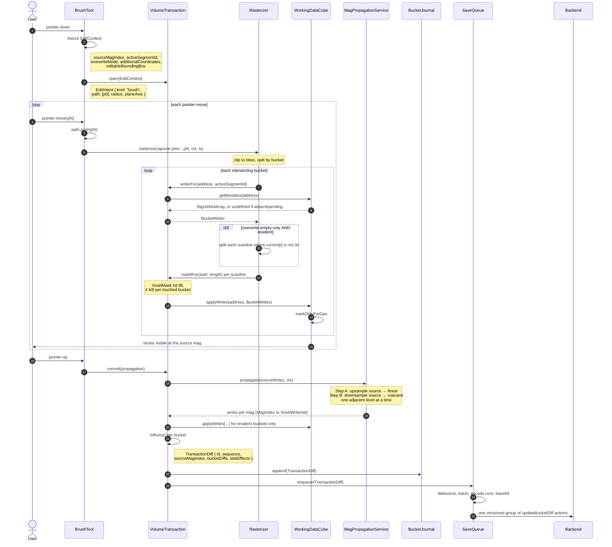

# Green-Field Architecture: Frontend Volume Annotation Editing

Status: draft / discussion doc
Scope: how the **frontend** represents, edits, undoes and saves volume (segmentation) annotation data. Backend implications are called out where the contract necessarily spans both sides, but are not designed in depth here.

This document intentionally does not try to stay close to the current implementation. It proposes a design from first principles, given the constraints below, so that we have a "north star" to compare the existing architecture against. A follow-up doc can define an incremental migration path.

Code in this document is illustrative TypeScript — signatures and sketches meant to pin down responsibilities and data flow, not copy-pasteable implementations.

---

## 1. Givens & Requirements

**Data model**
- Volume data is chunked into buckets of `32³` voxels. Each voxel value is a segment ID (`uint64`, i.e. `bigint` in JS; `0` = background).
- Coarser levels of detail ("mags") are downsampled versions of the finest mag, with independent per-axis factors (e.g. `2-2-1`).
- The frontend never holds the whole layer in memory; buckets are paged in/out from the backend on demand.

**Requirements**
1. Users can annotate at any mag, with brush, polygon/trace, fill, and interpolation-between-sections tools.
2. An edit made at one mag is reflected at all other mags.
3. Saved changes are diffs against the previous bucket state, not full bucket snapshots — a prerequisite for future collaborative editing, where diffs from different users must compose rather than clobber each other.
4. One user interaction (e.g. one brush stroke) = one transaction = one bundle of per-bucket diffs.
5. Every transaction is undoable/redoable, and undo must not silently discard edits (own or others') that happened after it.
6. An "overwrite mode" governs whether painting may overwrite already-labeled voxels or only empty (background) ones.

### 1.1 Terminology

Two words this doc leans on heavily and that are not today's vocabulary.

#### Folding

To **fold** a bucket is to reduce an ordered sequence of diff entries onto a base array, producing the bucket's content. The name is the functional `fold`/`reduce`: a base value, a sequence, and a combining step. (`BucketLogEntry` and `VoxelRun` are defined in §5.7 and §5.6; only their shape matters here.)

```ts
function fold(
  base: BigUint64Array,
  entries: BucketLogEntry[],          // ascending by sequence
  include: (e: BucketLogEntry) => boolean,
): BigUint64Array {
  const data = base.slice();
  for (const entry of entries) {
    if (!include(entry)) continue;
    for (const run of entry.runs) applyRun(data, run);   // absolute writes
  }
  return data;
}
```

Everything rests on the runs being **absolute writes** — "voxel `i` becomes `v`", not "voxel `i` changes by `v`". A later entry simply overwrites an earlier one wherever they touch the same voxel, so replaying in sequence order is exactly what "last-write-wins" means mechanically. It is also why folding never has to invert anything and never has to run backwards: to remove an entry's effect you re-fold without it (principle 5), rather than computing its opposite.

The same loop serves both callers; only the base and the filter differ:

| Caller | Base | Filter |
|---|---|---|
| undo / redo (§5.7) | nearest local checkpoint | skip entries marked `skipped` |
| bucket load (§5.5) | freshly fetched backend data | skip entries that data already contains |

Per principle 3 the fold *is* the definition of a bucket's content; the `32³` array held in memory is a cached result of one, kept because the GPU needs an array rather than a log.

#### Residency

This doc also uses **resident** throughout. Here is what it means and how it maps onto the states buckets actually have.

Two independent questions decide a bucket's state: *is there a `32³` array for it in memory?* and *does that array reflect the backend's content?*

| State | Array in memory | Contents authoritative | Can record diffs | Can render |
|---|---|---|---|---|
| **absent** | no | — | **yes** | no |
| **pending** | yes, zero-filled + local writes | no — backend data has not arrived | **yes** | local edits only |
| **resident** | yes | yes | **yes** | yes |

> **resident** = the array exists *and* holds the backend's content with all known diffs folded in.

Orthogonal to all three: **dirty** — the bucket has diffs not yet acknowledged by the backend. In this design that is simply "its log has unsaved entries", which is what §5.5's eviction rule keys off. A fourth case, the out-of-bounds *null bucket*, never reaches the write set at all: the rasterizer's clipping step (§5.3, step 1) discards those addresses.

**Why the pending/resident split matters.** Four things in this design read bucket state, and they need different guarantees:

- *Recording a diff* needs nothing. Any of the three states works — this is principle 4, and it is what makes coarse-mag editing viable.
- *Write-through for display* needs an array to exist, so `absent` must first become `pending`. Whether the backend data has arrived is irrelevant; the merge on arrival sorts it out.
- *The overwrite predicate* (§5.3) and *`beforeAccumulating` capture* (§5.2) need **authoritative** content, so `pending` is not good enough. A pending bucket's array is zero-filled, and reading it would report "everything is background" — under `overwrite-empty-only` that means painting over data that turns out to be labeled. `VoxelReader.getResident` therefore returns `undefined` for pending buckets, deliberately, so a placeholder can never be mistaken for real content.

**How this relates to the current implementation.** Today, brushing over unloaded data always instantiates the bucket (cheap), writes into the zero-filled array, marks it dirty, and merges when the backend data arrives. That is exactly the `absent → pending → resident` path above, and it stays valid here — with one change:

**Materialization on write becomes optional, driven by visibility.** Today it is unconditional. It cannot stay unconditional, because a single mag-16 stroke implies writes to ~250 finest-mag buckets the user is not looking at (§6.2); instantiating all of them costs ~64 MB to no purpose. The rule is: materialize on write only if the bucket is visible or about to be. Otherwise record the diff against its address and leave it `absent`.

The merge-on-arrival step generalizes too: folding a bucket's journal entries onto freshly fetched data (§5.5) is the same fold undo performs (§5.7), differing only in its starting point — so the temporal-bucket merge and undo replay become one mechanism instead of two.

### 1.2 Non-requirements

Things this design deliberately does *not* support. Each is argued where it comes up; they are collected here so the constraints are visible up front rather than discovered in a subsection.

- **Mag lists that are not a chain.** Every mag must be an integer multiple of the next-finer one, so that the list is totally ordered by resolution. A layer offering both `4-4-1` and `2-2-2` would violate this — neither divides the other, since one is finer in x/y and the other in z — and mag propagation (§5.4) would have no defined path between them. Standard pyramids, including anisotropic ones like `1-1-1, 2-2-1, 4-4-2`, are chains and are fine. Today's resampling does not support the non-chain case either, so this is not a regression.
- **Coarse mags exactly matching a re-downsampling of the finest mag.** They are derived from the write sequence and are order-dependent; see principle 2 and §9.
- **Sub-source-mag precision for `overwrite-empty-only`.** The predicate is evaluated at the mag the user is looking at, so finer detail hidden inside a coarse voxel can be overwritten; see §5.4.
- **Multi-valued transactions.** One user interaction writes one segment ID. This is relied on by the write-set representation (§4) and by the equivalence argument in §5.4.

---

## 2. Answers in Brief

The four questions this doc was written to answer:

**What happens when a user draws?** A tool converts pointer input into a declarative *edit intent* (a brush stroke, a polygon, a flood-fill spec). A single `VolumeTransaction` is opened on pointer-down and stays open until pointer-up. On each pointer-move the intent grows, the incremental part is rasterized at the mag the user is looking at, and the resulting voxel writes are recorded into the transaction (and applied to resident buckets so the user sees them immediately). On pointer-up the transaction commits: mag propagation runs, the accumulated write set becomes a set of per-bucket diffs, and those go to the undo log and the save queue.

**Who draws the circular brush into the data?** A single `Rasterizer` — the one component that knows how to turn geometry into voxel indices. Tools never touch buckets; buckets never know about brushes. The Rasterizer also owns the overwrite-mode filter, because that filter is a per-voxel decision made against current data, which is exactly its job.

**What is the intermediary representation?** A per-transaction **write set**: `bucketAddress → (bitmask of touched voxels + the segment ID being written)`, last-write-wins. This is the pivot point of the whole design. It coalesces repeated writes within a stroke for free, it can hold writes for buckets that are *not* in memory, and it converts trivially to both "apply to a live bucket" and "encode as a diff". Tools fill it through a bucket-scoped, run-oriented cursor, so no step of the pipeline pays a per-voxel function call or address computation.

**Who downsamples, and how is the diff encoded?** The `MagPropagationService` runs at commit time. Starting from the write set at the mag the user drew in, it walks the pyramid outward one level at a time: upsampling (block replication) toward the finest mag, and downsampling (written-value-wins, with background treated as an ordinary value) toward the coarsest. It propagates the *write set*, never whole buckets — recomputing a coarse bucket from its finest-mag children is infeasible (a mag-16 bucket has 4096 mag-1 children) — and it reads no voxel data at all. The diff is encoded as run-length-grouped voxel runs over the bucket's flat index space, one `updateBucketDiff` update-action per touched bucket, for every mag; all actions of a transaction are submitted as one versioned group, and the backend applies them verbatim without resampling.

---

## 3. Design Principles

1. **Geometry first, voxels second.** Tools describe *what the user meant*; a separate stage turns that into voxel writes. This is what makes "annotate at any mag" tractable — we rasterize once and derive everything else, rather than reconciling N independently-rasterized grids.

2. **The finest mag is the source of truth; coarser mags are a derived view.** Every edit, whatever mag it was authored at, resolves into finest-mag writes at full fidelity. Coarser mags are derived *at edit time* by downsampling the same writes — cheaply and locally, without reading data — and their diffs are then logged and replayed exactly like the finest mag's (§5.4). "Derived" describes the pyramid as a whole; mechanically each level is resampled from its neighbour rather than from mag 1, which for single-valued writes amounts to the same thing (§5.4).

   Crucially, we downsample the **writes**, at edit time — not the stored content, after the fact. Those are different operations with different results: the write-set downsampling is order-dependent, so it cannot be reconstructed later, and coarse mags will drift from what re-downsampling the finest mag afterwards would produce. **This is an accepted trade-off, for now.** It buys a propagation step that needs no data access and no bucket loads, which is what makes editing at coarse mags viable at all (§5.4). Coarse mags are a display approximation; the finest mag is what the annotation *means*. If exactness at coarse mags ever becomes a requirement, the fix is a background re-derivation pass, not a change to the editing path.

3. **Diffs are the unit of truth; buckets are a materialized cache.** A bucket's content is *defined* as "checkpoint + ordered diffs". The `32³` typed array in memory is a fold of that definition, kept around because the GPU needs it.

4. **A diff may exist for a bucket that is not in memory.** This falls out of (3) and is what makes coarse-mag editing scale: drawing at mag 16 implies writes to hundreds of finest-mag buckets, and we must be able to record them without materializing 64 MB of typed arrays. Recording a write must never force a bucket load.

5. **Undo replays forward; it never inverts against live state.** Undoing transaction *T* recomputes affected buckets as if *T* had never been in the log — not by subtracting *T*'s effect from whatever the bucket looks like now. This is what keeps undo correct once other actors, or your own later actions, have touched the same voxels.

6. **Keep diffs in the most compact faithful representation.** A coarse-mag stroke is a small amount of *information* even when it implies millions of finest-mag voxels. Materialize into voxel arrays only for buckets that are actually resident.

---

## 4. Core Types

```ts
// ── Coordinates & identifiers ───────────────────────────────────────────────

type Vector3 = [number, number, number];
type AdditionalCoordinate = { name: string; value: number };

/** Downsampling factor per axis relative to the finest mag, e.g. [2, 2, 1]. */
type Mag = Vector3;

/** Index into the layer's ordered mag list. 0 === finest mag. */
type MagIndex = number;

/** uint64 on the wire, therefore bigint in JS. 0n === background. */
type SegmentId = bigint;

/** [bucketX, bucketY, bucketZ, magIndex, additionalCoordinates] */
type BucketAddress = readonly [
  number, number, number, MagIndex, AdditionalCoordinate[] | null,
];

/** Stable string form so BucketAddress can be a Map key. */
type BucketKey = string & { readonly __brand: "BucketKey" };

const BUCKET_WIDTH = 32;
const BUCKET_VOXEL_COUNT = BUCKET_WIDTH ** 3; // 32_768

/**
 * Flat offset inside a bucket: `x + y * 32 + z * 1024` — x varies fastest.
 * (Matters for run-length encoding: runs are runs along x. See §5.8.)
 */
type VoxelIndex = number;

// ── Transaction context ─────────────────────────────────────────────────────

type OverwriteMode = "overwrite-all" | "overwrite-empty-only";

/** Everything that is constant for the duration of one user interaction. */
interface EditContext {
  layerId: string;
  /** The mag the user is looking at. The only mag the rasterizer ever runs at. */
  sourceMagIndex: MagIndex;
  sourceMag: Mag;
  /** Fixed for the whole transaction (4D/5D datasets). Part of every address. */
  additionalCoordinates: AdditionalCoordinate[] | null;
  activeSegmentId: SegmentId;
  overwriteMode: OverwriteMode;
  /** Annotation-level restriction; the rasterizer clips against it. */
  editableBoundingBox: BoundingBox | null;
}

// ── The central intermediary representation ─────────────────────────────────

/** One bit per voxel: 32_768 bits = 1024 words = 4 KB per bucket. */
class VoxelMask {
  /**
   * A "word" is one Uint32 holding the flags of 32 consecutive voxels, so
   * voxel `i` lives at bit `i & 31` of word `i >>> 5`.
   *
   * Because VoxelIndex is `x + y*32 + z*1024` and BUCKET_WIDTH is also 32,
   * a word is exactly one x-row of the bucket: word `w` covers the row at
   * `y = w & 31, z = w >>> 5`. That alignment is what makes `markRun` cheap —
   * a scanline never straddles a word boundary, so filling one is a single
   * store rather than a read-modify-write of two.
   */
  private words = new Uint32Array(BUCKET_VOXEL_COUNT / 32);
  mark(i: VoxelIndex): void;
  /** Word-wise fill; the hot path. `start..start+length` must stay in-bucket. */
  markRun(start: VoxelIndex, length: number): void;
  has(i: VoxelIndex): boolean;
  /** Ascending runs of consecutive set bits, found by word scan. */
  runs(): Iterable<{ start: VoxelIndex; length: number }>;
  get count(): number;
}

/**
 * Writes for one bucket: which voxels were touched, and the single value being
 * written. A transaction is always single-valued — one brush stroke, one fill,
 * one interpolation each write one activeSegmentId, and mag propagation
 * preserves values — so no per-voxel value is ever stored.
 */
interface BucketWrites {
  mask: VoxelMask;
  value: SegmentId;
}

/** Voxel writes across buckets — the output of rasterization and propagation. */
type VoxelWriteSet = Map<BucketKey, { address: BucketAddress; writes: BucketWrites }>;
```

`VoxelWriteSet` is deliberately the *only* currency exchanged between the rasterizer, the mag propagation service and the transaction. Every tool, at every mag, produces one of these, and nothing downstream needs to know which tool produced it.

**Why a mask and not `Map<VoxelIndex, SegmentId>`.** The per-voxel map is the obvious encoding and it does not survive contact with the numbers. The mag-16 stroke in §6.2 implies ~8.2 M finest-mag writes; at V8's ~40–50 bytes per `Map` entry that is ~370 MB of hash-table overhead, versus ~1 MB for 250 buckets' worth of 4 KB masks. It also pays a per-voxel value slot for a degree of freedom nothing uses. The mask form additionally makes §5.6's run extraction a word scan instead of a sort.

**Why there is no multi-valued variant.** Nothing produces one. Tools are single-valued by construction; propagation preserves values; undo folds stored runs directly into bucket arrays (§5.7) rather than building a write set; and undo is communicated to the backend as a skip marker rather than as a compensating diff (§5.8), so no "restore these various old values" write set is ever assembled. The one genuinely multi-valued data in the design is the pre-transaction values (`beforeAccumulating` / `beforeCommitted`, §5.2), which are never a `BucketWrites`.

A sparse form (a short index list) would beat a 4 KB mask for buckets the stroke merely grazes at its edges. Worth adding if profiling says edge buckets dominate; not worth the branch until then.

---

## 5. Components

```
   pointer / keyboard
          │
          ▼
   ┌──────────────┐
   │    Tool      │  brush · contour · fill · interpolate
   └──────┬───────┘
          │ EditIntent (declarative, source-mag-relative)
          ▼
   ┌──────────────┐        reads current values
   │  Rasterizer  │◀─────────────────────────────┐
   │  + overwrite │                              │
   │    predicate │                              │
   └──────┬───────┘                              │
          │ VoxelWriteSet @ source mag           │
          ▼                                      │
   ┌──────────────────────┐                      │
   │ VolumeTransaction    │──── apply writes ───▶│
   │ (write set, per      │                      │
   │  bucket, LWW)        │                ┌─────┴────────────┐
   └──────┬───────────────┘                │ WorkingDataCube  │
          │ on commit                      │ (resident        │
          ▼                                │  buckets → GPU)  │
   ┌──────────────────────┐                └─────┬────────────┘
   │ MagPropagation       │──── apply writes ───▶│
   │  A: → finest mag     │                      │
   │  B: → coarser mags   │                      │
   └──────┬───────────────┘
          │ TransactionDiff (finest-mag = authoritative,
          ▼                   every mag logged alike)
     ┌────┴──────────────────────────┐
     ▼                               ▼
┌──────────────┐            ┌──────────────────┐
│ Undo/Redo    │            │ Save Queue       │
│ Log          │            │ (encode, batch,  │
│ (per-bucket, │            │  send)           │
│  checkpoints)│            └──────────────────┘
└──────────────┘
```

### 5.1 Tools → `EditIntent`

A tool's only job is to turn input events plus viewer state into a declarative description of the edit. It never touches a `Bucket`.

```ts
type EditIntent = AnalyticShape | DataDependentShape;

/** Fully determined by geometry — no voxel reads needed to know the region. */
type AnalyticShape =
  | { kind: "brush";
      /** Pointer path in source-mag voxel coordinates (floats). */
      path: Vector3[];
      /** Constant for the whole stroke — brush size cannot change mid-stroke. */
      radius: number;
      /** null => 3D sphere brush; otherwise paint one slice along this axis. */
      planeAxis: 0 | 1 | 2 | null }
  | { kind: "polygon"; vertices: Vector3[]; planeAxis: 0 | 1 | 2 }
  | { kind: "box"; min: Vector3; max: Vector3 };

/** Region depends on the data itself; must be resolved against the cube. */
type DataDependentShape =
  | { kind: "floodFill"; seed: Vector3; is3D: boolean; bounds: BoundingBox | null }
  | { kind: "sliceInterpolation"; axis: 0 | 1 | 2; sliceA: number; sliceB: number }
  /** Escape hatch for ML/quick-select tools that produce a mask directly. */
  | { kind: "mask"; origin: Vector3; size: Vector3; bits: Uint8Array };
```

The split matters. Analytic shapes really are mag-independent — the same brush stroke rasterized at mag 1 and mag 4 describes the same physical region. Data-dependent shapes are **not**: a flood fill seeded at the same point yields a different region at mag 1 than at mag 4, because connectivity is evaluated on different data. So `EditIntent` coordinates are expressed in *source-mag* voxel space and `sourceMagIndex` is part of the intent's meaning, not an incidental detail. Framing all intents as mag-1-space geometry would be wrong for this half of the tools.

Adding a tool means adding an `EditIntent` variant and a rasterization case — nothing else in the system changes.

### 5.2 `VolumeTransaction` — the write set

One transaction per user interaction. It is a write recorder, not a snapshot differ.

```ts
/**
 * Bucket-scoped write cursor. Obtained once per (bucket, value), then written
 * to in a tight loop. Nothing in here computes a bucket address or a BucketKey:
 * that work happened once, in `writerFor`.
 */
interface BucketWriter {
  mark(index: VoxelIndex): void;
  /** The hot path. Runs are runs along x (see VoxelIndex), i.e. scanlines. */
  markRun(start: VoxelIndex, length: number): void;
  /** Dense current content, if resident. Read once, then index directly —
   *  this is how the overwrite predicate avoids a global lookup per voxel. */
  readonly current: BigUint64Array | undefined;
}

class VolumeTransaction {
  readonly id: TransactionId;
  readonly ctx: EditContext;

  private writes = new Map<BucketKey, { address: BucketAddress; writes: BucketWrites }>();

  /** Pre-transaction values, recorded on first touch — only for resident buckets. */
  private beforeAccumulating = new Map<BucketKey, Map<VoxelIndex, SegmentId>>();

  /**
   * Open a write cursor for one bucket. Does NOT require the bucket to be
   * resident (principle 4). Resident buckets are also written through to the
   * live array so the GPU picks the change up on the next texture update.
   */
  writerFor(address: BucketAddress, value: SegmentId): BucketWriter;

  /** Merge a whole VoxelWriteSet (from mag propagation, or a remote peer). */
  recordAll(writeSet: VoxelWriteSet): void;

  /** Finalize: run mag propagation, drop no-ops, build the diff. */
  commit(propagation: MagPropagationService): TransactionDiff;

  /** Restore every touched resident bucket from `beforeAccumulating`. */
  abort(): void;
}
```

**The API is bucket-scoped on purpose, independently of how `BucketWrites` is represented.** A per-voxel `record(address, index, value)` would be the more obvious signature, but it pushes address-to-key computation into every rasterizer inner loop, and it shapes all calling code into a per-voxel style — so changing the representation later would become a call-site migration across every tool rather than a swap behind an interface. `writerFor` + `markRun` costs nothing extra today and keeps the mask, a sparse list, or a slice-oriented buffer interchangeable.

Why a write set at all, rather than "snapshot the bucket, mutate freely, diff at the end":

- Repeated writes to the same voxel during a stroke coalesce for free — a brush passing over the same voxel 40 times sets the same bit 40 times.
- It works for non-resident buckets, which snapshot-and-diff cannot: there is nothing to snapshot.
- Its cost is bounded by *touched buckets* × 4 KB, not by touched buckets × 256 KB, and it never materializes a bucket that was not already resident.

**`beforeAccumulating` and `beforeCommitted` are the same information at two lifecycle stages**, mirroring the write side exactly:

| | accumulating (live, in the transaction) | committed (frozen, on the diff) |
|---|---|---|
| new values | `BucketWrites` — mask + one value | `BucketDiff.runs` |
| old values | `beforeAccumulating` — `Map<VoxelIndex, SegmentId>` | `BucketDiff.beforeCommitted` — `VoxelRun[]` |

The shapes differ because the stages have different access patterns. While the stroke is open, values are recorded lazily on first touch of each voxel and arrive in whatever order the brush wanders, so the accumulator needs O(1) "have I already recorded this one?" checks — a `Map`. At commit the same run-grouping pass that builds `runs` freezes it into `beforeCommitted`, which from then on is only iterated in order.

The rows differ from each other because new values are single-valued and compress to mask-plus-value, whereas old values are arbitrary (`3, 5, 0`, …) and need one per voxel. That is the sole reason `VoxelRun.values` has a `BigUint64Array` arm.

Both are populated only for resident buckets, and **neither is required for correctness** — forward replay never reads them (§5.7). `beforeAccumulating` exists so `abort()` is cheap; `beforeCommitted` exists so the common case of undoing your most recent action can skip a checkpoint replay.

**Cancel is not free, but it is cheap.** Because we do apply writes live (the user must see the stroke), cancelling means restoring the touched voxels from `beforeAccumulating`, not "throwing away an untouched buffer". That is O(number of written voxels), which is fine.

### 5.3 Rasterizer

The single place that turns geometry into voxel indices.

```ts
/** Read-only view over the cube; keeps the rasterizer decoupled from storage. */
interface VoxelReader {
  /** Dense content of a resident bucket. Fetch once per bucket, then index
   *  directly — never call this per voxel. Returns undefined for `absent` AND
   *  for `pending` buckets (§1.1): a zero-filled placeholder must never be
   *  mistaken for "all background". Never triggers a fetch. */
  getResident(address: BucketAddress): BigUint64Array | undefined;
  /** Random access for data-dependent shapes (flood fill's neighbour walk).
   *  Convenient but ~two orders of magnitude slower than indexing `current`. */
  peek(voxel: Vector3, magIndex: MagIndex): SegmentId | undefined;
}

interface Rasterizer {
  /**
   * Rasterize `shape` at ctx.sourceMagIndex, writing through `tx`. Always the
   * source mag — never called a second time for another mag (see §5.4).
   */
  rasterize(shape: EditIntent, ctx: EditContext, tx: VolumeTransaction): void;
}
```

Responsibilities, in order:

1. Compute the candidate region: the shape's bounding box at the source mag, clipped against `ctx.editableBoundingBox` and the layer bounding box, then **split by bucket**.
2. Per bucket, scanline the shape: for each row, produce the x-intervals it covers (a single interval for convex shapes, several for a polygon).
3. Apply the **overwrite predicate**, which splits an interval into sub-intervals.

The bucket split comes first, and that ordering is the whole point: bucket address, `BucketKey` and the writer are resolved once per bucket, and the inner loop touches nothing but integers and a `Uint32Array`.

```ts
function rasterizeBrush(
  shape: Extract<AnalyticShape, { kind: "brush" }>,
  ctx: EditContext,
  tx: VolumeTransaction,
): void {
  for (const [a, b] of consecutivePairs(shape.path)) {
    // Capsule: everything within `radius` of the segment a→b, in source-mag space.
    const bbox = capsuleBoundingBox(a, b, shape.radius).clipTo(ctx.editableBoundingBox);

    for (const { address, localBox } of bucketsIntersecting(bbox, ctx)) {
      const w = tx.writerFor(address, ctx.activeSegmentId);   // once per bucket

      for (const { y, z } of rowsOf(localBox, shape.planeAxis)) {
        const rowStart = y * BUCKET_WIDTH + z * BUCKET_WIDTH ** 2;  // x === 0

        for (const [x0, x1] of capsuleRowSpans(a, b, shape.radius, y, z, localBox)) {
          emitSpan(w, rowStart + x0, x1 - x0 + 1, ctx);
        }
      }
    }
  }
}

/** Applies the overwrite predicate to a contiguous span, emitting sub-runs. */
function emitSpan(w: BucketWriter, start: VoxelIndex, length: number, ctx: EditContext): void {
  if (ctx.overwriteMode === "overwrite-all") {
    w.markRun(start, length);              // fast path: word-wise fill, no reads
    return;
  }
  const current = w.current;
  if (current == null) {
    // Absent or pending (§1.1): no authoritative content to test against, so
    // paint optimistically. Same reasoning as §5.4's source-mag-only predicate.
    w.markRun(start, length);
    return;
  }
  let runStart = -1;
  for (let i = start; i < start + length; i++) {
    if (current[i] === 0n) {
      if (runStart < 0) runStart = i;
    } else if (runStart >= 0) {
      w.markRun(runStart, i - runStart);
      runStart = -1;
    }
  }
  if (runStart >= 0) w.markRun(runStart, start + length - runStart);
}
```

Three things this buys over the per-voxel formulation. The overwrite predicate reads `current[i]` — a direct typed-array index — instead of resolving a global coordinate to a bucket on every voxel. `overwrite-all`, the common mode, does no reads at all and fills whole words. And a solid interior row costs one `markRun` regardless of its length, which is what makes the block fills of §5.4's upsample cheap.

**The rasterizer runs exactly once per transaction, at the source mag.** Every other mag's content is derived by §5.4, never by re-rasterizing the same geometry at a different resolution. Rasterizing independently per mag would (a) cost N× and (b) produce boundary disagreements — a circle rasterized at mag 1 and a circle rasterized at mag 2 do not agree about their edges, so the pyramid would be internally inconsistent in a way no downsampling rule could repair.

Erasing is not a special case: it is a rasterization with `activeSegmentId = 0n` and `overwriteMode = "overwrite-all"`.

### 5.4 `MagPropagationService`

Three terms, used consistently from here on:

- **Propagation** — the umbrella process: everything this service does, both directions together.
- **Upsample** (Step A) — walk from the source mag toward the finest, one level at a time, emitting a write set at each. Increases resolution, so one voxel becomes a block. One-to-many; no conflicts possible.
- **Downsample** (Step B) — walk from the source mag toward the coarsest, one level at a time, emitting a write set at each. Decreases resolution, so many voxels collapse onto one. Many-to-one, which means a rule is needed to decide which value survives.

Both walks start at the **source mag** — the mag the user drew in — and move outward through *adjacent* mags. Between neighbours the factor is small (typically 2 per axis), and every mag in the list is visited exactly once: those finer than the source by Step A, those coarser by Step B.

Note these are the same terms, in the same directions, as `upsampleVoxelMap` / `downsampleVoxelMap` in today's `volume_annotation_sampling.ts`. Beware that they run *opposite* to mag index: upsampling moves toward mag 1, downsampling away from it. Sampling direction is stated in terms of resolution throughout this doc, never in terms of "up" or "down" the mag list.

```ts
interface MagPropagationService {
  /**
   * Source mag → every other mag, walking the pyramid outward in both
   * directions. Pure; reads no voxel data. Requires the mag list to be a
   * chain (§1.2).
   */
  propagate(
    sourceWrites: VoxelWriteSet, ctx: EditContext,
  ): Map<MagIndex, VoxelWriteSet>;
}

// Sketch of the walk. `relativeFactor(a, b)` is the per-axis ratio between
// two adjacent mags — normally [2,2,1] or [2,2,2], never the ratio to mag 1.
function propagate(sourceWrites: VoxelWriteSet, ctx: EditContext) {
  const out = new Map([[ctx.sourceMagIndex, sourceWrites]]);

  let writes = sourceWrites;                                   // Step A: finer
  for (let i = ctx.sourceMagIndex; i > FINEST_MAG_INDEX; i--) {
    writes = upsampleOneLevel(writes, relativeFactor(mags[i], mags[i - 1]), i - 1, ctx);
    out.set(i - 1, writes);
  }

  writes = sourceWrites;                                       // Step B: coarser
  for (let i = ctx.sourceMagIndex; i < mags.length - 1; i++) {
    writes = downsampleOneLevel(writes, relativeFactor(mags[i], mags[i + 1]), i + 1, ctx);
    out.set(i + 1, writes);
  }
  return out;
}
```

**Why cascade rather than deriving every mag from the finest one.** A hub model — upsample straight to the finest mag, then downsample from there into every other mag — produces *identical* results, because the writes are single-valued (§4) and block replication composes: a mag-4 voxel `q=3` upsampled directly to mag 1 gives the block `[12,16)`, and `⌊12/8⌋ = ⌊15/8⌋ = 1` is the same mag-8 voxel that `⌊3/2⌋` gives by cascading. The cascade is preferred because it is cheaper and more obvious, not because the hub is wrong.

Cheaper because each step works from the nearest, smallest write set rather than from the largest one. Drawing at mag 16, a hub model would derive mag 32 by iterating the ~32 K-run finest-mag set; cascading derives it from the ~2000-voxel mag-16 set. For mag-1 strokes the two are identical, since source *is* finest.

The cascade's one requirement is that adjacent mags divide each other, i.e. that the mag list forms a chain. That is a declared non-requirement to violate (§1.2). It also depends on transactions being single-valued: with multi-valued writes, collapsing in stages and collapsing once could disagree, so the equivalence above would no longer hold.

#### Step A — upsample toward the finest mag

A voxel `q` at one level covers the axis-aligned block `[q · f, (q+1) · f)` at the next finer level, where `f` is the *relative* factor between the two adjacent mags. Replicate the value across the block:

```ts
function upsampleOneLevel(
  writes: VoxelWriteSet, f: Mag, targetMagIndex: MagIndex, ctx: EditContext,
): VoxelWriteSet {
  const out = new WriteSetBuilder(targetMagIndex, ctx);

  for (const { address, writes: bw } of writes.values()) {
    const origin = originVoxelOf(address);                   // this level's grid
    for (const { start, length, value } of runsOf(bw)) {
      const [x, y, z] = voxelOffsetOf(start);
      const base: Vector3 = [
        (origin[0] + x) * f[0], (origin[1] + y) * f[1], (origin[2] + z) * f[2],
      ];
      // A run of `length` voxels becomes a solid block, emitted as one run of
      // `length * f[0]` per (dy, dz) — not length * f[0]*f[1]*f[2] writes.
      for (let dz = 0; dz < f[2]; dz++)
        for (let dy = 0; dy < f[1]; dy++)
          out.markRun([base[0], base[1] + dy, base[2] + dz], length * f[0], value);
    }
  }
  return out.build();
}
```

This needs no reads and no bucket loads, and it is exact: drawing at a coarse mag *means* producing blocky finest-mag geometry. That is the accepted cost of annotating at low resolution.

Note the loop nest is over `f[1] * f[2]`, not `f[0] * f[1] * f[2] * length` — the x extent is handled by `markRun`. Compounded across the chain, that is the difference between ~32 K run emissions and ~8.2 M individual writes for the mag-16 case below.

**Overwrite mode is evaluated at the source mag only — deliberately.** The predicate already ran in §5.3 against source-mag values; the upsample writes unconditionally. The consequence is real and should be documented in the UI: in `overwrite-empty-only` mode at mag 4, a coarse voxel that reads as empty may still contain labeled finest-mag voxels, and those get overwritten. The alternative — re-evaluating the predicate per finest-mag voxel — would require the finest-mag buckets to be resident, i.e. it would turn every coarse-mag brush stroke into hundreds of bucket fetches. Evaluating at the source mag is also arguably the better semantics: the user's intent ("don't paint over that segment") is formed from what they can actually see.

**Write amplification is the thing to watch here.** At mag `16-16-16`, each source voxel expands to 4096 finest-mag voxels. A stroke covering ~2000 mag-16 voxels implies ~8.2 M finest-mag voxels spanning ~250 finest-mag buckets. Three things keep that affordable:

- Those buckets are not materialized as `32³` typed arrays (~64 MB). Per principle 4, writes are recorded against bucket addresses whether or not the bucket is resident; per §4 a touched bucket costs a 4 KB mask, so ~1 MB in total.
- The work is `markRun` calls, not per-voxel writes — ~32 K of them rather than 8.2 M, since each fills a whole scanline of a block.
- The resulting diff run-length-encodes to a few kilobytes per bucket, because a block fill is exactly what §5.8's encoding is good at.

Non-resident buckets are never loaded just to be written; when they are later fetched, the backend has already folded the diff in, and any not-yet-saved local diffs are applied on load.

#### Step B — downsample toward the coarsest mag

At each step, a voxel `p` belongs to coarse voxel `⌊p / f⌋` at the next coarser level, where `f` is again the relative factor between adjacent mags. Many voxels collapse into one, so a rule is needed:

```ts
/**
 * Written-value-wins: a written voxel sets its coarse voxel to that value.
 * Background (0n) is not special — it is just another segment ID.
 *
 * Run-oriented like the rasterizer: a run along x downsamples to a run along
 * x, so the whole pyramid is built without ever visiting an individual voxel.
 */
function downsampleOneLevel(
  writes: VoxelWriteSet, f: Mag, targetMagIndex: MagIndex, ctx: EditContext,
): VoxelWriteSet {
  const out = new WriteSetBuilder(targetMagIndex, ctx);

  for (const { address, writes: bw } of writes.values()) {
    const origin = originVoxelOf(address);                   // this level's grid
    for (const { start, length, value } of runsOf(bw)) {
      const [x, y, z] = voxelOffsetOf(start);
      const cy = Math.floor((origin[1] + y) / f[1]);
      const cz = Math.floor((origin[2] + z) / f[2]);
      const cx0 = Math.floor((origin[0] + x) / f[0]);
      const cx1 = Math.floor((origin[0] + x + length - 1) / f[0]);
      out.markRun([cx0, cy, cz], cx1 - cx0 + 1, value);      // may span buckets
    }
  }
  return out.build();
}
```

`WriteSetBuilder` is the propagation-side counterpart of `BucketWriter`: it caches the current bucket and only re-resolves the address when a run crosses a bucket boundary.

Three things about this rule are worth stating explicitly, because they are choices, not consequences:

- **Background is not a special value.** Erasing is painting with `0n`, and it downsamples like any other value: one erased finest-mag voxel clears its whole coarse voxel. The tempting alternative — "only clear the coarse voxel if *all* its finest-mag siblings are now background" — is more faithful but needs a read of every sibling, which drags bucket residency back into a step that otherwise needs no data at all. Not worth it for a display-only approximation. This is also what webKnossos does today (`downsampleVoxelMap` any-hits a 0/1 *mask*, and `applyVoxelMap` then writes the segment ID — zero included — into every masked voxel at every mag).
- **The downsampling rule is written-value-wins, and it dilates in both directions.** Paint overstates presence at coarse mags; erase overstates absence. Majority vote — the textbook rule, and what "downsampling" might otherwise be assumed to mean here — would instead make thin structures disappear entirely — a 1-voxel-wide process annotated at mag 1 would be invisible the moment the user zooms out, which is unacceptable for tracing work. The upside of written-value-wins is predictability: whatever you just did is visible at every zoom level.
- **We propagate the write set, not the bucket.** The natural-sounding alternative — "recompute each affected coarse bucket from its finest-mag children" — is infeasible: a mag-16 bucket covers `512³` finest-mag voxels, i.e. `16·16·16 = 4096` finest-mag buckets. (The child count is the product of the per-axis ratio — a `2-2-1` bucket has 4 children, a `16-16-16` bucket has 4096.) Propagating the write set touches only the voxels the user actually edited and requires no additional loads.

Because background is not special, **mag propagation reads no data whatsoever** — it is a pure function of `(writeSet, magList)`. That is why `propagate` above takes no `VoxelReader`, and it is what makes principle 4 hold end-to-end: no step between pointer input and diff can be forced to load a bucket.

If the layer's finest mag is not mag 1 (some datasets start coarser), "finest mag" means index 0 throughout — nothing else changes.

#### What is authoritative

**Every mag's diffs go into the log and are replayed identically.** There is no distinction between "authored" and "derived" entries at replay time: a coarse bucket's content is the fold of its own log, exactly like a finest-mag bucket's.

The tempting alternative is to treat only finest-mag diffs as authoritative and, after an undo, re-downsample the affected coarse buckets from the rebuilt finest-mag content. Don't. It is worse in four ways:

- It needs a rule that does not exist. Written-value-wins is defined over a *sequence of writes*; re-deriving from static content is a downsample, which needs some other rule (majority, any-non-zero, …) that nothing else in this design specifies.
- It requires the finest-mag buckets to be resident, so undoing from a history panel after panning away would have to fetch them.
- It breaks convergence under collaboration: a client that re-downsamples and a client that replays compute different coarse content from the same history.
- It is the only thing that would ever need a multi-valued write set, since the rebuilt content carries arbitrary prior values (§4).

Replaying is also the more principled choice. Folding a coarse log with one entry skipped does not equal re-downsampling the finest mag afterwards — but principle 2 already declares that equality a non-goal. Coarse mags *are* the downsampled write sequence, and skipping one entry of that sequence yields exactly what the rule prescribes.

**All mags' diffs are sent to the backend, which applies them verbatim per mag and never resamples.** This is the same division of labour as today, where `updateBucket` ships per-mag bucket data and the backend stores what it is given; only the payload changes from a whole bucket to a diff.

The alternative — send only finest-mag diffs and let the backend derive the coarser mags — is tempting for payload size but does not actually work here, and the reason is worth spelling out because it constrains the downsampling rule:

- Written-value-wins is **order-dependent**: it is a function of the sequence of writes, not of the final voxel data.
- A backend deriving coarse mags from stored finest-mag data only ever sees final state, so it cannot reproduce an order-dependent rule under *any* choice of derivation rule.
- The result would be coarse mags that visibly change on reload.

So the downsampling rule and the save strategy are coupled: a simple order-dependent rule requires sending all mags; a data-derivable rule (majority vote, any-non-zero, …) would permit finest-mag-only payloads but drags back the per-voxel sibling reads this design just removed, and pins client and server to an identical rule forever.

Sending all mags is cheap. Coarse-mag diffs shrink geometrically with the pyramid, so the total is roughly `1.15×` the finest-mag diff for a 3D stroke and `~1.33×` for a thin/2D one — a small price for eliminating drift by construction and for asking the backend only to fold diffs (which requirement 3 needs regardless) rather than to fold *and* derive.

### 5.5 `WorkingDataCube`

Unchanged in spirit from today: one `32³` typed array per materialized `(bucketPosition, magIndex, additionalCoordinates)`, lazily fetched, evicted under memory pressure, feeding GPU textures directly.

```ts
interface WorkingDataCube extends VoxelReader {
  // getResident / peek are inherited from VoxelReader; neither triggers a fetch.
  state(address: BucketAddress): "absent" | "pending" | "resident";   // §1.1
  /** Allocates a zero-filled array (absent → pending) and starts a fetch.
   *  Called on write only when the bucket is visible or about to be. */
  materialize(address: BucketAddress): void;
  /** Applies a whole bucket's writes at once, walking the mask's runs. */
  applyWrites(address: BucketAddress, writes: BucketWrites): void;
  markDirtyForGpu(address: BucketAddress): void;
}
```

Three constraints the new model adds:

- **Eviction must respect unsaved state.** A bucket with unsaved diffs, or whose diff log is still needed by the undo horizon, cannot simply be dropped. Either keep it, or persist its log (checkpoint + entries) alongside the eviction — the log, not the array, is the thing that must survive.
- **Load must fold local diffs, and the journal owns that fold.** See below.
- **Materialization is a rendering decision, not a writing one.** Writes never force it (principle 4). The cube materializes a bucket because something needs to *display* it — which is why a mag-16 stroke leaves its ~250 finest-mag buckets `absent` while the mag-16 buckets on screen become `resident`.

#### When a fetched bucket arrives

The cube does not merge anything itself. Principle 3 says the journal holds the truth and the array is a materialized fold of it, so the journal performs the fold and the cube installs the result:

```ts
// WorkingDataCube, on the fetch completing
receiveData(address: BucketAddress, backendData: BigUint64Array, dataVersion: number) {
  const folded = journal.foldOntoFetched(address, backendData, dataVersion);
  this.install(address, folded);        // pending → resident
  this.markDirtyForGpu(address);
}
```

Note what this does *not* do: it does not try to reconcile the zero-filled placeholder that a `pending` bucket was carrying. The fetched data replaces the array outright and the journal's entries are re-folded on top. Merging two partially-written arrays would be both harder and wrong; re-folding from a known base is neither. Today's `mergeDataWithBackendDataInPlace` works the same way — `set(backendData)` first, then replay `pendingOperations`.

**Which entries get folded is the part that needs care.** "All of this bucket's entries" is the obvious answer and it is wrong. Fold only those the fetched data does not already contain:

```ts
foldOntoFetched(address, backendData, dataVersion) {
  const data = backendData.slice();
  for (const entry of this.logFor(address).entries) {
    if (entry.skipped) continue;
    // Unsaved, or saved after the server produced this data.
    if (entry.acknowledgedAtVersion != null && entry.acknowledgedAtVersion <= dataVersion) continue;
    for (const run of entry.runs) applyRun(data, run);
  }
  return data;
}
```

For a single client, folding everything would happen to be harmless: the entries are absolute writes replayed in sequence order, so re-applying them idempotently reproduces the same result. It breaks as soon as a second writer exists. Suppose our `T1` sets voxel `p = 5`, a collaborator's later `T2` sets `p = 7`, and we never received `T2`. The fetched data correctly reads `p = 7`; blindly replaying our `T1` on top rewrites it to `5`, resurrecting a superseded write. Version-gating avoids this because `T1` is already contained in the fetched data and is therefore skipped.

This also means the fetch response must carry the version its data reflects, and `BucketLogEntry` gains an `acknowledgedAtVersion` — set when the save queue receives the ack, `null` while the entry is still unsaved (§5.7).

### 5.6 Diff types

```ts
/** A run of consecutive voxel indices. `values` is a single SegmentId when the
 *  run is constant (the common case for painting), otherwise one per voxel. */
interface VoxelRun {
  start: VoxelIndex;
  length: number;
  /** A single SegmentId for a constant run — which is every run a transaction
   *  produces, since transactions are single-valued (§4). The per-voxel array
   *  is reached for only by `beforeCommitted`, which holds prior values. */
  values: SegmentId | BigUint64Array;
}

interface BucketDiff {
  address: BucketAddress;
  runs: VoxelRun[];
  /** Pre-transaction values, if known. Optional — see §5.7. */
  beforeCommitted?: VoxelRun[];
}

interface TransactionDiff {
  id: TransactionId;
  layerId: string;
  /** Monotonic per client. Becomes the merge key in collaborative mode (§7). */
  sequence: number;
  timestamp: number;
  toolName: string;                       // diagnostics only, not load-bearing
  /** The mag the user authored at; every other mag's diffs are resampled from it. */
  sourceMagIndex: MagIndex;               // diagnostics only, not load-bearing
  bucketDiffs: BucketDiff[];
  /**
   * Non-voxel changes belonging to the same interaction: a newly created
   * segment, largestSegmentId bumps, mapping locking, etc. Carried here so that
   * "one interaction = one transaction" holds for the whole annotation state,
   * not just for voxels — and so undo restores them together.
   */
  sideEffects: UpdateAction[];
}
```

Building the diff from the write set falls out of the representation — a word scan over the mask, with no sort and no per-voxel value lookup:

```ts
function toRuns(writes: BucketWrites): VoxelRun[] {
  // VoxelMask.runs() walks 1024 words, emitting maximal spans of set bits.
  return [...writes.mask.runs()].map(({ start, length }) => ({
    start, length, values: writes.value,            // constant run: one value
  }));
}
```

No-op writes (`newValue === oldValue`, knowable for resident buckets) are dropped before this step, so a stroke that repaints voxels already carrying the active segment ID produces no diff at all for those voxels.

### 5.7 `BucketJournal` — undo/redo and the per-bucket log

Requirement: per-transaction undo that does not discard edits that happened afterwards — which rules out "restore the bucket snapshot from before the transaction".

**Model: a per-bucket ordered event log, not a global stack of inverses.**

```ts
interface BucketLogEntry {
  sequence: number;
  transactionId: TransactionId;
  runs: VoxelRun[];
  skipped: boolean;              // set by undo, cleared by redo
  /** Server version this entry was acked at; null while unsaved (§5.5). */
  acknowledgedAtVersion: number | null;
}

interface BucketLog {
  /** Folded content at `checkpoint.sequence`; bounds how far replay must go. */
  checkpoint: { sequence: number; data: BigUint64Array } | null;
  entries: BucketLogEntry[];     // ascending by sequence
}

/**
 * Owns the per-bucket logs. Despite the undo/redo methods this is not an
 * undo-specific structure — it is where bucket content is *defined*
 * (principle 3), with three consumers:
 *   1. undo/redo      — fold with an entry skipped        (§5.7)
 *   2. load           — fold onto freshly fetched data    (§5.5)
 *   3. save           — hand entries to the queue, record acks (§5.8)
 */
interface BucketJournal {
  append(diff: TransactionDiff): void;
  undo(id: TransactionId): void;
  redo(id: TransactionId): void;
  foldOntoFetched(
    address: BucketAddress, backendData: BigUint64Array, dataVersion: number,
  ): BigUint64Array;
}
```

The two folds differ only in their base. Undo starts from a local checkpoint and replays every non-skipped entry after it; load starts from freshly fetched backend data and replays only entries that data does not already contain. Same loop, same `applyRun`, different starting point and filter.

A bucket's content is *defined* as: nearest checkpoint, then apply every non-skipped entry's runs in sequence order. The live typed array is a cached fold of exactly this.

```ts
function rebuild(log: BucketLog): BigUint64Array {
  const data = log.checkpoint
    ? log.checkpoint.data.slice()
    : new BigUint64Array(BUCKET_VOXEL_COUNT);   // or the fetched backend state
  for (const entry of log.entries) {
    if (entry.skipped) continue;
    for (const run of entry.runs) applyRun(data, run);
  }
  return data;
}
```

**Undo(T):** mark T's entries `skipped` in each bucket log it touched, then `rebuild` those buckets. Entries *after* T — whether this user's or, later, a collaborator's — are replayed normally, so their effects survive. There is no inverse being computed and applied; only forward folding with one entry removed. **Redo(T):** clear the flag, rebuild again.

"Each bucket log it touched" includes the coarse-mag buckets, which replay exactly like the finest-mag ones (§5.4). Nothing is re-downsampled and no voxel data is read, so undo works whether or not the affected buckets are resident. `sideEffects` are reverted through the normal update-action mechanism.

**`beforeCommitted` is not what makes forward-only undo work** — forward replay never reads it. It is optional, and worth keeping for three narrower reasons:

1. **Fast-path undo.** If T is the newest transaction touching a bucket, undo is just "write `beforeCommitted` back", which is O(voxels changed) instead of a checkpoint replay. This is the overwhelmingly common case in single-user editing, so the fast path carries almost all real traffic.
2. **`abort()`** (Escape during a stroke) uses them.
3. **Conflict detection** later: comparing a remote diff's `beforeCommitted` against local state reveals concurrent edits to the same voxels, which is what a merge policy needs.

They are never sent to the backend — the backend's version history already reconstructs prior state for its own purposes.

**Cost.** Replay is scoped to exactly the buckets T touched (recorded on the `TransactionDiff`) and to the entries since their checkpoints — not to the layer's whole history.

**Checkpoints** exist only to bound replay length and memory. Take one per bucket every *k* entries, and when a bucket is about to be evicted with a long log. Entries older than the undo horizon (e.g. the last 100 user actions, matching normal editor UX) can be folded into the checkpoint and dropped. *k* on the order of 20–50 is a reasonable starting point; see §9.

The UI-level undo stack is unchanged from a conventional editor: an ordered list of this client's `TransactionDiff`s, with `undo` targeting the newest non-skipped one. Only the *realization* of an undo differs.

### 5.8 Save Queue / Backend Sync

`TransactionDiff`s are queued and flushed with the same debounce-and-batch behaviour as today's push queue; what changes is the payload — a diff instead of a whole bucket.

```ts
interface UpdateBucketDiffAction {
  name: "updateBucketDiff";
  value: {
    actionTracingId: string;
    position: Vector3;                       // bucket position
    mag: Vector3;
    additionalCoordinates: AdditionalCoordinate[] | null;
    /** The binary run encoding below. Stays binary in memory; it is base64'd
     *  only when serialized, and only because the update stream is JSON. */
    runs: Uint8Array;
  };
}

/**
 * Binary run encoding for UpdateBucketDiffAction.runs.
 * Little-endian. Every run in a bucket carries the same
 * value — transactions are single-valued (§4), and `beforeCommitted` is never
 * sent — so the value is hoisted into the header and a run is just 4 bytes:
 *
 *   uint64  value             // the segment ID this transaction writes
 *   uint32  runCount
 *   repeat runCount times:
 *     uint16  startIndex      // flat voxel index in the 32³ bucket (< 32768)
 *     uint16  length          // a whole-bucket fill is a single run
 *
 * Encoded and decoded through a DataView: the field widths are mixed, and
 * DataView takes an explicit `littleEndian` argument, so the format does not
 * silently inherit the platform's byte order the way a typed-array view would.
 */

/**
 * Undo is transmitted as a marker, not as data. The backend already holds T's
 * diff and everything after it, so it can re-fold on its own.
 */
interface UndoTransactionAction {
  name: "undoTransaction" | "redoTransaction";
  value: { actionTracingId: string; transactionId: TransactionId };
}
```

**Why undo is a marker and not a compensating diff.** The obvious alternative is to emit a normal forward transaction that restores the old values. It fails on two counts. It needs absolute prior values for every touched bucket — but undoing a mag-16 stroke means ~250 finest-mag buckets that were never resident and for which the client has no baseline, so it would have to fetch them all just to describe the undo. And those restored values are arbitrary and multi-valued, which is the one thing that would force a multi-valued write set back into §4.

A marker has neither problem: it is O(1) regardless of how many buckets T touched, and a collaborator receiving it performs the identical skip-and-refold, so client, peer and server stay in agreement by construction.

The update stream stays append-only — an undo appends a marker, it does not rewrite history. "Version N" still means "fold the first N actions", with the fold honouring whatever skip markers appear among them. Redo appends a second marker; for a given transaction, the last marker wins.

Encoding notes:

**Why runs, specifically.** Worth writing down, because the obvious justification is the wrong one and the alternatives are better than they first look.

*Not* for the compression ratio. The transport is compressed anyway, and gzip is excellent at exactly the shape run records have — near-identical structs with starts in arithmetic progression. Any argument for runs that rests on pre-compression byte counts is an argument against a straw man.

The real comparison is against three specific alternatives:

- **A dense `32³` array of segment IDs, gzipped.** This is the one runs clearly beat, and the reason is materialization, not size: producing it means allocating 256 KB per touched bucket, including the ~250 non-resident finest-mag buckets a mag-16 stroke writes to (§6.2). That is 64 MB to describe one stroke, and it breaks principle 4 outright.
- **A `32³` *bitmask* plus one value, gzipped.** This one is genuinely competitive and does *not* require materialization — the mask is 4 KB, we already build one (§4), and a sparse mask gzips down to very little. The trade is fixed versus proportional cost: a bucket the stroke merely grazes costs 5 runs (20 B) but a full 4 KB mask, while a densely-written bucket costs a fixed 4 KB as a mask but up to 8 KB as runs. So neither wins universally — which is precisely why the box/bitmask payload is kept on the table in §10.1 rather than dismissed.
- **Compressing the in-memory representation.** Also viable, and not hypothetical: `frontend/javascripts/viewer/model/bucket_data_handling/bucket_snapshot.ts` does exactly this today, gzipping bucket clones for undo snapshots. The cost is not CPU but **asynchrony** — encode and decode become promises, and that file's comments document the resulting race conditions and redundant-compression caveats. Runs are small enough to keep uncompressed, so `rebuild` (§5.7) stays a tight synchronous fold and log entries stay directly inspectable.

What is left, once the size argument is discarded, is narrow but solid: runs are the rasterizer's **native output** (it emits scanline spans, so no conversion step exists in either direction), they need no materialization, they stay synchronous in memory, and both client and backend **apply them as range writes** rather than decompressing a blob and scattering per voxel.
- **Runs are runs along x**, because the flat index is `x + y·32 + z·1024`. XY and XZ strokes both scan along x and encode well. A YZ stroke (x constant) is the one bad case: y steps by 32 and z by 1024, so every run degenerates to length 1 — a radius-10 disk becomes ~314 runs instead of ~20. See §10 if that turns out to matter.
- **Block fills encode very compactly**, which is what makes coarse-mag editing viable: the upsample of one mag-16 voxel into a finest-mag bucket is a solid `16×16×16` block, i.e. 256 runs of length 16 — about 1 KB, versus 256 KB for the full bucket.
- **base64 is a transport artifact, not part of the format.** `runs` is a `Uint8Array` everywhere it is built, stored in the log, and applied. It becomes a string only at the JSON boundary, because the update stream is a heterogeneous array of JSON actions and JSON cannot carry binary. Apply it last, after compression, as `wkstore_adapter.ts` does today (LZ4 in a worker, then base64) — the 33% expansion then lands on an already-compressed payload rather than on the raw bytes. If the update stream ever moves to a binary framing (multipart, CBOR, protobuf), the base64 step disappears and nothing else about the format changes.
- **One action per touched bucket; one versioned group per transaction.** This gives the backend (and later, other clients) the transaction boundary explicitly instead of making it infer grouping from timing.
- **Ordering and idempotency.** Transactions are submitted in `sequence` order and are idempotent on retry, so a reconnect can safely resend the tail of the queue.
- **Backend counterpart.** Two changes are needed. First, accept per-bucket diffs and fold them into the bucket's stored content rather than overwriting wholesale — that is what unlocks multi-user diff composition; without it, two users' concurrent edits to one bucket still resolve as last-writer-wins over the entire bucket. Second, retain the per-bucket diff log and support re-folding it with entries skipped, which is what `undoTransaction` requires. The backend still never resamples and needs no notion of the mag pyramid: diffs arrive for every mag and are applied verbatim to that mag (§5.4).
- **The two horizons are coupled.** The backend's materialization/squashing point must stay at or behind the undo horizon. If T gets folded into a materialized base, it can no longer be skipped and becomes un-undoable. This is the same constraint as local checkpoints in §5.7 — one rule, enforced on both sides.

### 5.9 Sequence: one brush stroke

Pointer-down through pointer-up, showing which component does what and which structure crosses each boundary.



Two things the diagram makes visible that the prose does not. The `getResident` call returning `undefined` is the *normal* case for a coarse-mag stroke — most touched buckets are `absent` (§1.1), the overwrite predicate is skipped for them, and no fetch is triggered. And mag propagation appears exactly once, after pointer-up, not inside the move loop (§6.1).

What crosses each boundary:

| Structure | Produced by | Consumed by | Defined in |
|---|---|---|---|
| `EditContext` | BrushTool, at pointer-down | everything downstream | §4 |
| `EditIntent` | BrushTool, growing per move | Rasterizer | §5.1 |
| `BucketWriter` | VolumeTransaction, one per bucket | Rasterizer's inner loop | §5.2 |
| `BucketWrites` (mask + value) | accumulated in the transaction | cube, `toRuns` | §4 |
| `VoxelWriteSet` | Rasterizer, then propagation | transaction, cube | §4 |
| `TransactionDiff` | `commit()` | BucketJournal, SaveQueue | §5.6 |
| `UpdateBucketDiffAction[]` | SaveQueue encoder | backend | §5.8 |

---

## 6. Worked Examples

### 6.1 Brush stroke at the finest mag

1. **Pointer-down.** `VolumeTransaction` opens with an `EditContext` snapshotting the active segment ID, overwrite mode, source mag and additional coordinates. An empty `brush` intent is created, with the brush radius fixed for the stroke.
2. **Pointer-move.** The tool appends a point to the path. Only the *incremental* capsule (previous point → new point) is rasterized, at the source mag. The rasterizer walks it bucket by bucket, opening one `BucketWriter` per bucket and emitting scanline runs through the overwrite predicate.
3. **Record + display.** Those runs land in the transaction's write set and are written through to resident buckets; their GPU textures are refreshed. The user sees the stroke immediately.
4. Steps 2–3 repeat. Overlapping samples coalesce in the write set at no cost.
5. **Pointer-up → commit.** Mag propagation runs *once*, over the whole accumulated write set. Step A is a no-op — the source mag already *is* the finest — so the walk only goes outward: mag 1 → 2 → 4 → …, each level downsampled from the one before it. Those writes are applied to resident coarse buckets too.
6. The write set becomes a `TransactionDiff` (no-ops dropped, runs grouped), appended to the `BucketJournal` and enqueued for save.

Running mag propagation on *every pointer-move* was considered and discarded: it does strictly more total work, since overlapping samples get re-propagated, for no correctness benefit.

Two costs come with that choice. A second viewport showing a different mag lags until pointer-up. And the propagation work lands as a spike on pointer-up rather than being spread across the stroke, which may read as a hitch even though the total CPU cost is lower.

**Both are tunable without touching the architecture.** Propagation is a pure function `VoxelWriteSet → VoxelWriteSet` applied to the cube, not to the diff, and — because upsampling and written-value-wins are both per-voxel maps — it distributes over the write set: `propagate(A ∪ B) == propagate(A) ∪ propagate(B)`. So running it mid-stroke on a throttle, for visible mags only, produces exactly the same result as running it once at commit. The throttle interval is a free parameter, including "never", which is the default above.

The spike is worst for coarse-mag strokes, and there the throttle is the wrong lever — see §9.

### 6.2 Brush stroke at mag 16

Identical, except at commit:

- Step A walks mag 16 → 8 → 4 → 2 → 1, expanding ~2000 mag-16 voxels into ~8.2 M finest-mag voxels across ~250 finest-mag buckets (the intermediate levels are emitted on the way and are far smaller). Almost none of those buckets are resident (the user is zoomed out); no fetches are triggered. Their writes live only as 4 KB masks in the write set, then in the diff, run-encoded as block fills.
- Step B walks the other way from mag 16 — to mag 32, 64, … — each level derived from the small set one step finer, never from the 8.2 M-voxel finest set. The mag-16 buckets the user is looking at were already written by the rasterizer in step 3 and are simply carried through as the walk's starting point, so there is no visible re-flicker.
- The save payload is a few hundred `updateBucketDiff` actions of a few KB each — not 64 MB of bucket data.

### 6.3 Undo with an intervening transaction

The user paints stroke `T1` (segment 5) over a region, then stroke `T2` (segment 7) partially overlapping it, then presses Ctrl+Z.

- `T2` is the newest transaction on every bucket it touched → **fast path**: write `T2.beforeCommitted` back. Done, O(voxels in T2).
- Had the user instead undone `T1` (via a history panel), the slow path runs: mark `T1`'s entries skipped in each affected bucket log, rebuild from the nearest checkpoint replaying `T2` but not `T1`. Voxels that `T2` painted stay segment 7; voxels only `T1` touched revert to their pre-`T1` value. Under the old snapshot-restore model, `T2`'s overlapping work would have been silently destroyed.
- The coarse-mag bucket logs are folded the same way, skipping `T1`'s entries — no re-downsampling, and no need for the finest-mag buckets to be resident.

---

## 7. Toward Collaborative Editing

Not implemented here, but the shape is deliberately compatible:

- Diffs, not snapshots, are the unit of truth, so a remote peer's diff and a local one are the same object.
- The per-bucket ordered log with last-write-wins folding is already the merge structure. A remote `TransactionDiff` is handled exactly like an undo replay: insert its entries at the right sequence position in the affected bucket logs and re-fold.
- `TransactionDiff.sequence` is today just local chronological order. Making it a *total* order across users needs either server-assigned sequence numbers (simple, costs a round-trip) or a logical clock (no round-trip, more complexity). Either slots into the existing `sequence` field without changing the model.
- `BucketDiff.beforeCommitted` becomes useful here: comparing it against local state detects genuine conflicts rather than assuming last-writer-wins is always acceptable.
- Undo becomes "skip *my* transaction, keep everyone else's", which is exactly what the forward-replay model already does. Because it travels as a marker rather than as data (§5.8), a peer applies it by performing the identical skip-and-refold, so no reconciliation step is needed.
- Convergence holds at every mag, not just the finest: all parties fold the same ordered per-mag diffs, and none of them re-derive coarse content locally.

---

## 8. Rejected Alternatives

| Alternative | Why not |
|---|---|
| Send full bucket snapshots (today's model) | Simple, but two users' edits to one bucket can only resolve as last-writer-wins over the whole bucket. Blocks requirement 3. |
| Undo as a stack of inverse diffs applied to live state | Correct only if nothing else touched those voxels in between. Breaks under collaboration and even under some local redo orderings. |
| Undo as full-bucket snapshot restore | Same problem, worse: silently reverts *all* later edits to the bucket, not just the undone ones. |
| Rasterize the shape independently at each mag | N× the work, and the per-mag results disagree at boundaries, leaving the pyramid inconsistent in a way no downsampling can fix. |
| Recompute each coarse bucket from its finest-mag children | Infeasible: a mag-16 bucket has 4096 finest-mag children. Propagate the *write set* instead. |
| Majority-vote downsampling into coarse mags | Thin structures vanish when zooming out. Written-value-wins keeps them visible; the resulting dilation is the accepted price. |
| Treat background as special when downsampling (clear a coarse voxel only if all finest-mag siblings are background) | More faithful, but requires reading every sibling — which re-couples mag propagation to bucket residency and forces loads during coarse-mag strokes. |
| Send only finest-mag diffs; let the backend derive coarse mags | Written-value-wins is order-dependent, so a backend seeing only final state cannot reproduce it under any derivation rule. Coarse mags would visibly change on reload. Sending all mags costs ~15–35% more payload and avoids this entirely. |
| Keep diffs at their authoring mag, never normalize | No single source of truth; reading mag *k* requires folding diffs authored at every other mag, with ill-defined ordering between them. |
| Snapshot-then-diff per bucket instead of a write set | Cannot represent writes to non-resident buckets, and costs O(bucket) per touched bucket even for a 5-voxel edit. |
| Re-downsample coarse mags from the finest mag after an undo, instead of replaying their logs | Needs a downsample rule nothing specifies, requires the finest-mag buckets to be resident, breaks convergence between a re-downsampling and a replaying client, and is the only thing that would force multi-valued write sets. |
| Transmit undo as a compensating diff that restores the old values | Needs absolute prior values for every touched bucket — including the hundreds of non-resident ones a coarse-mag stroke writes — and those values are multi-valued. A skip marker is O(1) and needs no data (§5.8). |

---

## 9. Open Questions

- **Flood fill and unloaded data.** Fill needs the connected region resident to be correct. Options: block on fetches with a progress indicator, fill progressively as buckets arrive, or bound the fill to a region and refuse beyond it. Needs a UX decision — this is the one tool where "diffs for non-resident buckets" does not save us, because the *region itself* depends on data we do not have.
- **Interaction with mappings / agglomerates.** Proofreading edits operate on mapped IDs, and `EditContext.activeSegmentId` is then an agglomerate ID rather than a stored one. Where the mapping is resolved (before rasterization? at apply time?) is unresolved and deserves its own section.
- **Commit-time spike on coarse-mag strokes.** Two things already blunt this. The run-oriented upsample (§5.4) reduces the mag-16 case from ~8.2 M per-voxel writes to ~32 K `markRun` calls over ~1 MB of masks; and cascading means the *downsample* side never touches that large set at all, deriving each coarser level from the small one beside it. What remains is the upsample chain, which is irreducible — the finest level genuinely has 8.2 M voxels in it. What is unmeasured is whether ~32 K run emissions plus the resulting encode land as a perceptible hitch on pointer-up. If they do, the lever is *not* the mid-stroke throttle — the expansion is inherent to drawing at a coarse mag, and per-sample propagation would only repeat it. It would instead be keeping the upsample fully symbolic: carry `(box, value)` fills through to §5.8's encoder and never build masks for non-resident finest-mag buckets at all. Measure before building.
- **Checkpoint interval *k*.** Too small → memory and storage overhead; too large → slow replay and slow eviction. Start around 20–50 entries per bucket and tune empirically. Interacts with the undo horizon.
- **Where does the rasterizer run?** It is a pure function of `(intent, context, reader)`, which makes it a good Web Worker candidate for large strokes. Not needed for correctness; the blocker is giving a worker a cheap read view of resident buckets (`SharedArrayBuffer`, probably).
- **Coarse mags diverge from re-downsampling the finest mag, permanently.** Not drift between client and server, and not drift between collaborators: every party folds the same ordered per-mag diffs, so everyone agrees (§5.4). But because written-value-wins is order-dependent, the stored coarse mags are a function of *how* a region was edited, and no later pass can reconstruct them from the finest mag. Principle 2 accepts this. If it stops being acceptable, the answer is a background re-derivation job on a schedule — which would first have to settle what "correct" means at coarse mags, a question this doc does not answer. Adopting a data-derivable rule instead would re-couple propagation to bucket residency and reintroduce multi-valued write sets; see §5.4.
- **Undo across a reload.** The log is currently in-memory. Persisting it (IndexedDB) would let undo survive a refresh, but raises the question of what "undo" means once the backend has already accepted the transaction. Probably out of scope, but worth deciding explicitly rather than by omission.

---

## 10. Potential Performance Improvements

Deliberately out of the baseline design. Each is a local change behind an existing interface, and none should be built before the corresponding cost has been measured.

### 10.1 Sub-box + bitmask payload for YZ strokes and block fills

The run encoding (§5.8) has one bad shape and one wasteful one. A YZ-plane stroke produces only length-1 runs, because x — the fast axis — is constant in that plane. And an upsampled block fill produces hundreds of short runs describing what is really just a box.

Both are fixed by the same thing: let a bucket's payload be an axis-aligned sub-box plus, optionally, a bitmask over that box. A one-byte header selects the shape, and the encoder picks whichever is smallest.

| Case | `RUNS` @ 4 B/run | `BOX` / `BOX_MASK` |
|---|---|---|
| YZ disk, r = 10 | ~314 runs → 1256 B | bbox `1×21×21` → 6 B + 56 B mask = **62 B** |
| XY disk, r = 10 | ~20 runs → 80 B | 62 B |
| mag-16 upsample, full bucket | ~2048 runs → 8 KB | solid box → **6 B** |

This is preferable to the more obvious fix of adding a **stride** to each run (`start, count, stride`, so a YZ column becomes one strided run). Strides help only the YZ case and do nothing for block fills; they require detecting stride patterns during `VoxelMask.runs()`, which is an awkward word scan; and extracting a sub-box bitmask from the mask is simpler than either.

The degenerate case of `BOX_MASK` — box = the whole bucket — is just "a `32³` bitmask plus one value", the alternative weighed in §5.8. It is a fixed 4 KB and therefore beats runs for densely-written buckets while losing badly for lightly-grazed ones. Letting the encoder choose per bucket is what makes the two complementary rather than competing.

Measure first. The transport is compressed, and 314 near-identical records with starts in arithmetic progression compress extremely well, so the gap after gzip is likely far smaller than the raw numbers suggest. Raw size matters more in the in-memory undo log — but note that compressing *there* is also possible (`bucket_snapshot.ts` does it today) at the cost of making access asynchronous, so the comparison is against that complexity rather than against nothing.

Note this does not help the CPU side: filling the mask for a YZ stroke is bit-at-a-time, because `markRun`'s word-fill only applies along x (§4). For a brush dab that is a few hundred OR operations — negligible, and O(voxels) either way.

### 10.2 Others, tracked in §9

Two further performance items are open questions rather than designed improvements, and are listed in §9: keeping the upsample fully symbolic to flatten the commit-time spike on coarse-mag strokes, and moving the rasterizer into a Web Worker.
