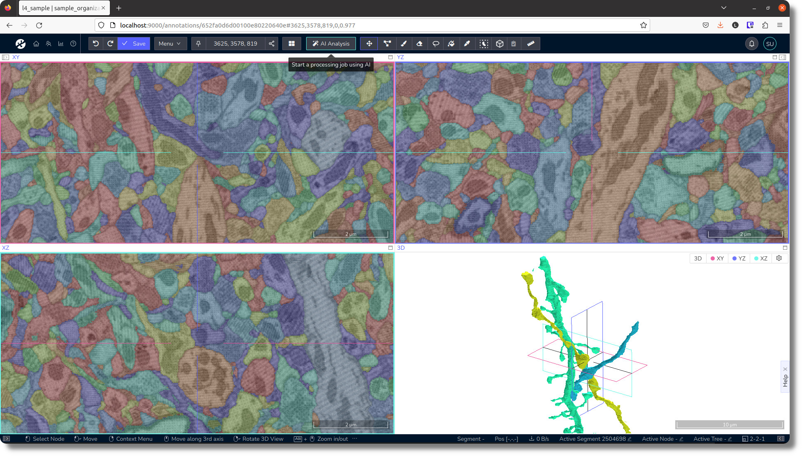
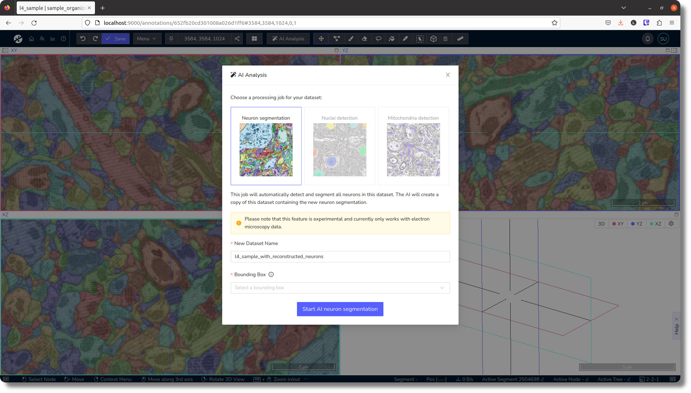
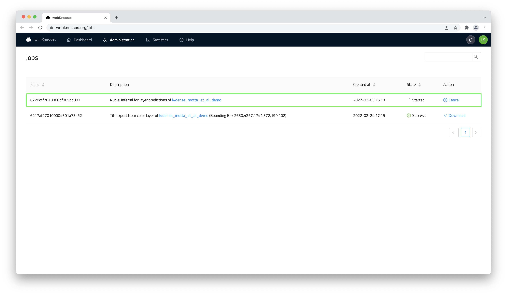

# AI Segmentation

While WEBKNOSSOS is great for manual annotation, some datasets are either too big to do by hand or you need results quicker. WEBKNOSSOS contains early access to automated analysis using machine learning classifiers for dataset segmentations. The WEBKNOSSOS developer team has many years of experience with training AI models for large-scale data analysis outside of WEBKNOSSOS. We aim to bring some of this know-how directly into WEBKNOSSOS itself.

The automated analysis features are designed to provide a general solution to a wide range of (EM) datasets. Since datasets differ in staining protocols, imaging modalities, imaging resolution & fidelity, your results may vary. [Please contact us](mailto:hello@webknossos.org) for customized, fine-tuned solutions for your dataset. 

We plan to add more automated analysis features in the future. If you want to work with us on an automated analysis project, [please contact us](mailto:hello@webknossos.org). 
We would love to integrate analysis solutions for more modalities and use cases.

!!!info
    Automated analysis is only available on [webknossos.org](https://webknossos.org) at the moment. 
    If you want to set up on-premise automated analysis at your institute/workplace, then [please contact sales](mailto:sales@webknossos.org). 

## Neuron Segmentation
As a first trial, WEBKNOSSOS includes neuron segmentation. This analysis is designed to work with serial block-face electron microscopy (SBEM) data of neural tissue (brain/cortex) and will segment all neurons within the dataset.

You can launch the AI analysis dialog using the `AI Analysis` button in the toolbar at the top. Use the `Start AI neuron segmentation` button in the dialog to start the analysis.

Computation time for this analysis depends directly on the size of your dataset. 
Expect a few hours for medium-sized volumetric EM datasets. 
The finished analysis will be available as a new dataset from your dashboard. You can monitor the status and progress of the analysis job from the [`Processing Jobs` page](./jobs.md) or wait for the email notification.

## Mitochondria detection
Similarly to the neuron segmentation, you can now start a mitochondria detection in WEBKNOSSOS. In the AI analysis dialog, choose `Mitochondria detection`, select a bounding box, and go to `Processing Jobs` to look at the result. 

## Custom Analysis
You'll soon be able to train custom classifiers directly in WEBKNOSSOS. [Contact us](mailto:hello@webknossos.org) for an invite to join the beta program.

If you are interested in specialized, automated analysis, image segmentation, object detection etc. then feel free to [contact us](mailto:hello@webknossos.org). The WEBKNOSSOS development teams offers [commercial analysis services](https://webknossos.org/services/automated-segmentation) for that. 

