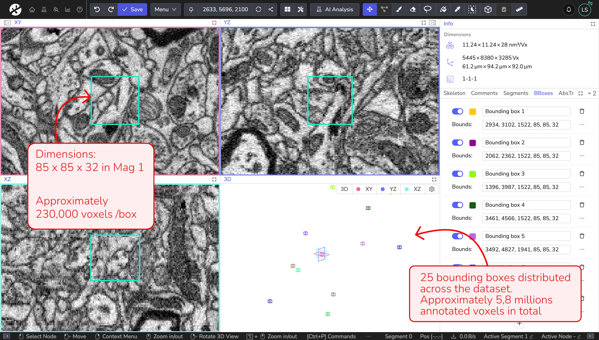
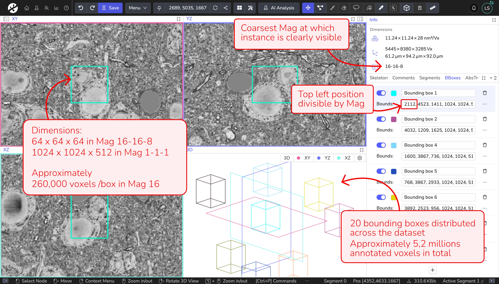

# Choosing Magnification and Bounding Boxes for Custom AI Training in WEBKNOSSOS

This guide explains how to choose the right magnification for training and how to define bounding boxes for ground truth annotation. 
The checklist below summarizes the key requirements. 
Part 1 covers magnification selection, Part 2 explains how to define bounding box dimensions, and Part 3 presents two example use cases.

## Checklist: key requirements

- Use the coarsest magnification that still allows accurate annotation
- Ensure box sizes are defined relative to magnification
- Use ≥ 230,000 voxels per box
- Respect the hard minimum dimensions: 85x85x32 for neuron training and 32x32x32 for instance segmentation (recommendation: 64x64x64). Use multiple of these values if larger boxes.
- Ensure box position and size are divisible by magnification
- Prefer many well-distributed boxes over a few large ones
- Total volume recommended for training: 5–10 million voxels

## Part 1: Choosing the Right Magnification

**Choose the coarsest magnification at which you can still annotate with the required accuracy**. All features needed for the task must remain clearly recognizable. Using a finer magnification than necessary usually increases annotation effort and computational cost without improving results.

Training at a coarser magnification has two important effects:

- The model sees **more spatial context**, which typically improves learning.
- The model output is produced **only at the magnification used for training**.

### Practical guidance

- **Neuron segmentation:** Our experience has shown that computing a neuron segmentation for a dataset in a voxel size finer than **8 nm/vx** usually doesn’t offer any benefits. Consider switching to the next-coarse magnification instead to benefit from increased data context.
- **Instance segmentation / object detection:** The optimal magnification depends on the objects of interest. Choose the coarsest magnification at which object boundaries and distinguishing features are still clearly visible.

## Part 2: Defining Bounding Boxes for Ground Truth Generation

There are several constraints on bounding box dimensions to ensure that enough data is annotated and used as efficiently as possible. In this section, we list these constraints and then describe two example use cases.

### Constraints for Bounding Box Dimensions

Bounding box dimensions are always interpreted **relative to the chosen magnification**. Internally, the model effectively sees the box size divided by the magnification.

We recommend that each bounding box contains at least **230,000 voxels** at the chosen magnification. There are hard minimum dimensions for bounding boxes. To use the annotated data efficiently, bounding box dimensions should ideally be integer multiples of these minimum values. This means that:

- For neuron segmentation, the hard minimum bounding box dimensions are **`85 × 85 × 30`**, corresponding to approximately **230,000 voxels** at the chosen magnification.
- For instance segmentation, the hard minimum dimensions are **`32 × 32 × 32`** (approximately **33,000 voxels**). This is not sufficient, so we recommend using at least **`64 × 64 × 64`** or **`96 x 96 x 32`** to reach approximately **260,000 voxels** at the chosen magnification.

Bounding box dimensions may vary and should ideally be integer multiples of the minimum values, but the training will also work as long as the boxes exceed the minimum size. The scaling factor does not need to be the same for all three dimensions.

In addition, the position of the top-left corner of each bounding box must be divisible by the chosen magnification.

The recommended total annotated ground truth volume for training (both neuron and instance segmentation) is **5–10 million voxels** at the chosen magnification. A smaller volume may be sufficient for small or very homogeneous datasets.

When distributing this total annotated volume of 5–10 million voxels, **many smaller, well-distributed boxes are preferable to a few large contiguous ones**. For example, ten spatially distributed boxes of size **85 × 85 × 32** voxels usually yield better results than a single larger volume of **170 × 425 × 32** voxels, as they capture more variability in the data.

### Part 3: Example Use Cases

**Neuron training: dense neuron segmentation**

In this example, we create ground truth data to train an EM neuron segmentation model. For this dataset, we work at **magnification 1** to resolve neuronal structures clearly. We use bounding boxes of size **85 × 85 × 32** voxels, which corresponds to approximately **230,000 voxels per box**. Annotating **25 boxes** results in a total annotated volume of approximately **5.8 million voxels**.

**Instance segmentation training: detecting nuclei**

In this example, we create ground truth data to train an instance segmentation model for nuclei detection. Nuclei are clearly visible and can be reliably annotated at **magnification 16–16–8**. We use bounding boxes of size **64 × 64 × 64** voxels (the recommended size for instance segmentation) at this magnification. This corresponds to **1024 × 1024 × 512** voxels at magnification 1: size that needs to be defined in WEBKNOSSOS. Each box therefore contains approximately **260,000 voxels** at magnification 16. 

To reach the recommended total annotated volume of 5–10 million voxels, we annotate **20 boxes** distributed across the dataset, resulting in approximately **5.2 million annotated voxels** in total. The top-left position of each bounding box is divisible by 16. 

