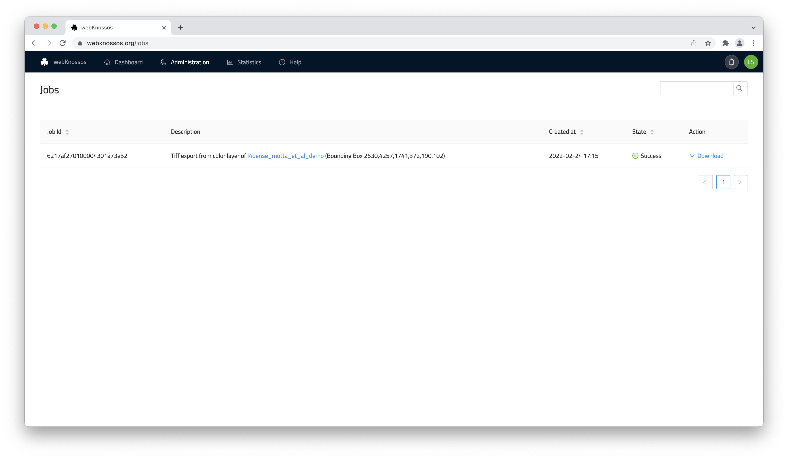

# Jobs

webknossos.org includes several compute-intensive and automated workflows that are processed in the background. Depending on the operation and dataset size, these workflows may take some time (from minutes to hours) to finish. 

WEBKNOSSOS will notify you via email upon completion or failure of any job.

Example workflows:

- [AI segmentation](./ai_segmentation.md), e.g., nuclei inferral 
- [converting datasets on upload](../data/upload_ui.md)
- [mesh file (pre)-computation](../meshes/precomputed_meshes.md)
- [applying a merger mode annotation](../proofreading/merger_mode.md)
- automatic inference of a segmentation layer's large segment ID
- [dataset & annotation export as Tiff files](../data/export_ui.md)
- [creating engaging animations of datasets](./animations.md)
- downsampling volume annotations

These workflows are executed in background worker tasks as so-called *processing jobs*. 

!!! info
    These workflows are exclusive to webknossos.org. Contact [sales](mailto:sales@webknossos.org) for access to the WEBKNOSSOS worker or [Voxelytics](https://voxelytics.com) for the job processing.

## Listing Processing Jobs
A list of all past and currently running jobs can be found in the administration menu in the navbar (Administration -> *Processing Jobs*).

Depending on the job workflow you may:

- view the resulting resource, e.g., a new segmentation 
- download the data, e.g., [Tiff export](../data/export_ui.md)

We constantly monitor job executions. In rare cases, jobs can fail, and we aim to re-run them as quickly as possible. In case you run into any trouble please [contact us](mailto:hello@webknossos.org).
