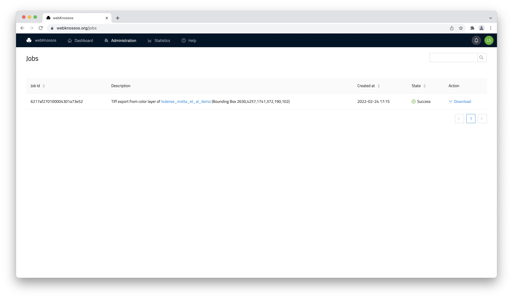

# Jobs

webknossos.org includes several compute-intensive and automated workflows that are processed in the background. Depending on the operation and dataset size, these workflows may take some time (from minutes to hours) to finish. 

WEBKNOSSOS will notify you via email upon completion or failure of any job.

Example workflows:

- [AI segmentation](./ai_segmentation.md), e.g. running AI model for nuclei segmentation and mitochondria detection  
- [converting datasets on upload](../data/upload_ui.md)
- [mesh file (pre)-computation](../meshes/loading_meshes.md)
- [applying a merger mode annotation](../proofreading/merger_mode.md)
- automatic inference of a segmentation layer's large segment ID
- [dataset & annotation export as Tiff files](../data/export_ui.md)
- [creating engaging animations of datasets](./animations.md)
- downsampling volume annotations

These workflows are executed in background worker tasks as so-called *processing jobs*. 

!!! info
    These workflows are exclusive to webknossos.org. Contact [sales](mailto:sales@webknossos.org) for access to the WEBKNOSSOS worker or [Voxelytics](https://voxelytics.com) for the job processing.

## Listing Processing Jobs
A list of all past and currently running jobs can be found in the analysis menu in the navbar (Analysis -> *Processing Jobs*).

Depending on the job workflow you may:

- view the resulting resource, e.g., a new segmentation 
- download the data, e.g., [Tiff export](../data/export_ui.md)

/// caption
Overview of the Jobs page
///

We constantly monitor job executions. In rare cases, jobs can fail, and we aim to re-run them as quickly as possible. In case you run into any trouble, please [contact us](mailto:support@webknossos.org).

## Credits

Compute-intensive AI jobs — [AI segmentation/inference](./ai_segmentation.md), [AI model training](./ai_training.md), and [alignment](./alignment.md) — are paid for with WEBKNOSSOS credits. The cost of a job depends on the size of the processed data (and the job type), so it scales with the bounding box and magnification you select.

- **Estimating the cost:** Each AI job dialog includes a `Credit Information` step that shows your organization's available credits and the estimated cost for the configured job *before* you start it. We recommend a test run on a small bounding box first.
- **Free monthly credits:** Every organization receives a free credit allotment each month to trial AI jobs. Unused credits expire at the end of the month.
- **Checking your balance and history:** Your current balance is shown as `AI Credits` on the `Organization` page. The `Credit Activity` page (under your organization settings) lists all credit purchases, spending, and refunds for your organization. (Admin users only)
- **Refunds:** If a job fails, the credits it consumed are refunded automatically.
- **Buying more credits:** Only the organization owner can purchase additional credits. To buy more, [contact us](mailto:sales@webknossos.org).