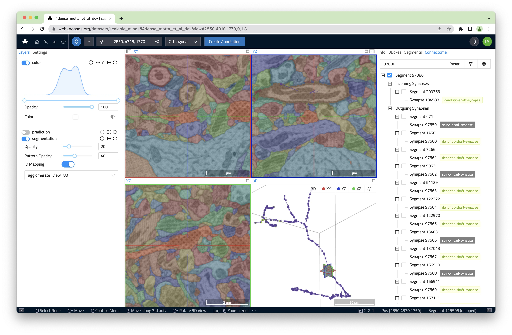

# Synapse and Connectome Viewer

While WEBKNOSSOS works great for many different imaging environments, the Synapse and Connectome Viewer is designed in particular for Neuroscientists. The Synapse and Connectome viewer offers a way of listing all incoming and outgoing synapses for a given segment/cell in a neuron segmentation for exploration and analysis. 

Synapse locations, types, and partners have to be pre-computed outside of WEBKNOSSOS, e.g. with [Voxelytics](https://voxelytics.com). WEBKNOSSOS can load the resulting synaptic connectivity maps, often called Connectome, and offer deeper insights into your dataset.

## Features

- Visualization of all synapse locations for a given segment
- Visualization of the agglomerate skeleton for a given segment
- Display of metadata information such as synapse types (e.g., "dendritic shaft", "spine head", "soma"-synapse, etc.)
- Filtering by synapse type or direction 



## Getting started with the Synapse & Connectome Viewer

The viewer is available from the `Connectome` tab in the right-hand side panel. If your dataset is prepared with a matching connectome file (see below), you can look up the synapses for any segment.

Use the input field at the top of the Connectome Viewer to enter one or several segment IDs. Alternatively, right-click on any segment in the XYZ viewports and select 'Import Agglomerate and Synapses'.

Several segments/cells can be loaded at the same time to highlight their matching synaptic partners.

In addition to loading the synapse locations and visualizing them as nodes, WEBKNOSSOS will also load the agglomerate skeleton representation of the selected segment(s) for context.

## Configuration
For WEBKNOSSOS to detect and load your Connectome file, you need to place it into a `connectome` subdirectory for a respective segmentation layer, e.g.:

```
my_dataset                          # Dataset root
├─ segmentation                     # Dataset layer name (e.g., color, segmentation)
│  ├─ connectome                    # Parent directory for connectome files
│  │  ├─ my_connectome.hdf5         # one or more connectome files
│  │  ├─ different_connectome.hdf5  # one agglomerate file per mapping
```


## Connectome File Format
The connectome file format is under active development and experiences frequent changes. [Please reach out to us for the latest file format spec and configuration help](mailto://hello@webknossos.org).
