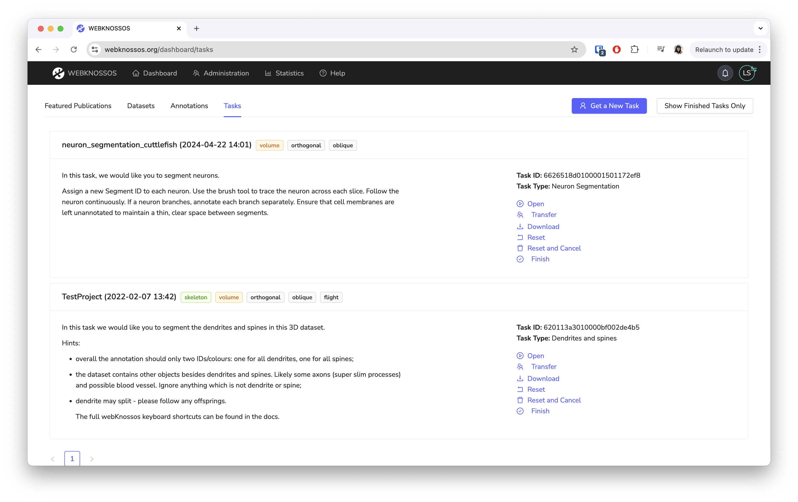
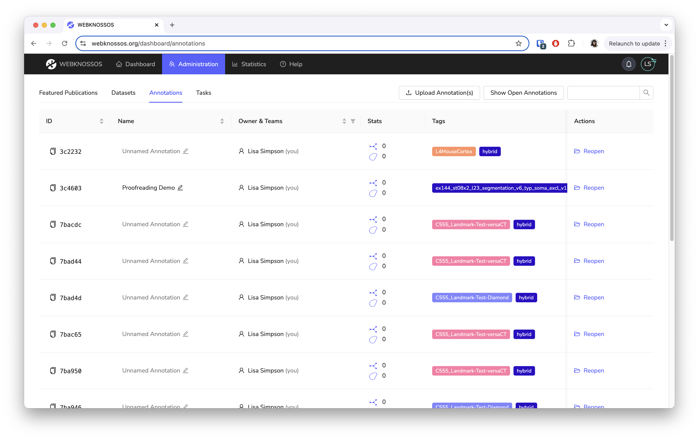

# Dashboard

The Dashboard is the entry point to webKnossos.
You can manage your datasets, create annotations, resume existing annotations and manage active tasks.

## My Datasets
This screen shows all the available and accessible datasets for a user.
The presentation differs corresponding to the user role.
Normal users can start or continue annotations and work on tasks.
[Admins and Team Managers](./users.md#access-rights-roles) also have access to dedicated administration screens and advanced dataset properties.

You can **view** the dataset, or create a new **skeleton** or **volume** annotations from this screen.
Search for your dataset by using the search bar or by sorting any of the table columns.
Learn more about managing datasets in the [Datasets guide](./datasets.md).

## My Tasks

With Tasks, you can coordinate large annotation projects with your users.
Tasks are small assignments that are automatically distributed to users.

On the Task screen, users can request new tasks, continue to work on existing tasks and finish tasks.
These tasks will be assigned based on the user's experience levels, project priority, and task availability.
Read more about the tasks feature in the [Tasks and Projects guide](./tasks.md).

## My Annotations (Explorative)
Explorative Annotations are all skeleton or volume annotations that do not belong to a task.
They are created by starting new annotations from the datasets screen or by uploading [NML files](./data_formats.md#nml).

In this screen, the annotations can be resumed, archived and downloaded.
You can also add custom tags to annotations in order to organize them.

## Shared Annotations
This screen shows all skeleton or volume annotations that were shared with one of your teams.
You can directly view the linked annotations and copy them to your account.

Read more about sharing your own annotations in the [Sharing guide](./sharing.md#annotation-sharing).

## Featured Publications

This screen is the same gallery that is used on the public webKnossos screen.
Here, it also includes non-public datasets.
See a [live Dataset Gallery](https://demo.webknossos.org).
