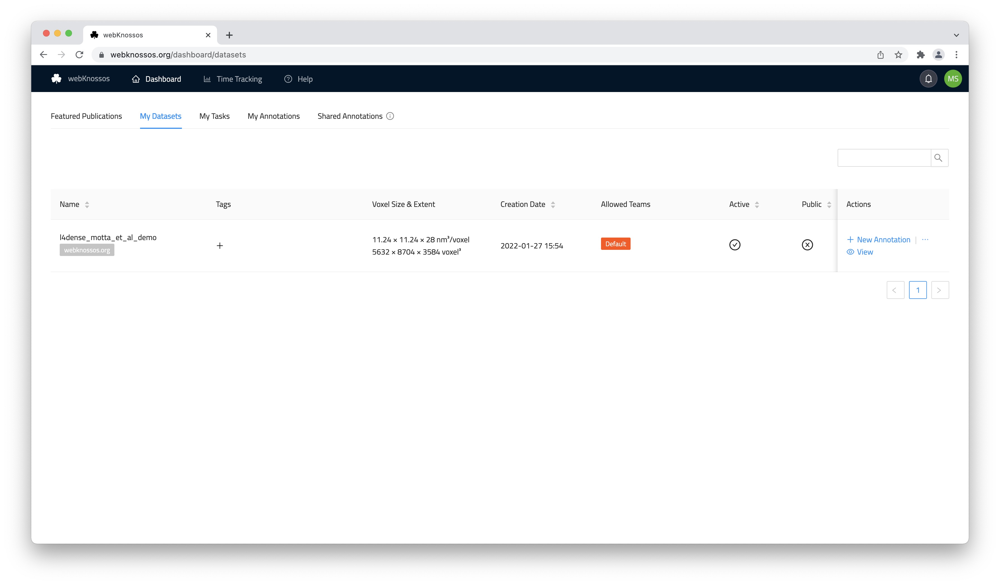
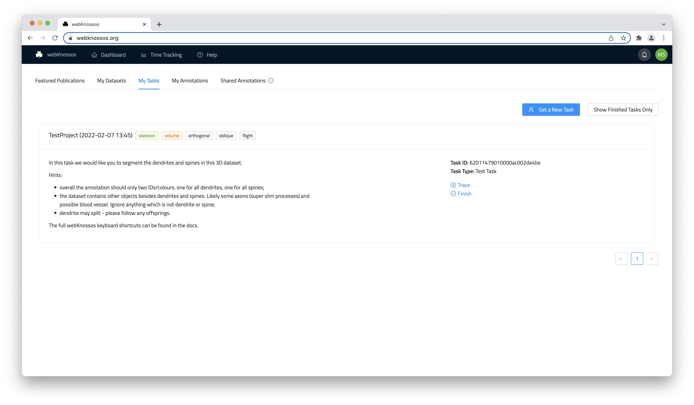

# Dashboard

Welcome to WEBKNOSSOS! 
The Dashboard lets you do the following things: manage your datasets, create new annotations, continue working on existing annotations, and get tasks assigned to you.

## Datasets

On this screen, you can see all the datasets that you can access. 
You can either _view_ a dataset without making any changes, or start a new annotation on it.
Search for your dataset by using the search bar or sorting any of the table columns.
Learn more about managing datasets in the [Datasets guide](./datasets.md).

What you can do on this screen depends on your user role. 
If you are a regular user, you can only create or resume annotations and work on tasks. 
If you are [an Admin, a Dataset Manager or a Team Manager](./users.md#access-rights-roles), you can also perform administrative actions, manage access rights, and change dataset settings.

Read more about the organization of datasets [here](./datasets.md#dataset-organization).

## Tasks

With Tasks, you can coordinate large annotation projects with your users.
Tasks are small annotation work assignments that are automatically distributed to users. This is particularly useful when you have several users in your organization that you can distribute the work to, e.g., working students, scientific assistances, outside collaborators, etc.

On the Task screen, users can request new tasks, continue to work on existing tasks, and finish tasks. These tasks are assigned based on a user's experience level, project priority, and task availability.
Read more about the tasks feature in the [Tasks and Projects guide](./tasks.md).

## Annotations

This screen lists all your annotations (skeleton, volume or both) that you started on a dataset (outside of tasks) and annotations that were shared with you. Annotations are either created by starting new annotations from the "Datasets" tab, from the WEBKNOSSOS data viewer, or by uploading an existing annotation from your computer (see [NML files](./data_formats.md#nml) for skeleton annotations).

Annotations can be resumed, archived (like delete, but reversible), and downloaded for offline analysis.
You can also add custom tags to annotations to organize and group them. Click on one or multiple of your tags if you want to filter a particular group of annotations.
Each annotation can be renamed to reflect its content.

### Sharing Annotations

The annotations tab also shows all annotations that were shared by other collaborators of your organization. Only annotations shared through the "Team Sharing" mechanic will be listed provided your user account is part of the respective team. Read more about sharing your own annotations in the [Sharing guide](./sharing.md#annotation-sharing).

You can view the linked annotations (read-only) or copy them to your account for modification.

## Featured Publications

This screen lists a number of featured public community datasets and their respective publications hosted by the WEBKNOSSOS team. Feel free to explore these datasets or to build upon them.

[Contact us](mailto:hello@webknossos.org) if you would like your data and publication to be featured here as well.

