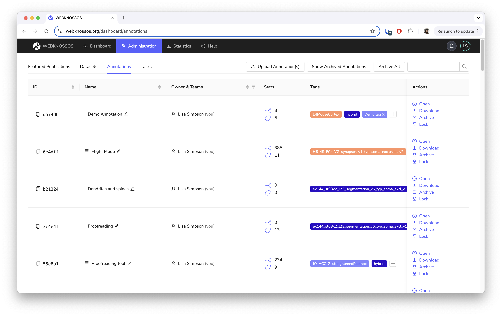

# Dashboard

The Dashboard is the entry point to webKnossos.
You can manage your datasets, create annotations, resume existing annotations and manage active tasks.

## Datasets
This screen shows all the available and accessible datasets for a user.
The presentation differs corresponding to the user role.
Normal users can start or continue annotations and work on tasks.
[Admins and Team Managers](./users.md#access-rights-roles) also have access to dedicated administration screens and advanced dataset options.

## Tasks
On the Task screen, users can request new tasks, continue to work on existing tasks and finish tasks.
Tasks are pieces of work that are automatically distributed to users.
These tasks will be assigned based on the user's experience levels, project priority and task availability. Read more about the tasks feature in the (Tasks and Projects guide](./tasks.md).

## Explorative Annotations

## Dataset Gallery

This screen is the same gallery that is used on the public webKnossos screen.
Here, it also includes non-public datasets.

<!--
- what are explorative tracings
- archiving

- dataset management
-> see chapter 
-->
