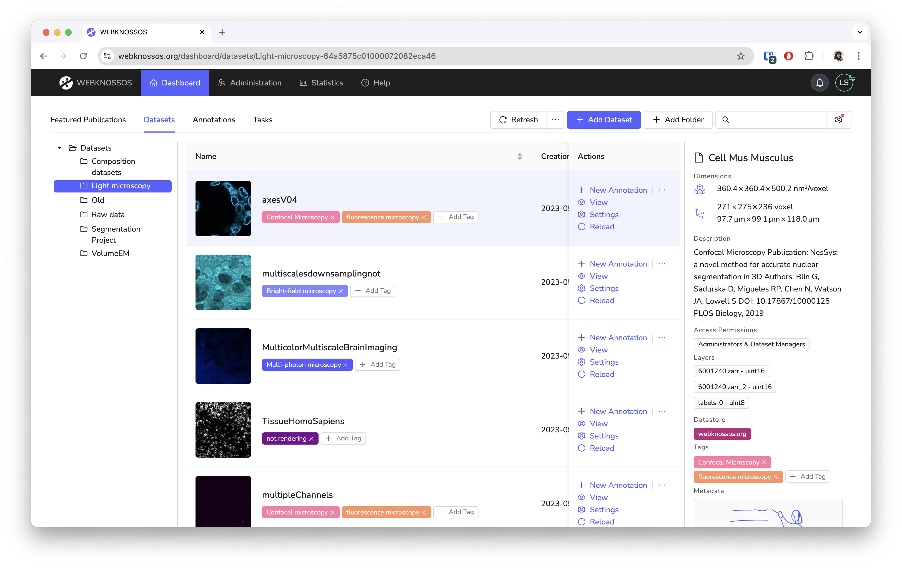

# Datasets Dashboard

On this screen, you can see all the datasets that you can access. 
You can either _view_ a dataset without making any changes, or start a new annotation on it.
Search for your dataset by using the search bar or sorting any of the table columns.
Learn more about managing datasets in the [Datasets guide](../datasets/index.md).

What you can do on this screen depends on your user role. 
If you are a regular user, you can only create or resume annotations and work on tasks. 
If you are [an Admin, a Dataset Manager or a Team Manager](../users/access_rights.md), you can also perform administrative actions, manage access rights, and change dataset settings.

Read more about the organization of datasets [here](../datasets/organization.md).

