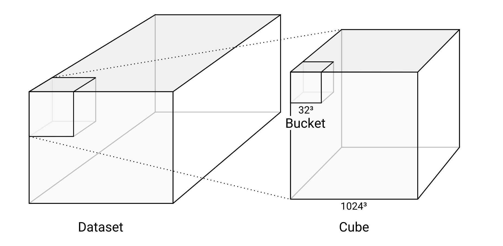
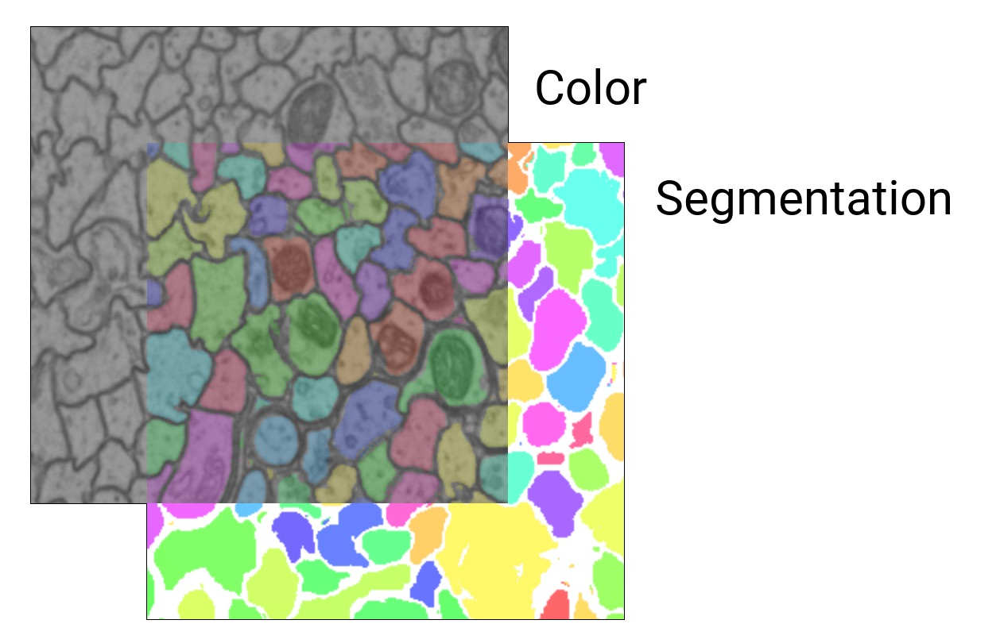
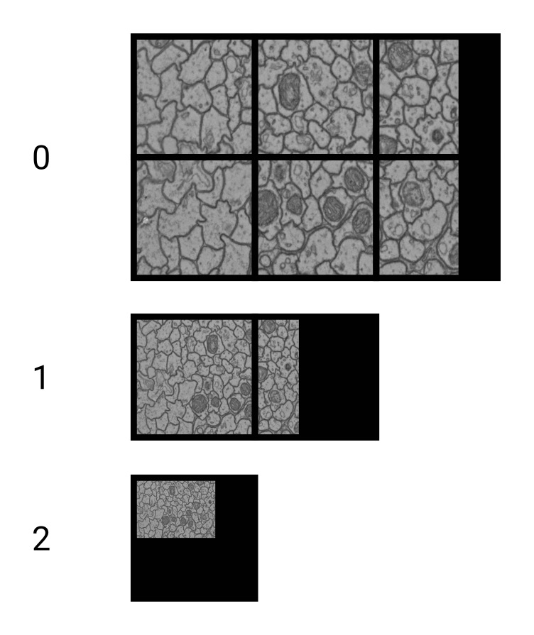

# High-Level Concepts

## Datasets, Cubes, and Buckets

A *dataset* consists of [one or more layers](#layers).
Since WEBKNOSSOS deals with 3D imagery, the data is organized in *cubes*.
WKW cubes are 1024^3 voxels in size by default and each cube is stored as one file on disk.
Each cube contains multiple *buckets* of 32^3 voxel size.
This is the unit in which the data is streamed to a user's browser.



## Layers

A dataset consists of one or more layers.

For microscopy/CT/MRI data, there is usually a `color` layer that holds the raw grayscale image data.
Additionally, there may be one or more `segmentation` layers that hold manually or automatically generated volume annotations (one ID per voxel).

A WEBKNOSSOS dataset can contain several `color` and `segmentation` layers which can be rendered individually or overlaid on top of each other. The maximum number of visible layers depends on your GPU hardware - typically 16 layers.



## Magnification Steps and Downsampling

To enable zooming within huge datasets in WEBKNOSSOS, dataset layers usually contain multiple magnification steps (also called mags, mipmaps or resolutions).
`1` is the magnification step with the finest resolution, i.e. the original data.
`2` is downsampled by a factor of two in all dimensions and therefore only is an eighth of the file size of the original data.
Downsampling is done in power-of-two steps: `1, 2, 4, 8, 16, 32, 64, …`

WEBKNOSSOS also supports non-uniform (anisotropic) downsampling. For example, `[2, 2, 1]` is downsampled in the `x` and `y` dimensions, but not in `z`.




## Segmentation

Segmentations in WEBKNOSSOS are represented by ID maps.
Every segment or component has its own ID.
These IDs are stored as the value of the corresponding voxel, just as the grayscale value in the voxels of the color layer.
`0` is usually interpreted as a missing or empty value.
The underlying data type limits the maximum number of IDs:

| Data Type | Maximum ID                 |
| --------- | -------------------------- |
| `uint8`   | 255                        |
| `uint16`  | 65,535                     |
| `uint32`  | 4,294,967,295              |
| `uint64`  | 18,446,744,073,709,551,615 |


## Dataset Metadata
For each dataset, we store metadata in a `datasource-properties.json` file.
See below for the [full specification](#dataset-metadata-specification).
This is an example:

```json
{
  "id" : {
    "name" : "great_dataset",
    "team" : "<unknown>"
  },
  "dataLayers" : [ {
    "name" : "color",
    "category" : "color",
    "boundingBox" : {
      "topLeft" : [ 0, 0, 0 ],
      "width" : 1024,
      "height" : 1024,
      "depth" : 1024
    },
    "mags" : [
        { "mag": [1, 1, 1], "path": "my_team/great_dataset/color/1" },
        { "mag": [2, 2, 1], "path": "my_team/great_dataset/color/2" },
        { "mag": [4, 4, 1], "path": "my_team/great_dataset/color/4" },
        { "mag": [8, 8, 1], "path": "my_team/great_dataset/color/8" },
        { "mag": [16, 16, 2], "path": "my_team/great_dataset/color/16" }
      ],
    "elementClass" : "uint8",
    "dataFormat" : "wkw"
  }, {
    "name" : "segmentation",
    "boundingBox" : {
      "topLeft" : [ 0, 0, 0 ],
      "width" : 1024,
      "height" : 1024,
      "depth" : 1024
    },
    "mags" : [
      { "mag" : [1, 1, 1], "path": "my_team/great_dataset/segmentation/1" },
      { "mag" : [2, 2, 1], "path": "my_team/great_dataset/segmentation/2" }
    ],
    "cubeLength": 1024,
    "elementClass" : "uint32",
    "largestSegmentId" : 1000000000,
    "category" : "segmentation",
    "dataFormat" : "wkw"
  } ],
  "scale" : [ 11.24, 11.24, 28 ]
}
```

Note that the `mag` property within the elements of `mags` is always an array of length 3, denoting the scaling factor for x, y, and z. The `path` property specifies the location of the data for each magnification step.
The term "magnifications" is used synonymously for mags throughout the UI.
At the moment, WebKnossos guarantees correct rendering of data with non-uniform mag factors only if the z-component between two mags changes by a factor of 1 or 2.

Most users do not create these metadata files manually.
When using the [WEBKNOSSOS CLI](https://docs.webknossos.org/cli), a metadata file is automatically generated. Alternatively, you can create and edit WEBKNOSSOS datasets using the [WEBKNOSSOS Python library](https://github.com/scalableminds/webknossos-libs/).
During the data import process, WEBKNOSSOS will ask for the necessary properties.

[See below for the full specification](#dataset-metadata-specification).

### Dataset Metadata Specification
WEBKNOSSOS requires several metadata properties for each dataset to properly display it. We refer to this as a WEBKNOSSOS `datasource`, in reference to the `datasource-properties.json` file for local datasets.

- `id`: This section contains information about the name and corresponding team of the dataset. However, this information is not used by WEBKNOSSOS because it will be replaced by more accurate runtime information.
  + `id.name`: Name of the dataset. Just for reference purposes. Will be inferred/overwritten by the folder name.
  + `id.team`: Team to which this dataset belongs. Just for reference purposes. Will be inferred/overwritten by WEBKNOSSOS.

- `dataLayers`: This array contains information about the layers of the dataset.
  + `dataLayers.name`: Name of the layer. Can be an arbitrary string, but needs to correspond to the folder in the file system. Needs to be unique within the dataset. Usually is either `color`, `segmentation` or `color_0`.
  + `dataLayers.category`: Either `color` for raw data or `segmentation` for segmentation layers.
  + `dataLayers.boundingBox`: The position and size of the data that is contained in this layer. `topLeft` holds the `min_x,min_y,min_z` position, `width` is `max_x - min_x`, `height` is `max_y - min_y` and `depth` is `max_z - min_z`.

  + `dataLayers.mags`: Holds information about the available magnification steps of the layer.
    * `dataLayers.mags.mag`: A 3-tuple (e.g., `[1, 1, 1]`, `[2, 2, 1]`) for uniform or non-uniform magnifications.
    * `dataLayers.mags.path`: The path to the directory containing the data for this magnification step.

  + `dataLayers.elementClass`: The underlying datatype of the layer, e.g., `uint8`, `uint16`, `uint24` (rgb), `uint32`, `uint64`, `float` (32-bit) or `double` (64-bit).
  + `dataLayers.largestSegmentId`: The highest ID that is currently used in the respective segmentation layer. This is required for volume annotations where new objects with incrementing IDs are created. Only applies to segmentation layers.
  + `dataLayers.dataFormat`: Should be `wkw`.

## NML Files
When working with skeleton annotation data, WEBKNOSSOS uses the NML format.
It can be downloaded and uploaded to WEBKNOSSOS. Advanced users integrate the skeleton data (e.g. nodes positions to mark objects or tree groups to cluster cells) as part of their analysis workflow and custom scripting.
NML is an XML-based, human-readable file format.
See the following example for reference:

```xml
<things>
  <parameters>
    <experiment name="great_dataset" />
    <scale x="11.24" y="11.24" z="25.0" />
    <offset x="0" y="0" z="0" />
    <time ms="1534787309180" />
    <editPosition x="1024" y="1024" z="512" />
    <editRotation xRot="0.0" yRot="0.0" zRot="0.0" />
    <zoomLevel zoom="1.0" />
  </parameters>
  <thing id="1" groupId="2" color.r="0.0" color.g="0.0" color.b="1.0" color.a="1.0" name="explorative_2018-08-20_Example">
    <nodes>
      <node id="1" radius="120.0" x="1475" y="987" z="512" rotX="0.0" rotY="0.0" rotZ="0.0" inVp="0" inMag="0" bitDepth="8" interpolation="false" time="1534787309180" />
      <node id="2" radius="120.0" x="1548" y="1008" z="512" rotX="0.0" rotY="0.0" rotZ="0.0" inVp="0" inMag="0" bitDepth="8" interpolation="false" time="1534787309180" />
    </nodes>
    <edges>
      <edge source="1" target="2" />
    </edges>
  </thing>
  <branchpoints>
    <branchpoint id="1" time="1534787309180" />
  </branchpoints>
  <comments>
    <comment node="2" content="This is a really interesting node" />
  </comments>
  <groups>
    <group id="1" name="Axon 1">
        <group id="2" name="Foo" />
    </group>
  </groups>
</things>

```

Each NML contains some metadata about the annotation inside the `<parameters>`-tag. 
An example of important metadata is the dataset name inside the `<experiment>`-tag and the scale of the dataset saved in the `<scale>`-tag.
Each skeleton tree has its own `<thing>`-tag containing a list of its nodes and edges.
All comments of the skeleton annotation are saved in a separate list and refer to their corresponding nodes by id.
The structure of the tree groups is listed inside the `<groups>`-tag. 
Groups can be freely nested inside each other.


## ID Mapping Files

WEBKNOSSOS supports [dynamic, on-demand re-mapping of the segmentation IDs](../proofreading/segmentation_mappings.md), allowing you to quickly toggle between different agglomeration strategies for a segmentation layer. These mapping files, also known as agglomerate files, need to be pre-computed and put into the correct (sub)-directory inside a segmentation layer for WEBKNOSSOS to identify and read them (self-hosted instance only).

WEBKNOSSOS expects hdf5 agglomerate files in the `agglomerates` directory of the segmentation layer.

E.g.:
```
my_dataset                      # Dataset root
├─ segmentation                 # Dataset layer name (e.g., color, segmentation)
│  ├─ agglomerates         # parent directory for all mappings
│  │  ├─ my_mapping_file.hdf5   # one or more mapping files
│  │  ├─ different_mapping.hdf5 # one mapping file per pre-computed mapping strategy
```

Note that JSON mappings are deprecated and support will be removed in a future version.
