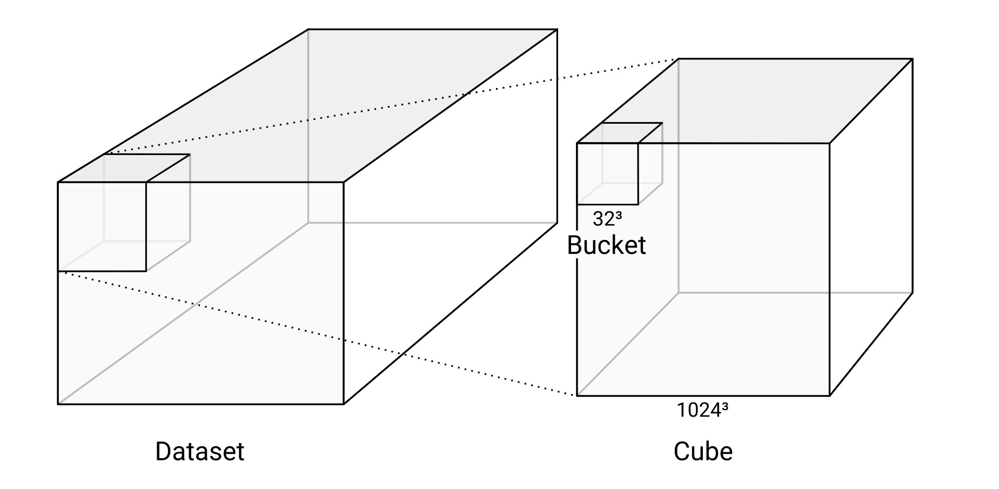
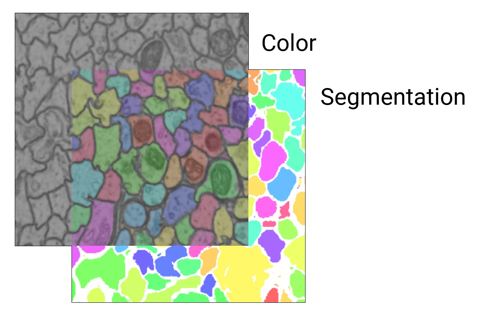
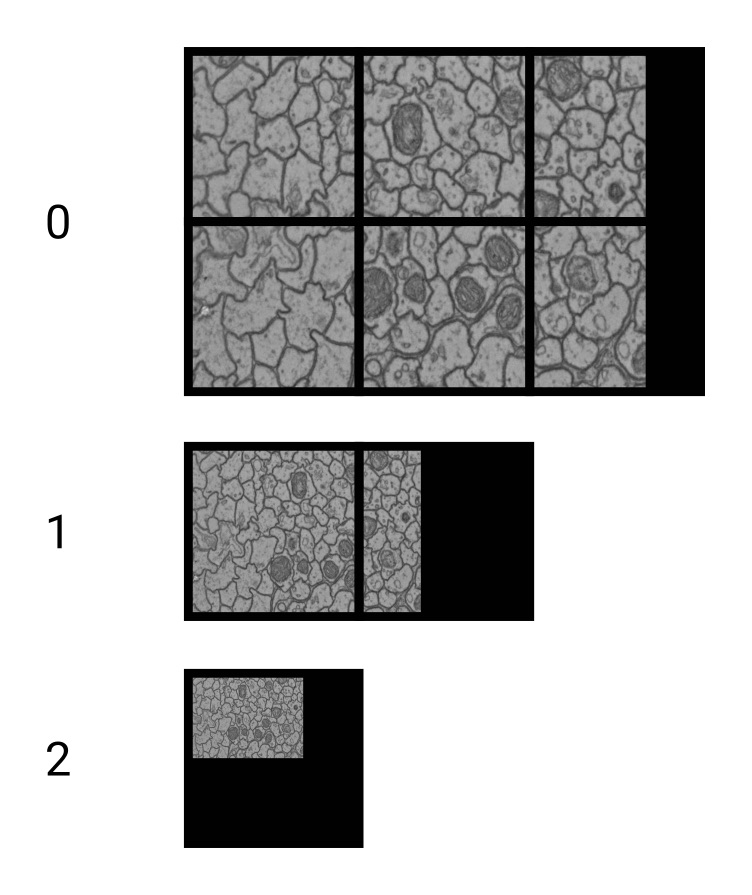

# High-Level Concepts

## Datasets, Cubes, and Buckets

A *dataset* consists of [one or more layers](#layers).
Since WEBKNOSSOS deals with 3D imagery, the data is organized in *cubes*.
WKW cubes are 1024^3 voxels in size by default and each cube is stored as one file on disk.
Each cube contains multiple *buckets* of 32^3 voxel size.
This is the unit in which the data is streamed to a user's browser.


/// caption
The relationship between datasets, cubes, and buckets.
///

## Layers

A dataset consists of one or more layers.

For microscopy/CT/MRI data, there is usually a `color` layer that holds the raw grayscale image data.
Additionally, there may be one or more `segmentation` layers that hold manually or automatically generated volume annotations (one ID per voxel).

A WEBKNOSSOS dataset can contain several `color` and `segmentation` layers which can be rendered individually or overlaid on top of each other. The maximum number of visible layers depends on your GPU hardware - typically 16 layers.


/// caption
Color layers contain the microscopy data and segmentation layers contain (volume) annotations or masks.
///

## Magnification Steps and Downsampling

To enable zooming within huge datasets in WEBKNOSSOS, dataset layers usually contain multiple magnification steps (also called mags, mipmaps or resolutions).
`1` is the magnification step with the finest resolution, i.e. the original data.
`2` is downsampled by a factor of two in all dimensions and therefore only is an eighth of the file size of the original data.
Downsampling is done in power-of-two steps: `1, 2, 4, 8, 16, 32, 64, …`

WEBKNOSSOS also supports non-uniform (anisotropic) downsampling. For example, `[2, 2, 1]` is downsampled in the `x` and `y` dimensions, but not in `z`.


/// caption
Downsampling the data to improve zooming
///


## Segmentation

Segmentations in WEBKNOSSOS are represented by ID maps.
Every segment or component has its own ID.
These IDs are stored as the value of the corresponding voxel, just as the grayscale value in the voxels of the color layer.
`0` is usually interpreted as a missing or empty value.
The underlying data type limits the maximum number of IDs:

| Data Type | Maximum ID                 |
| --------- | -------------------------- |
| `uint8`   | 255                        |
| `uint16`  | 65,535                     |
| `uint32`  | 4,294,967,295              |
| `uint64`  | 18,446,744,073,709,551,615 |


## Dataset Metadata
For each dataset, we store metadata in a `datasource-properties.json` file.
See below for the [full specification](#dataset-metadata-specification).
This is an example:

```json
{
  "id" : {
    "name" : "great_dataset",
    "team" : "<unknown>"
  },
  "dataLayers" : [ {
    "name" : "color",
    "category" : "color",
    "boundingBox" : {
      "topLeft" : [ 0, 0, 0 ],
      "width" : 1024,
      "height" : 1024,
      "depth" : 1024
    },
    "mags" : [
        { "mag": [1, 1, 1], "path": "my_team/great_dataset/color/1" },
        { "mag": [2, 2, 1], "path": "my_team/great_dataset/color/2" },
        { "mag": [4, 4, 1], "path": "my_team/great_dataset/color/4" },
        { "mag": [8, 8, 1], "path": "my_team/great_dataset/color/8" },
        { "mag": [16, 16, 2], "path": "my_team/great_dataset/color/16" }
      ],
    "elementClass" : "uint8",
    "dataFormat" : "wkw"
  }, {
    "name" : "segmentation",
    "category" : "segmentation",
    "boundingBox" : {
      "topLeft" : [ 0, 0, 0 ],
      "width" : 1024,
      "height" : 1024,
      "depth" : 1024
    },
    "mags" : [
      { "mag" : [1, 1, 1], "path": "my_team/great_dataset/segmentation/1" },
      { "mag" : [2, 2, 1], "path": "my_team/great_dataset/segmentation/2" }
    ],
    "elementClass" : "uint32",
    "largestSegmentId" : 1000000000,
    "dataFormat" : "wkw"
  } ],
  "scale" : { "factor": [ 11.24, 11.24, 28 ], "unit": "nanometer" }
}
```

Note that the `mag` property within the elements of `mags` is always an array of length 3, denoting the scaling factor for x, y, and z. The `path` property specifies the location of the data for each magnification step.
The term "magnifications" is used synonymously for mags throughout the UI.
At the moment, WEBKNOSSOS guarantees correct rendering of data with non-uniform mag factors only if the z-component between two mags changes by a factor of 1 or 2.

Most users do not create these metadata files manually.
When using the [WEBKNOSSOS CLI](https://docs.webknossos.org/cli/), a metadata file is automatically generated. Alternatively, you can create and edit WEBKNOSSOS datasets using the [WEBKNOSSOS Python library](https://github.com/scalableminds/webknossos-libs/).
During the data import process, WEBKNOSSOS will ask for the necessary properties.

[See below for the full specification](#dataset-metadata-specification).

### Dataset Metadata Specification
WEBKNOSSOS requires several metadata properties for each dataset to properly display it. We refer to this as a WEBKNOSSOS `datasource`, in reference to the `datasource-properties.json` file for local datasets.

- `id`: This section contains information about the name and corresponding team of the dataset. However, this information is not used by WEBKNOSSOS because it will be replaced by more accurate runtime information.
  + `id.name`: Name of the dataset. Just for reference purposes. Will be inferred/overwritten by the folder name.
  + `id.team`: Team to which this dataset belongs. Just for reference purposes. Will be inferred/overwritten by WEBKNOSSOS.

- `dataLayers`: This array contains information about the layers of the dataset.
  + `dataLayers.name`: Name of the layer. Can be an arbitrary string, but needs to correspond to the folder in the file system. Needs to be unique within the dataset. Usually is either `color`, `segmentation` or `color_0`.
  + `dataLayers.category`: Either `color` for raw data or `segmentation` for segmentation layers.
  + `dataLayers.boundingBox`: The position and size of the data that is contained in this layer. `topLeft` holds the `min_x,min_y,min_z` position, `width` is `max_x - min_x`, `height` is `max_y - min_y` and `depth` is `max_z - min_z`.

  + `dataLayers.mags`: Holds information about the available magnification steps of the layer.
    * `dataLayers.mags.mag`: A 3-tuple (e.g., `[1, 1, 1]`, `[2, 2, 1]`) for uniform or non-uniform magnifications.
    * `dataLayers.mags.path`: The path to the directory containing the data for this magnification step.

  + `dataLayers.elementClass`: The underlying datatype of the layer. Supported values: `uint8`, `uint16`, `uint24` (rgb), `uint32`, `uint64`, `int8`, `int16`, `int32`, `int64`, `float` (32-bit) or `double` (64-bit).
  + `dataLayers.dataFormat`: The storage format of the layer data. Supported values: `wkw`, `zarr`, `zarr3`, `n5`, `neuroglancerPrecomputed`.
  + `dataLayers.largestSegmentId`: The highest ID that is currently used in the respective segmentation layer. This is required for volume annotations where new objects with incrementing IDs are created. Only applies to segmentation layers.
  + `dataLayers.mappings` *(optional)*: A set of pre-computed agglomerate mapping names available for this segmentation layer. Only applies to segmentation layers.
  + `dataLayers.defaultViewConfiguration` *(optional)*: A key-value map of default rendering settings for this layer (e.g., color, opacity, intensity range). Overridden by `adminViewConfiguration`.
  + `dataLayers.coordinateTransformations` *(optional)*: An array of coordinate transformations to apply to this layer. Each transformation has:
    * `type`: Either `"affine"` or `"thin_plate_spline"`.
    * `matrix` *(for affine)*: A 4×4 row-major transformation matrix as a list of 4 lists of 4 doubles.
    * `correspondences` *(for thin_plate_spline)*: An object with `source` and `target` arrays of `[x, y, z]` control points.
  + `dataLayers.additionalAxes` *(optional)*: Defines additional coordinate axes beyond x, y, z for n-dimensional datasets. Each axis has:
    * `name`: A string identifier for the axis (e.g., `"t"` for time, `"c"` for channel).
    * `bounds`: A 2-element array `[lowerBound, upperBound]` where lower is inclusive and upper is exclusive.
    * `index`: An integer ordering index used for sorting.
  + `dataLayers.attachments` *(optional)*: Pre-computed attachment files associated with this layer. Each attachment has a `name`, `path`, `dataFormat` (`hdf5`, `json`, `zarr3`, or `neuroglancerPrecomputed`), and optional `credentialId`. Attachment collections:
    * `meshes`: Array of pre-computed mesh files.
    * `agglomerates`: Array of agglomerate mapping files (HDF5).
    * `segmentIndex` *(single)*: A segment index file for fast segment lookup.
    * `connectomes`: Array of connectome files.
    * `cumsum` *(single)*: A cumulative sum file used together with agglomerate mappings.

- `scale`: The real-world size of a single voxel at magnification 1. Can be specified as:
  + An object `{ "factor": [x, y, z], "unit": "<unit>" }` where `unit` is a physical length unit string (e.g., `"nanometer"`, `"micrometer"`, `"millimeter"`). Common SI prefixes from yoctometer to yottameter are supported, as well as `angstrom`, `inch`, `foot`, `yard`, `mile`, and `parsec`. Defaults to `"nanometer"`.
  + A plain array `[x, y, z]` (legacy format, interpreted as nanometers).

- `defaultViewConfiguration` *(optional)*: A key-value map of default rendering settings for the entire dataset (e.g., default position, zoom level).

## NML Files
When working with skeleton annotation data, WEBKNOSSOS uses the NML format.
It can be downloaded and uploaded to WEBKNOSSOS. Advanced users integrate the skeleton data (e.g. nodes positions to mark objects or tree groups to cluster cells) as part of their analysis workflow and custom scripting.
NML is an XML-based, human-readable file format.
See the following example for reference:

```xml
<things>
  <parameters>
    <experiment name="great_dataset" organization="my_org" datasetId="abc123" description="My annotation" wkUrl="https://webknossos.org" />
    <scale x="11.24" y="11.24" z="25.0" unit="nanometer" />
    <offset x="0" y="0" z="0" />
    <time ms="1534787309180" />
    <editPosition x="1024" y="1024" z="512" />
    <editRotation xRot="0.0" yRot="0.0" zRot="0.0" />
    <zoomLevel zoom="1.0" />
    <activeNode id="1" />
    <userBoundingBox id="1" name="My Box" isVisible="true" color.r="1.0" color.g="0.0" color.b="0.0" color.a="1.0"
      topLeftX="0" topLeftY="0" topLeftZ="0" width="512" height="512" depth="512" />
    <taskBoundingBox topLeftX="0" topLeftY="0" topLeftZ="0" width="512" height="512" depth="512" />
    <additionalAxes>
      <additionalAxis name="t" index="0" start="0" end="10" />
    </additionalAxes>
  </parameters>
  <thing id="1" groupId="2" color.r="0.0" color.g="0.0" color.b="1.0" color.a="1.0" name="explorative_2018-08-20_Example" isVisible="true">
    <nodes>
      <node id="1" radius="120.0" x="1475" y="987" z="512" rotX="0.0" rotY="0.0" rotZ="0.0" inVp="0" inMag="0" bitDepth="8" interpolation="false" time="1534787309180" />
      <node id="2" radius="120.0" x="1548" y="1008" z="512" rotX="0.0" rotY="0.0" rotZ="0.0" inVp="0" inMag="0" bitDepth="8" interpolation="false" time="1534787309180" />
    </nodes>
    <edges>
      <edge source="1" target="2" />
    </edges>
    <metadata>
      <metadataEntry key="comment" stringValue="interesting tree" />
    </metadata>
  </thing>
  <branchpoints>
    <branchpoint id="1" time="1534787309180" />
  </branchpoints>
  <comments>
    <comment node="2" content="This is a really interesting node" />
  </comments>
  <groups>
    <group id="1" name="Axon 1" isExpanded="true">
        <group id="2" name="Foo" isExpanded="false" />
    </group>
  </groups>
  <volume id="0" name="Volume Layer" location="data.zip" format="zip"
    fallbackLayer="segmentation" largestSegmentId="1000" mappingName="agglomerate_view" mappingIsLocked="false">
    <segments>
      <segment id="1" name="Cell 1" isVisible="true" created="1534787309180"
        anchorPositionX="1475" anchorPositionY="987" anchorPositionZ="512"
        color.r="1.0" color.g="0.0" color.b="0.0" color.a="1.0" groupId="1">
        <metadata>
          <metadataEntry key="score" numberValue="0.95" />
          <metadataEntry key="reviewed" boolValue="true" />
        </metadata>
      </segment>
    </segments>
    <groups>
      <group id="1" name="Group A" />
    </groups>
  </volume>
</things>

```

### NML Specification

#### `<parameters>` section

Holds global metadata for the annotation.

- `<experiment>`: Dataset reference and annotation context.
  + `name` *(required)*: The dataset name.
  + `organization` *(optional)*: The organization the dataset belongs to.
  + `datasetId` *(optional)*: Unique identifier of the dataset.
  + `description` *(optional)*: A free-text description of the annotation.
  + `wkUrl` *(optional)*: URL of the WEBKNOSSOS instance that created this annotation.

- `<scale>`: The real-world voxel size of the dataset.
  + `x`, `y`, `z`: Voxel size in the given unit.
  + `unit` *(optional)*: Physical unit string (e.g., `nanometer`). Defaults to `nanometer` if omitted.

- `<offset>`: A global offset applied to all node positions (usually `0, 0, 0`). Attributes: `x`, `y`, `z`.

- `<time>`: Creation timestamp. Attribute: `ms` (Unix timestamp in milliseconds).

- `<editPosition>`: The viewport position when the annotation was last saved.
  + `x`, `y`, `z`: Position in voxel coordinates.
  + `additionalCoordinate-<name>` *(optional, multiple)*: Position along each additional axis (e.g., `additionalCoordinate-t="3"`).

- `<editRotation>`: The viewport rotation when last saved. Attributes: `xRot`, `yRot`, `zRot`.

- `<zoomLevel>`: The zoom level when last saved. Attribute: `zoom`.

- `<activeNode>` *(optional)*: The node that was selected when the annotation was last saved. Attribute: `id`.

- `<userBoundingBox>` *(optional, multiple)*: User-defined bounding boxes for regions of interest.
  + `id` *(required)*: Unique integer ID.
  + `name` *(optional)*: Display name.
  + `isVisible` *(optional)*: Boolean visibility flag.
  + `color.r`, `color.g`, `color.b`, `color.a` *(optional)*: RGBA color (floats 0.0–1.0).
  + `topLeftX`, `topLeftY`, `topLeftZ`, `width`, `height`, `depth`: Bounding box geometry in voxels.

- `<taskBoundingBox>` *(optional)*: The task bounding box (present only for task-based annotations). Same geometry attributes as `userBoundingBox` but without `id`, `name`, `isVisible`, or color.

- `<additionalAxes>` *(optional)*: Declares additional coordinate axes for n-dimensional datasets.
  + `<additionalAxis>` child elements with:
    * `name`: Axis name (e.g., `"t"`).
    * `index`: Sort order index.
    * `start`: Lower bound (inclusive).
    * `end`: Upper bound (exclusive).

#### `<thing>` (skeleton tree) attributes

Each `<thing>` element represents one skeleton tree.

- `id` *(required)*: Unique integer tree ID.
- `name` *(required)*: Display name of the tree.
- `color.r`, `color.g`, `color.b`, `color.a` *(optional)*: RGBA color (floats 0.0–1.0).
- `isVisible` *(optional)*: Boolean visibility flag.
- `groupId` *(optional)*: ID of the tree group this tree belongs to.
- `type` *(optional)*: Tree type string (e.g., `"NORMAL"`, `"AGGLOMERATE"`).
- `<nodes>`: Contains `<node>` child elements.
- `<edges>`: Contains `<edge>` child elements.
- `<metadata>` *(optional)*: Contains `<metadataEntry>` child elements (see [Metadata Entries](#metadata-entries)).

#### `<node>` attributes

- `id`, `radius`, `x`, `y`, `z`, `rotX`, `rotY`, `rotZ`: Basic node properties.
- `inVp`: Viewport index the node was created in.
- `inMag`: Magnification step at time of creation.
- `bitDepth`: Bit depth of the data at time of creation.
- `interpolation`: Boolean, whether the node position was interpolated.
- `time`: Unix timestamp (ms) of creation.
- `additionalCoordinate-<name>` *(optional, multiple)*: Coordinate along an additional axis (e.g., `additionalCoordinate-t="3"`).

#### `<edge>` attributes

- `source`, `target`: Node IDs of the connected nodes.

#### `<branchpoint>` attributes

- `id`: Node ID of the branch point.
- `time`: Unix timestamp (ms).

#### `<comment>` attributes

- `node`: Node ID.
- `content`: Free-text content of the comment.

#### `<group>` (tree groups) attributes

Tree groups are nested under the top-level `<groups>` element.

- `id` *(required)*: Unique integer group ID.
- `name` *(required)*: Display name.
- `isExpanded` *(optional)*: Boolean, whether the group is expanded in the UI (default: `true`).
- Child `<group>` elements for nesting.

#### `<volume>` attributes

Represents a volume annotation layer.

- `id` *(required)*: Layer index (integer).
- `name` *(required)*: Layer name.
- `location` *(optional)*: Path to the volume data ZIP file within the annotation ZIP archive.
- `format` *(optional)*: Format of the volume data ZIP (e.g., `"zip"`, `"nmlV4"`).
- `fallbackLayer` *(optional)*: Name of a dataset segmentation layer to use as read-only fallback.
- `largestSegmentId` *(optional)*: The highest segment ID currently used.
- `mappingName` *(optional)*: Name of the active agglomerate mapping.
- `mappingIsLocked` *(optional)*: Boolean, whether the active mapping is locked.
- `editedMappingEdgesLocation` *(optional)*: Path to the editable mapping edges ZIP (present only for editable mappings).
- `editedMappingBaseMappingName` *(optional)*: The underlying mapping name for editable mappings.
- `<segments>`: Contains `<segment>` child elements.
- `<groups>`: Contains `<group>` child elements for segment groups.

#### `<segment>` attributes

- `id` *(required)*: Segment ID.
- `name` *(optional)*: Display name.
- `isVisible` *(optional)*: Boolean visibility flag.
- `created` *(optional)*: Unix timestamp (ms) of creation.
- `anchorPositionX`, `anchorPositionY`, `anchorPositionZ` *(optional)*: Anchor voxel position.
- `additionalCoordinate-<name>` *(optional, multiple)*: Anchor position along additional axes.
- `color.r`, `color.g`, `color.b`, `color.a` *(optional)*: RGBA color (floats 0.0–1.0).
- `groupId` *(optional)*: ID of the segment group this segment belongs to.
- `<metadata>` *(optional)*: Contains `<metadataEntry>` child elements.

Segment `<group>` elements (inside `<volume>/<groups>`) have `id`, `name`, and support recursive nesting, but no `isExpanded` attribute.

#### Metadata Entries

Both `<thing>` (tree) and `<segment>` elements may contain a `<metadata>` child with `<metadataEntry>` elements. Each entry has a `key` and exactly one value attribute:

- `stringValue`: A string value.
- `numberValue`: A floating-point number.
- `boolValue`: A boolean (`true` or `false`).
- `stringListValue-0`, `stringListValue-1`, … : A string array stored as indexed attributes.


## ID Mapping Files

WEBKNOSSOS supports [dynamic, on-demand re-mapping of the segmentation IDs](../proofreading/segmentation_mappings.md), allowing you to quickly toggle between different agglomeration strategies for a segmentation layer. These mapping files, also known as agglomerate files, need to be pre-computed and put into the correct (sub)-directory inside a segmentation layer for WEBKNOSSOS to identify and read them (self-hosted instance only).

WEBKNOSSOS expects hdf5 agglomerate files in the `agglomerates` directory of the segmentation layer.

E.g.:
```
my_dataset                      # Dataset root
├─ segmentation                 # Dataset layer name (e.g., color, segmentation)
│  ├─ agglomerates         # parent directory for all mappings
│  │  ├─ my_mapping_file.hdf5   # one or more mapping files
│  │  ├─ different_mapping.hdf5 # one mapping file per pre-computed mapping strategy
```

Note that JSON mappings are deprecated and support will be removed in a future version.
