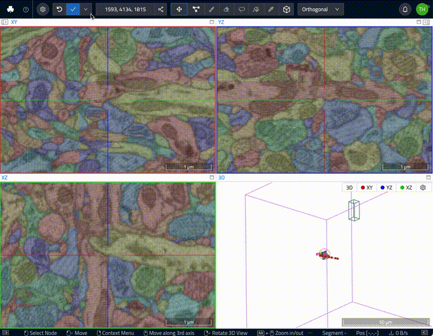

# Data Export through the Web UI

The WEBKNOSSOS UI comes with a fully featured `Download` panel offering a wide variety of download export options:

- Export cutouts of the data as OME-TIFF or TIFF stack (uses [long-running jobs](../automation/jobs.md) for export)
- Download skeleton annotation as [NML files](../data/concepts.md#nml-files)
- Download volume annotations as [WKW files](../data/concepts.md)
- Instructions for using the WEBKNOSSOS Python library for download (see below)

To access the download panel:

1. Click on the overflow menu (dropdown), next to the `Save` button in the WEBKNOSSOS navbar
2. Select `Download` entry
3. Select the desired data for download or export 

