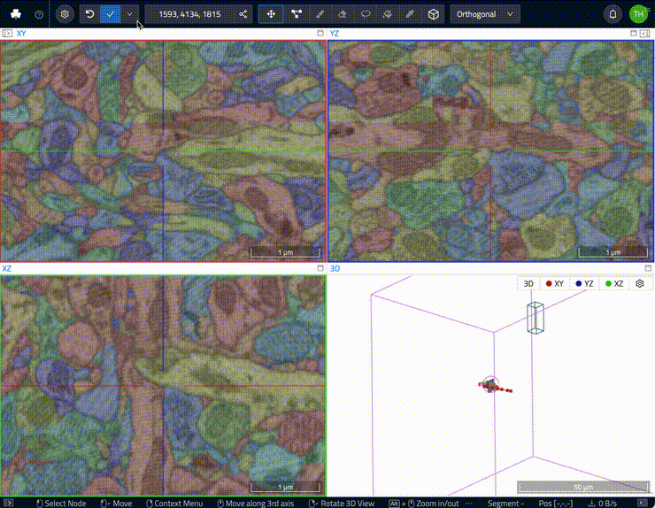

# Data Export through the Web UI

The WEBKNOSSOS UI comes with a fully featured `Download` panel offering a wide variety of download export options:

- Export cutouts of the data as OME-TIFF or TIFF stack (uses [long-running jobs](../automation/jobs.md) for export)
- Download skeleton annotations as [NML files](../data/concepts.md#nml-files)
- Download volume annotations as Zarr (default) or WKW files; an NML file describing the annotation is always included. WKW is unavailable for n-dimensional volume annotations.
- Instructions for using the WEBKNOSSOS Python [library for download](../data/export_python.md)

To access the download panel:

1. Click on the overflow menu (dropdown), next to the `Save` button in the WEBKNOSSOS navbar
2. Select `Download` entry
3. Select the desired data for download or export 

/// caption
The "Download" dialog for exporting and downloading annotations and dataset layers. WEBKNOSSOS offers downloads as Tiff stacks, the native WEBKNOSSOS file formats, and through the Python library.
///

To export skeleton trees, nodes, and edges as CSV files, use the `Skeleton` (Trees) tab in the right-hand sidebar rather than the `Download` dialog.

## Exporting TIFF / OME-TIFF cutouts

To export a cutout of your data as a TIFF stack or OME-TIFF:

1. Open the `Export as Tiff` tab in the `Download` dialog.
2. Pick the layer to export.
3. Choose a bounding box, either one of your user-defined bounding boxes or the full layer.
4. Choose the format (TIFF stack or OME-TIFF) and a magnification.
5. Start the export.

TIFF exports run as a [long-running job](../automation/jobs.md); you can track progress and download the result from the Jobs Overview page. Maximum volume and edge-length limits apply to the selected bounding box.