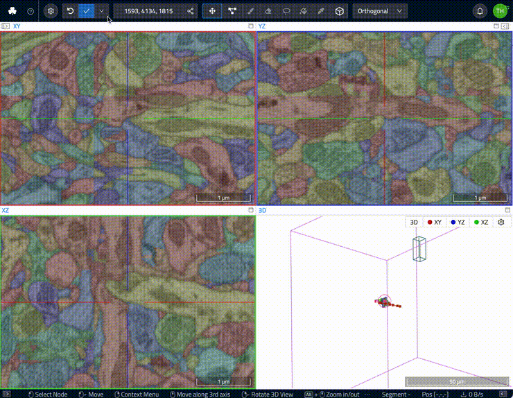

# Data Export through the Web UI

The WEBKNOSSOS UI comes with a fully featured `Download` panel offering a wide variety of download export options:

- Export cutouts of the data as OME-TIFF, TIFF stack, or OME-Zarr (uses [long-running jobs](../automation/jobs.md) for export)
- Download the complete annotation, including all metadata, skeletons (as [NML files](../data/concepts.md#nml-files)), and volume layers (as Zarr, by default). You can customize this to skip volume layers entirely, or download them as WKW files (not available for n-dimensional volume annotations).
- Instructions for using the WEBKNOSSOS Python [library for download](../data/export_python.md)

To access the download panel:

1. Click on the overflow menu (dropdown), next to the `Save` button in the WEBKNOSSOS navbar
2. Select `Download` entry
3. Select the desired data for download or export 

/// caption
The "Download" dialog for exporting and downloading annotations and dataset layers. WEBKNOSSOS offers downloads as Tiff stacks, the native WEBKNOSSOS file formats, and through the Python library.
///

To export skeleton trees, nodes, and edges as CSV files, use the `Skeleton` (Trees) tab in the right-hand sidebar rather than the `Download` dialog.

## Exporting TIFF / OME-TIFF / OME-Zarr cutouts

To export a cutout of your data as a TIFF stack, OME-TIFF, or OME-Zarr:

1. Open the `TIFF and OME-Zarr Export` tab in the `Download` dialog.
2. Pick the layer to export.
3. Choose a bounding box, either one of your user-defined bounding boxes or the full layer.
4. Choose the format (TIFF stack, OME-TIFF, or OME-Zarr) and a magnification.
5. Start the export.

OME-Zarr exports are delivered as a single `.ozx` file, a zipped [OME-Zarr](./zarr.md) store following [NGFF RFC-9](https://ngff.openmicroscopy.org/rfc/9/). It contains the selected magnification plus all coarser ones already available on the layer, and WEBKNOSSOS accepts `.ozx` files as an upload format as well.

TIFF and OME-Zarr exports run as a [long-running job](../automation/jobs.md); you can track progress and download the result from the Jobs Overview page. Maximum volume and edge-length limits apply to the selected bounding box.