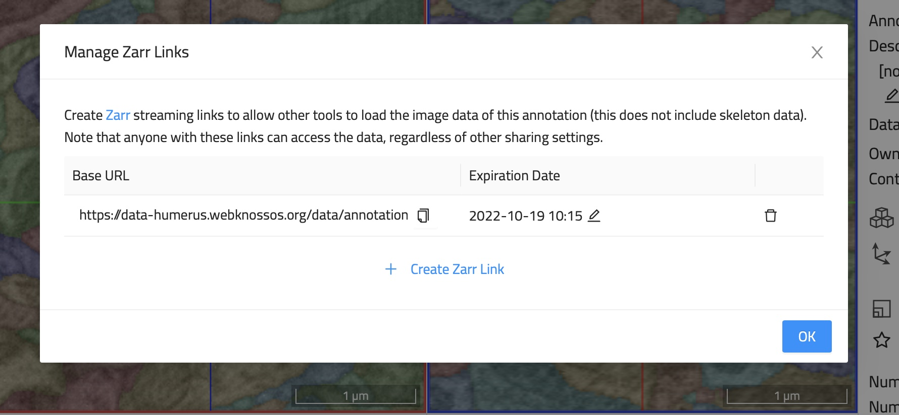

## Data Export through Zarr Streaming 

Any dataset and volume annotation in WEBKNOSSOS can also be accessed by third-party software through the Zarr streaming interface. In other words, WEBKNOSSOS is a fully, capable server for streaming data according to the Zarr spec to any client and can be viewed as an alternative to cloud storage options such as AWS S3/Google Cloud Storage. 
As an additional benefit, you still retain all the other helpful WEBKNOSSOS features for managing, searching, tagging, and securing datasets adhering to the FAIR (Findability, Accessibility, Interoperability, and Reuse of digital assets) principles.

Any WEBKNOSSOS dataset/annotation can be accessed this way regardless of its original file format. WEBKNOSSOS will automatically convert any data on the fly.

To access and share a dataset through Zarr streaming, follow these steps:

1. Click on the overflow menu (dropdown), next to the `Save` button in the WEBKNOSSOS navbar
2. Select `Zarr Links` entry
3. Click `Create Zarr Link` to make the resource available through the Zarr streaming interface. Set the `Expiration Date` as required. The default duration is 1 month into the future.
4. Click on the little copy button (clipboard icon) to copy the Zarr web link. Due to the nature of the Zarr spec, if you need to individually copy a URL for each WEBKNOSSOS layer.

A unique aspect of WEBKNOSSOS is private Zarr links. Any annotation shared through Zarr generates a web link containing a unique access token for authentication such that only allowed users and collaborators may access this data. This is akin to WEBKNOSSOS ability to [privately share annotations through web URLs](../sharing/annotation_sharing.md). Zarr links can be revoked/deleted at any time (or time-limited by default) to retain control over your data.

