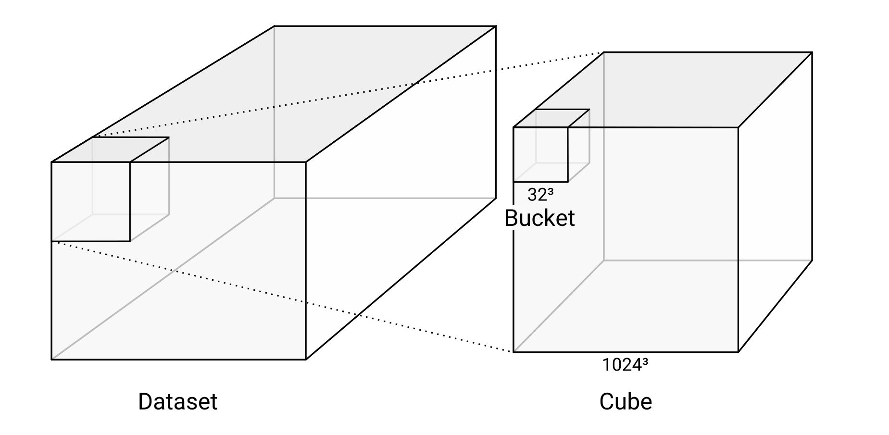
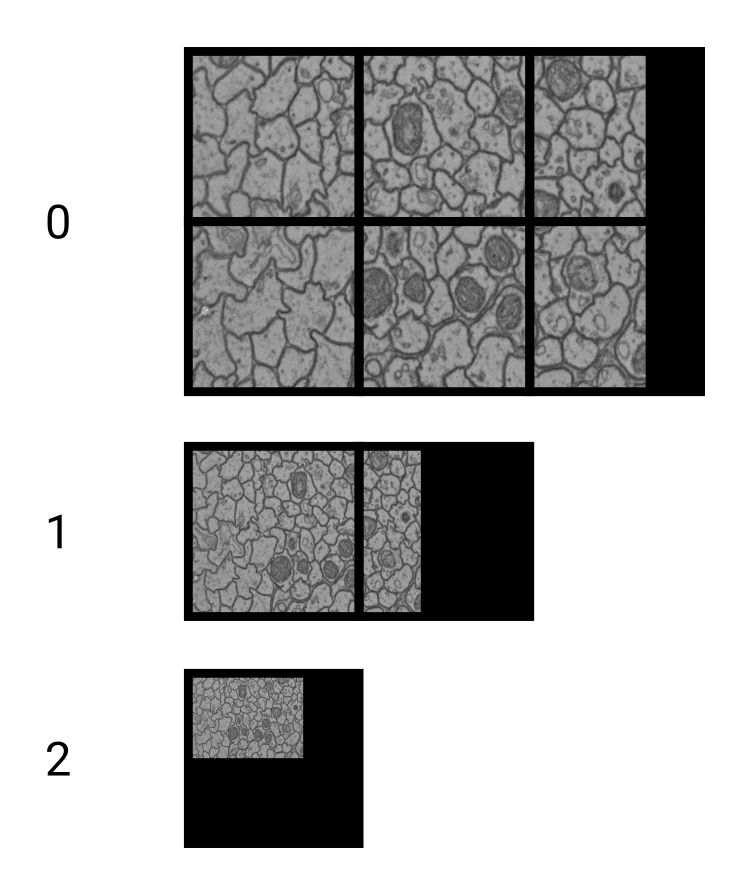

# Supported Data Formats

webKnossos uses the WKW format for voxel datasets and NML for skeleton annotations.
If your image data isn't available as WKW, yet, you can either:
- convert it automatically on [webknossos.org](https://webknossos.org) or
- manually convert it using [webKnossos Cuber](https://github.com/scalableminds/webknossos-cuber)
Read more about how to convert your data [here](#tools).

The following sections explain the concepts, formats and tools which are supported by webKnossos.

## Concepts

### Datasets, Cubes, and Buckets

A **dataset** consists of [one or more layers](#layers).
Since webKnossos deals with 3D imagery, the data is organized in **cubes**.
WKW cubes are 1024^3 voxels in size by default and each cube is stored as one file on disk.
Each cube contains multiple **buckets** of 32^3 voxel size.
This is the unit in which the data is streamed to the users' browser.



### Layers

A dataset consists of one or more layers.
For electron-microscopy (EM) data, there is usually a `color` layer that holds the raw grayscale image data.
Additionally, there may be a `segmentation` layer that holds manually or automatically generated volume annotations.

For light-microscopy (LM) data, there may be multiple layers with different channels.


### Magnification Steps and Downsampling

To enable zooming within huge datasets in webKnossos, dataset layers usually contain multiple magnification steps.
`1` is the magnification step with the highest resolution, i.e. the original data.
`2` is downsampled by two in all dimensions and therefore only is an eighth of the file size of the original data.
The list goes on in power-of-two steps: `1, 2, 4, 8, 16, 32, 64, …`

webKnossos also supports non-uniform downsampling. For example, `[2, 2, 1]` is downsampled in the `x` and `y` dimension, but not in `z`.




### Segmentation

Segmentations in webKnossos are represented by ID maps.
Every segment or component has its own ID.
These IDs are stored as the value of the corresponding voxel, just as the grayscale value in the voxels of the color layer.
`0` is usually interpreted as missing or empty value.
The underlying datatype limits the maximum number of IDs:

| Data Type | Maximum ID                 |
| --------- | -------------------------- |
| `uint8`   | 255                        |
| `uint16`  | 65,535                     |
| `uint32`  | 4,294,967,295              |
| `uint64`  | 18,446,744,073,709,551,615 |

## Data Formats

To bring the above concepts together, webKnossos uses [webknossos-wrap (WKW)](https://github.com/scalableminds/webknossos-wrap) as a container format for volumetric voxel data.
For sparse skeleton-like structures, webKnossos uses [NML](#NML).

### WKW Datasets
[webknossos-wrap (WKW)](https://github.com/scalableminds/webknossos-wrap) is a format optimized for large datasets of 3D voxel imagery and supports compression, efficient cutouts, multi-channel and several base datatypes.
It works well for large datasets and is built with modern file systems in mind.
Compared to KNOSSOS datasets, it is more efficient because it orders the data within the container for optimal read performance (Morton order).
WKW is versatile in the image formats it can hold: Grayscale, Multi-Channel, Segmentation, RGB as well as a range of data types (e.g., `uint8`,  `uint16`, `float32`).
Additionally, WKW supports compression for disk space efficiency.

Each layer of a WKW dataset may contain one of the following:
* Grayscale data (8 Bit, 16 Bit, Float), also referred to as `color` data
* RGB data (24 Bit)
* Segmentation data (8 Bit, 16 Bit, 32 Bit)
* Multi-channel data (multiple 8 Bit)

#### WKW Folder Structure
A WKW dataset is represented with the following file system structure:

```
great_dataset          # One folder per dataset
├─ color               # Dataset layer (e.g., color, segmentation)
│  ├─ 1                # Magnification step (1, 2, 4, 8, 16 etc.)
│  │  ├─ header.wkw    # Header wkw file
│  │  ├─ z0
│  │  │  ├─ y0
│  │  │  │  ├─ x0.wkw  # Actual data wkw file
│  │  │  │  └─ x1.wkw  # Actual data wkw file
│  │  │  └─ y1/...
│  │  └─ z1/...
│  └─ 2/...
├─ segmentation/...
└─ datasource-properties.json  # Dataset metadata (will be created upon import, if non-existent)
```

#### WKW Metadata by Example
Metadata is stored in the `datasource-properties.json`.
See below for the [full specification](#dataset-metadata-specification).
This is an example:

```json
{
  "id" : {
    "name" : "great_dataset",
    "team" : "<unknown>"
  },
  "dataLayers" : [ {
    "name" : "color",
    "category" : "color",
    "boundingBox" : {
      "topLeft" : [ 0, 0, 0 ],
      "width" : 1024,
      "height" : 1024,
      "depth" : 1024
    },
    "wkwResolutions" : [
        { "resolution": 1, "cubeLength": 1024 },
        { "resolution": [ 2, 2, 1 ], "cubeLength": 1024 },
        { "resolution": [ 4, 4, 1 ], "cubeLength": 1024 },
        { "resolution": [ 8, 8, 1 ], "cubeLength": 1024 },
        { "resolution": [ 16, 16, 2 ], "cubeLength": 1024 },
      ],
    "elementClass" : "uint8",
    "dataFormat" : "wkw"
  }, {
    "name" : "segmentation",
    "boundingBox" : {
      "topLeft" : [ 0, 0, 0 ],
      "width" : 1024,
      "height" : 1024,
      "depth" : 1024
    },
    "wkwResolutions" : [ {
      "resolution" : 1,
      "cubeLength" : 1024
    }, {
      "resolution" : [ 2, 2, 1 ],
      "cubeLength" : 1024
    } ],
    "elementClass" : "uint32",
    "largestSegmentId" : 1000000000,
    "category" : "segmentation",
    "dataFormat" : "wkw"
  } ],
  "scale" : [ 11.24, 11.24, 28 ]
}
```

Note that the `resolutions` property within the elements of `wkwResolutions` can be an array of length 3.
The three components within such a resolution denote the scaling factor for x, y, and z.
At the moment, WebKnossos guarantees correct rendering of data with non-uniform resolution factors only if the z-component between two resolutions changes by a factor of 1 or 2.

Most users don't create these metadata files manually.
webKnossos can guess most of these properties automatically, except for `scale` and `largestSegmentId`.
During the import process, webKnossos will ask for the necessary properties.
When using the [webKnossos Cuber](https://github.com/scalableminds/webknossos-cuber), a metadata file is automatically generated.

[See below for the full specification](#dataset-metadata-specification).

#### Dataset Metadata Specification

- `id`: This section contains information about the name and corresponding team of the dataset. However, this information is not used by webKnossos because it will be replaced by more accurate runtime information.
  + `id.name`: Name of the dataset. Just for reference purposes. Will be inferred/overwritten by the folder name.
  + `id.team`: Team to which this dataset belongs. Just for reference purposed. Will be inferred/overwritten by webKnossos.

- `dataLayers`: This array contains information about the layers of the dataset.
  + `dataLayers.name`: Name of the layer. Can be an arbitrary string, but needs to correspond to the folder in the file system. Needs to be unique within the dataset. Usually is either `color`, `segmentation` or `color_0`.
  + `dataLayers.category`: Either `color` for raw data or `segmentation` for segmentation layers.
  + `dataLayers.boundingBox`: The position and size of the data that is contained in this layer. `topLeft` holds the `min_x,min_y,min_z` position, `width` is `max_x - min_x`, `height` is `max_y - min_y` and `depth` is `max_z - min_z`. *Only for WKW datasets.*

  + `dataLayers.wkwResolutions`: Holds information about the available magnification steps of the layer. *Only for WKW datasets.*
    * `dataLayers.wkwResolutions.resolution`: Either a scalar integer (e.g. `1`, `2` or `4`) or a 3-tuple (e.g. `2, 2, 1`) for non-uniform magnifications. *Only for WKW datasets.*
    * `dataLayers.wkwResolutions.cubeLength`: The cube size of the WKW cube files. Usually is `1024`. *Only for WKW datasets.*

  + `dataLayers.sections`: Holds information about the sections in the layer. Usually, a dataset only has one section. *Only for KNOSSOS datasets.*
    * `dataLayers.sections.boundingBox`: Same as `dataLayers.boundingBox` but for a section. *Only for KNOSSOS datasets.*
    * `dataLayers.sections.resolutions`: Contains an array of the available magnification steps, e.g. `[1, 2, 4, 8]`. Does not support non-uniform magnifications. *Only for KNOSSOS datasets.*

  + `dataLayers.elementClass`: The underlying datatype of the layer, e.g. `uint8`, `uint16` or `float32`.
  + `dataLayers.largestSegmentId`: The highest ID that is currently used in the respective segmentation layer. This is required for volume annotations where new objects with incrementing IDs are created. Only applies to segmentation layers.
  + `dataLayers.dataFormat`: Either `wkw` or `knossos`.


#### NML
When working with skeleton annotation data, webKnossos uses the NML format.
It can be downloaded from and uploaded to webKnossos, and used for processing in your scripts.
NML is an XML-based file format.
See the following example for reference:

```xml
<things>
  <parameters>
    <experiment name="great_dataset" />
    <scale x="11.24" y="11.24" z="25.0" />
    <offset x="0" y="0" z="0" />
    <time ms="1534787309180" />
    <editPosition x="1024" y="1024" z="512" />
    <editRotation xRot="0.0" yRot="0.0" zRot="0.0" />
    <zoomLevel zoom="1.0" />
  </parameters>
  <thing id="1" groupId="2" color.r="0.0" color.g="0.0" color.b="1.0" color.a="1.0" name="explorative_2018-08-20_Example">
    <nodes>
      <node id="1" radius="120.0" x="1475" y="987" z="512" rotX="0.0" rotY="0.0" rotZ="0.0" inVp="0" inMag="0" bitDepth="8" interpolation="false" time="1534787309180" />
      <node id="2" radius="120.0" x="1548" y="1008" z="512" rotX="0.0" rotY="0.0" rotZ="0.0" inVp="0" inMag="0" bitDepth="8" interpolation="false" time="1534787309180" />
    </nodes>
    <edges>
      <edge source="1" target="2" />
    </edges>
  </thing>
  <branchpoints>
    <branchpoint id="1" time="1534787309180" />
  </branchpoints>
  <comments>
    <comment node="2" content="This is a really interesting node" />
  </comments>
  <groups>
    <group id="1" name="Axon 1">
        <group id="2" name="Foo" />
    </group>
  </groups>
</things>

```

Each NML contains some metadata about the tracing inside the `parameters`-tag. An example of important metadata is the dataset name inside the `experiment`-tag and the scale of the dataset saved in the `scale`-tag.
The trees of the skeleton have their own `thing`-tag containing a list of nodes and edges of that tree.
The comments of the skeleton are saved in a separate list and refer to their corresponding nodes by id.
The structure of the tree groups is listed inside the `groups`-tag. Here groups can be freely nested inside each other.


## Tools
To make working with webKnossos' data a seamless experience, multiple tools are available:

- [webKnossos](https://webknossos.org) itself is obviously the prime example. In addition to viewing and annotating datasets, image data can also be converted to WKW during import.
- The [webKnossos Cuber](https://github.com/scalableminds/webknossos-cuber) is a python-based tool and library which converts various data formats to WKW datasets. It also compresses datasets for efficient file storage and creates necessary metadata.
- [wknml](https://github.com/scalableminds/wknml) is a python-based library which facilitates operations working with skeleton-based NML files.

### Conversion with webknossos.org
When uploading data to [webKnossos](https://webknossos.org), various data formats are automatically detected and converted.


In particular, the following file formats are supported:
                
- [WKW dataset](#WKW-Datasets)
- [Image file sequence](#Single-Layer-Image-File-Sequence) in one folder (tif, jpg, png, dm3, dm4)
  - as an extension, multiple folders with image sequences are interpreted as [separate layers](#Multi-Layer-Image-File-Sequence)
- Single-file images (tif, czi, nifti, raw)
- KNOSSOS file hierarchy 

#### Single-Layer Image File Sequence
When uploading multiple image files, these files are sorted numerically and each is interpreted as one section within a 3D dataset.
Alternatively, the same files can also be uploaded bundled in a single folder (or zip archive).

As an example, the following file structure would create a dataset with one layer which has a z-depth of 3.

```
dataset_name/
├── image_1.tif
├── image_2.tif
├── image_3.tif
└── ...
```

#### Multi-Layer Image File Sequence
The image file sequences explained above can be composed to build multiple [layers](#Layers).
As an example, the following file structure (note the additional hierarchy level) would create a dataset with two layers (named `color` and `segmentation`).

```
dataset_name/
├── color
│ ├── image_1.tif
│ ├── image_2.tif
│ └── ...
├── segmentation
│ └── ...
```

#### Single-file images
The following file formats can be dragged individually into webKnossos to convert them to a 3D dataset:

- tif
- czi
- nifti
- raw
- dm3
- dm4
- png

#### KNOSSOS file hierarchy
Datasets saved as KNOSSOS cubes also be converted on [webKnossos](https://webknossos.org).
Please ensure that you import the correct folder (so that all layers of the dataset are contained).

### Converting with webKnossos Cuber

#### Image Stacks
If you have image stacks (e.g. tiff stacks), you can easily convert them with [webKnossos cuber](https://github.com/scalableminds/webknossos-cuber).
The tool expects all image files in a single folder with numbered file names.
After installing, you can create simple WKW datasets with the following command:

```
python -m wkcuber \
  --layer_name color \
  --scale 11.24,11.24,25 \
  --name great_dataset \
  data/source/color data/target
```

This snippet converts an image stack that is located at `data/source/color` into a WKW dataset which will be located at `data/target`.
It will create the `color` layer.
You need to supply the `scale` parameter which is the size of one voxel in nanometers.

Read the full documentation at [webKnossos cuber](https://github.com/scalableminds/webknossos-cuber).
[Please contact us](mailto:hello@webknossos.org) or [write a post](https://forum.image.sc/tag/webknossos), if you have any issues with converting your dataset.

#### KNOSSOS Cubes

Datasets saved as KNOSSOS cubes can be easily converted with the [webKnossos cuber](https://github.com/scalableminds/webknossos-cuber) tool.

<!--
#### Catmaid Datasets

Catmaid datasets can be easily converted with the [webKnossos cuber](https://github.com/scalableminds/webknossos-cuber) tool.
-->

#### Import Datasets

After the manual conversion, proceed with the remaining import step.
See the [Datasets guide](./datasets.md#Importing) for further instructions.
