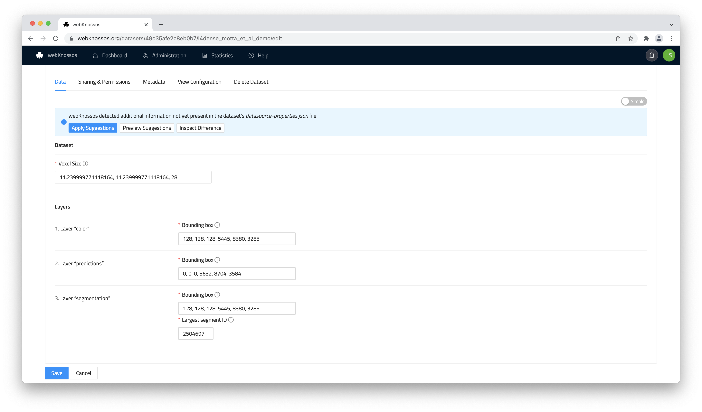
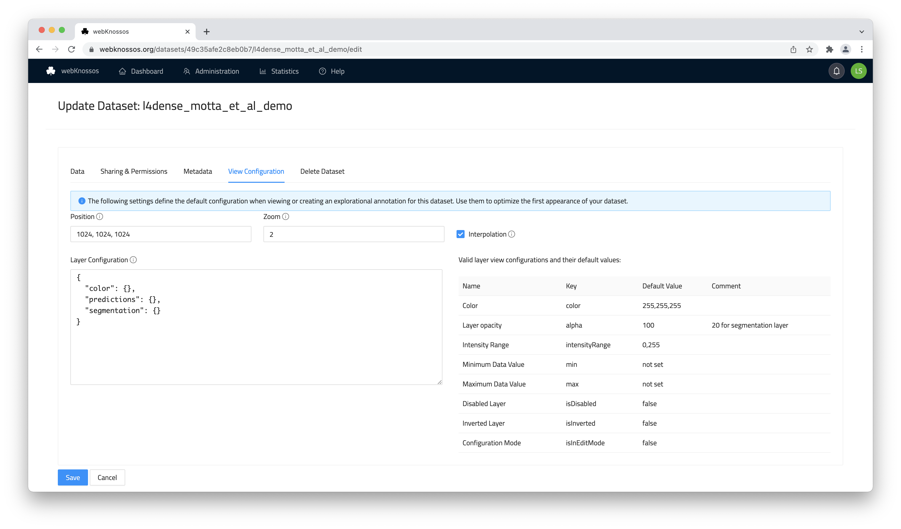

# Managing Datasets

Working with 3D (and 2D) image datasets is at the heart of webKnossos. 

- [Import datasets](#importing-datasets) by uploading them directly via the web UI or by using the file system (self-hosted instances only).
- [Configure the dataset](#configuring-datasets) defaults and permissions to your specification.
- [Share your datasets](./sharing.md#dataset-sharing) with the public or with selected users.

## Importing Datasets


### Uploading through the web browser
To import a dataset, you can use the upload functionality within webKnossos.
From the "My dataset" tab in the user dashboar, click the "Add Dataset" button.
Then, drag your data into the form and ensure all form fields are filled.

webKnossos uses the [WKW-format](./data_formats.md#wkw-datasets) internally to display your data.
If your data is already in WKW you can simply drag your folder (or zip archive of that folder) into the upload view.
If your data is not in WKW, you can either:
- upload the data in a supported file format and webKnossos will be automatically converted to WKW ([webknossos.org](https://webknossos.org) only). Depending on the size of the dataset conversion will take some time. Check the Jobs page for progress or refresh the dashboard page periodically.
- [Convert](#convert-datasets) your data manually to WKW.

Read more about the [Data Formats](./data_formats.md) we support and how they should be structured when uploading them.

Once the data is uploaded (and potentially converted) you can to go the Dataset Settings to doublecheck important properties (such as the dataset scale) or to make it public.

### Uploading through the Python API
For those wishing to automate dataset upload or to do it programmatically, check out the webKnossos [Python library](https://github.com/scalableminds/webknossos-libs). It allows to create, manage and upload datasets as well. 

### Uploading through the File System (Self-Hosted Instances Only)
On self-hosted instances, large datasets can be efficiently imported by placing them directly in the file system:

* Place the dataset at `<webKnossos directory>/binaryData/<Organization name>/<Dataset name>`. For example `/opt/webknossos/binaryData/Springfield_University/great_dataset`.
* Go to the [dataset view on the dashboard](./dashboard.md)
* Use the refresh button on the dashboard or wait for webKnossos to detect the dataset (up to 10min)

Typically webKnossos can infer all the required metadata for a dataset automatically and import datasets automatically on refresh. In some cases you will need to manually import a dataset and provide more information:
* On the dashboarb, click `Import` for your new dataset
* Provided the requested properties, such as **scale** and ****largestSegmentId**. See the section on [configuring datasets](.datasets.md#configuring-datasets) below for more detailed explanations of these parameters.

!!! info
    If you uploaded the dataset along with a `datasource-properties.json` metadata file the dataset will be imported automatically without any additional manual steps.


#### Using Symbolic Links (Self-Hosted Instances Only)

When you have direct file system access, you can also use symbolic links to import your data into webKnossos. This might be usefull when you want to create new datasets based on potentially very large raw micrscopy data and symlink it to one or several segmentation layers.

Note, when using Docker, the targets of the link also need to be available to the container through mounts.

For example, you could have a link from `/opt/webknossos/binaryData/sample_organization/awesome_dataset` to `/cluster/path/to/dataset123`.
In order to make this dataset available to the Docker container, you need to add `/cluster` as another volume mount.
You can add this directly to the docker-compose.yml:

```yaml
...
services:
  webknossos:
    ...
    volumes:
      - ./data:/webknossos/binaryData
      - /cluster:/cluster
...
```

### Converting Datasets
Any dataset uploaded through the web interface at [webknossos.org](https://webknossos.org) is automatically converted for compatiblity.

For manual conversion, we provide the following software tools and libraries:
- The [webKnossos Cuber](https://github.com/scalableminds/webknossos-libs/wkcuber) is a CLI tool that can convert many formats to WKW. 
- For other file formats, the [Python webKnossos libray](https://github.com/scalableminds/webknossos-libs) can be an option for custom scripting.

See page on [software tooling](.tooling.md) for more.

## Configuring Datasets
You can configure the metadata, permission, and other properties of a dataset at any time. 

Note, any changes made to a dataset may influence the user experience of all users in you organization working with that dataset, e.g. removing access rights working, adding/removing layers, or setting default values for rendering the data.

To make changes, click on the "Settings" action next to a dataset in the "My Datasets" tab of your dashboard.
Editting these settings requires your account to have enough access rights and permissions. [Read more about this.](./users.md)

### Data Tab
The **Data** tab contains, the settings for correctly reading (e.g. data types)

- `Scale`: The physical size of a voxel in nanometers, e.g. `11, 11, 24`

For each detected layer:
- `Bounding Box`: The position and extents of the dataset layer in voxel coordinates. The format is `x, y, z, x_size,y_size, z_size` or respectively `min_x, min_y, min_z, (max_x - min_x), (max_y - min_y), (max_z - min_z)`.
- `Largest Segment ID`: The highest ID that is currently used in the respective segmentation layer. This is required for volume annotations where new objects with incrementing IDs are created. Only applies to segmentation layers.

The `Advanced` view lets you edit the underlying [JSON configuration](./data_formats.md#wkw-metadata-by-example) directly. Toggle between the `Advanced` and `Simple` view in the upper right. Advanced mode is only recommend for

webKnossos automatically periodially checks and detects changes to a dataset's metadata (`datasource-properties.json`) on disc. (Only relevant for self-hosted instances) Before applying these suggestions, users can preview the all the new settings (as JSON) and inspect just the detected difference (as JSON).




### Sharing & Permissions Tab
- `Teams allowed to access this dataset`: Defines which [teams of your organization](./users.md) have access to this dataset. By default no team has access but admins and team managers can see and edit the dataset.
- `Visibility`: Lets you make the dataset available to the general public and shows it in the public [Gallery view](./sharing.md#public-sharing). This will enable any visitor to your webKnossos instance to view the data, even unregistered users.
- `Sharing Link`: A special URL which allows any user to view your dataset that uses this link. Because of the included random token, the link cannot be guessed by random visitors. You may also revoke the random token and create a new one when you don't want previous users to access your data anymore. Read more in [the Sharing guide](./sharing.md).

// Todo add image

### Metadata Tab
- `Display Name`: A meaningful name for a dataset other then it's automically assigned technical moniker/ID. Displayed in various parts of webKnossos. Especially useful when sharing datasets with outsiders, when you want to "hide" any internal nameing schemes or make it more approachable, e.g. "L. Simpson et al: Full Neuron Segmentation" instead of "neuron_seg_v4_2022".
- `Description`: A free-text field for providing more information about your datasets including authors, paper reference, descriptions, etc. Supports Markdown formatting. The description will be featured in the webKnossos UI when opening a dataset in view mode.

// Todo add image

### View Configuration Tab
The **View configuration** tab lets you set defaults for viewing this dataset. Anytime a user opens a dataset or creates a new annotation based on this dataset, these default values will be applied. 

Defaults include:
- `Position`: Default position of the dataset in voxel coordinates. When opening the dataset, users will be located at this position.
- `Zoom`: Default zoom.
- `Interpolation`: Whether interpolation should be enabled by default.
- `Layer Configuration`: Advanced feature to control the default settings on a per layer basis. It needs to be configured in a JSON format. E.g. layer visibility & opacity, color, contrast/brightness/intensity range ("histogram sliders"), and many more.



Of course, the defaults can all be overwritten and adjusted once a user opens the dataset in the main webKnossos interface and makes changes to any of these settings in his viewports. 

For self-hosted webKnossos instances, there are two ways to set default **View Configuration** settings:
- in the web UI as described above
- inside the `datasource_properties.json` on disc

The **View Configuration** from the web UI takes precedence over the `datasource_properties.json`.
You don't have to set complete **View Configurations** in either option, as webKnossos will fill missing attributes with sensible defaults.


// Todo add image

### Delete Tab

Offers the option to delete a dataset and completely removes it from webKnossos. Careful, this can not be undone.

// Todo add image


## Dataset Sharing
Read more in the [Sharing guide](./sharing.md#dataset-sharing)

## Using External Datastores
The system architecture of webKnossos allows for versatile deployment options where you can install a dedicated datastore server directly on your lab's cluster infrastructure.
This may be useful when dealing with large datasets that should remain in your data center.
[Please contact us](mailto:hello@webknossos.org) or [write a post](https://forum.image.sc/tag/webknossos), if you require any assistance with your setup.

scalable minds also offers a dataset alignment tool called **Voxelytics Align**.
[Learn more.](https://scalableminds.com/voxelytics-align)


## Sample Datasets

For convience and testing, we provide a list of sample datasets for webKnossos:

- Sample_e2006_wkw: https://static.webknossos.org/data/e2006_wkw.zip
Raw SBEM data and segmentation (sample cutout, 120MB).
Connectomic reconstruction of the inner plexiform layer in the mouse retina.
M Helmstaedter, KL Briggman, S Turaga, V Jain, HS Seung, W Denk.
Nature. 08 August 2013. https://doi.org/10.1038/nature12346

- Sample_FD0144_wkw: https://static.webknossos.org/data/FD0144_wkw.zip
Raw SBEM data and segmentation (sample cutout, 316 MB).
FluoEM, virtual labeling of axons in three-dimensional electron microscopy data for long-range connectomics.
F Drawitsch, A Karimi, KM Boergens, M Helmstaedter.
eLife. 14 August 2018. https://doi.org/10.7554/eLife.38976

- Sample_MPRAGE_250um: https://static.webknossos.org/data/MPRAGE_250um.zip
MRI data (250 MB).
T1-weighted in vivo human whole brain MRI dataset with an ultrahigh isotropic resolution of 250 μm.
F Lüsebrink, A Sciarra, H Mattern, R Yakupov, O Speck.
Scientific Data. 14 March 2017. https://doi.org/10.1038/sdata.2017.32
