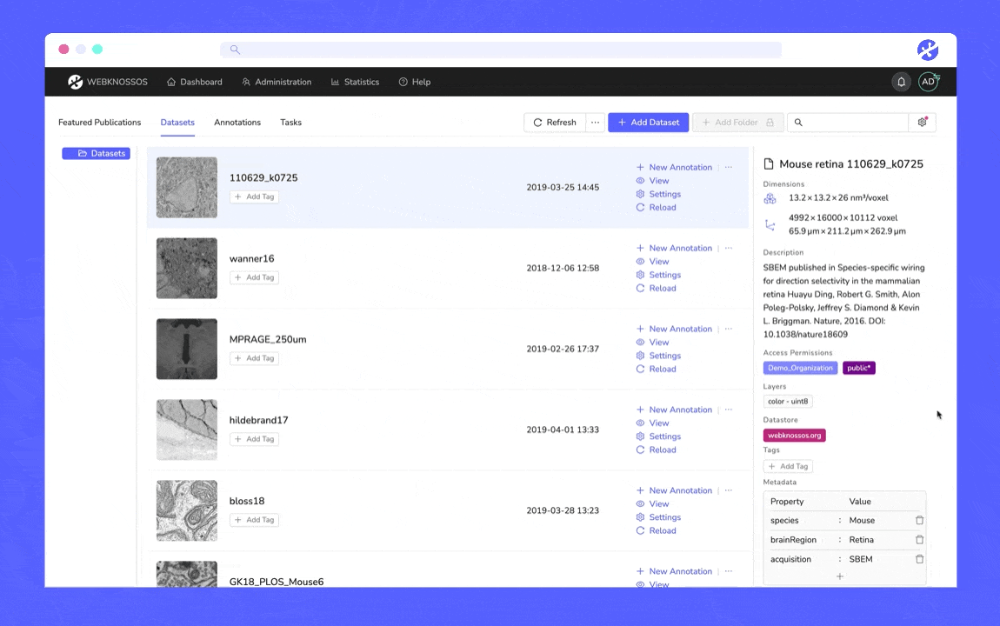

# Dataset Organization and Folders

In the dashboard, you can see all datasets of your organization (if you have the necessary permissions).
Datasets can be organized within folders by simply dragging a dataset entry from the table to a folder in the left sidebar.
New folders can be created by right-clicking an existing folder in the sidebar and selecting "New Folder".

A folder can be edited (also via the context menu) to change its name or its access permissions.
In the access permissions field, a list of teams can be provided that controls which teams should have access to that folder.
Note that even a folder with an empty access permissions field can be accessed by users which have access to its parent folder.
This is because the access permissions are handled cumulatively.

In addition to the folder organization, datasets can also be tagged.
Use the tags column to do so or select a dataset with a click and use the right sidebar.

You also have the possibility to add metadata for your dataset in the info tab on the right. You'll be able to add text, numbers, or multi-text items as key-value pairs and keep your datasets organized and manageable.

To move multiple datasets to a folder at once, you can make use of multi-selection. As in typical file explorers, CTRL + left click adds individual datasets to the current selection. Shift + left click selects a range of datasets.