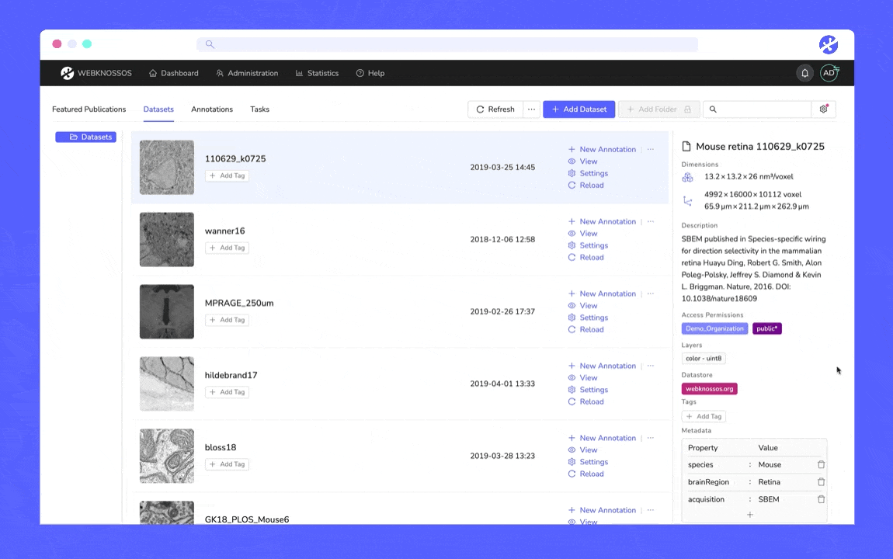

# Dataset Organization and Folders

In the dashboard, you can see all datasets of your organization (if you have the necessary permissions).
Datasets can be organized within folders by simply dragging a dataset entry from the table to a folder in the left sidebar.
New folders can be created with the "Add Folder" button above the dataset table, or by right-clicking a folder in the sidebar and selecting "New Folder" at the root, or "New Subfolder" when right-clicking an existing (non-root) folder.
A dialog opens where you can enter the folder's name and, optionally, set its access permissions right away.

A folder can be edited (also via the context menu) to change its name or its access permissions.
In the access permissions field, a list of teams can be provided that controls which teams should have access to that folder.
Note that even a folder with an empty access permissions field can be accessed by users which have access to its parent folder.
This is because the access permissions are handled cumulatively.

Admins, dataset managers, and team managers can create a new [team](../users/teams.md) directly from the access permissions dropdown (via "Create new team") without leaving the dialog. The "Add users to teams …" link in the same dropdown opens the [user administration](../users/new_users.md#adding-users-to-teams), where users can be assigned to teams.

In addition to the folder organization, datasets can also be tagged.
Use the tags column to do so or select a dataset with a click and use the right sidebar.
To add a tag, click into the `Tags` cell of the dataset's row and type the new tag; to remove one, click the × on the tag.

You also have the possibility to add metadata for your dataset in the info tab on the right. You'll be able to add text, numbers, or multi-text items as key-value pairs and keep your datasets organized and manageable.

/// caption
Adding metadata to a dataset as key-value pairs to keep it organized and manageable.
///

To move multiple datasets to a folder at once, you can make use of multi-selection. As in typical file explorers, ++ctrl++ + left click adds individual datasets to the current selection. ++shift++ + left click selects a range of datasets.
