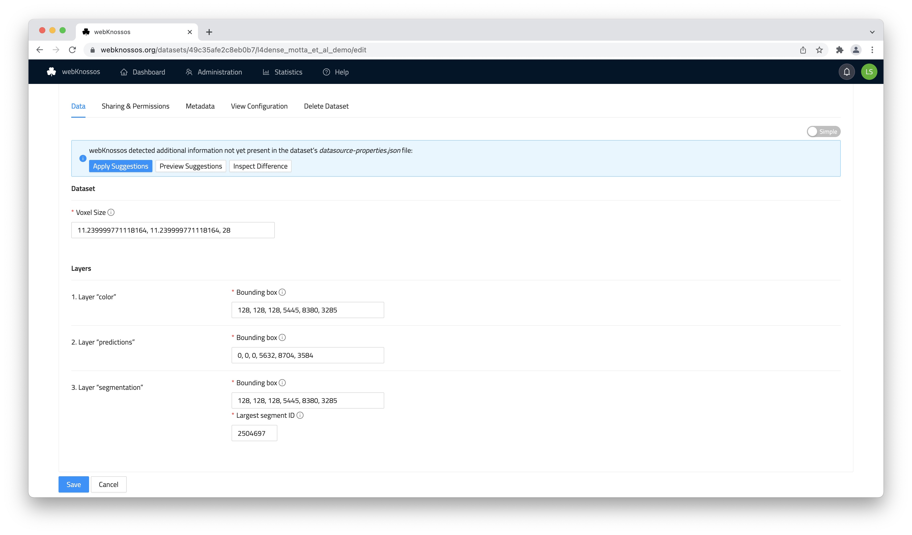
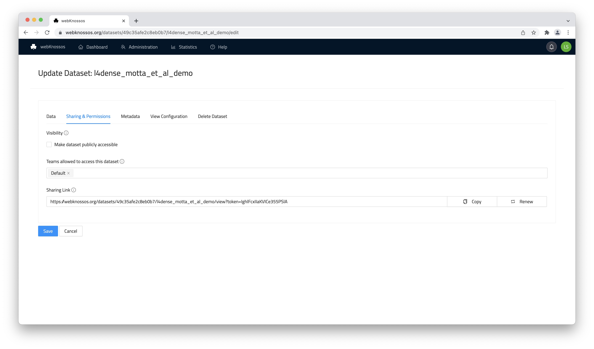
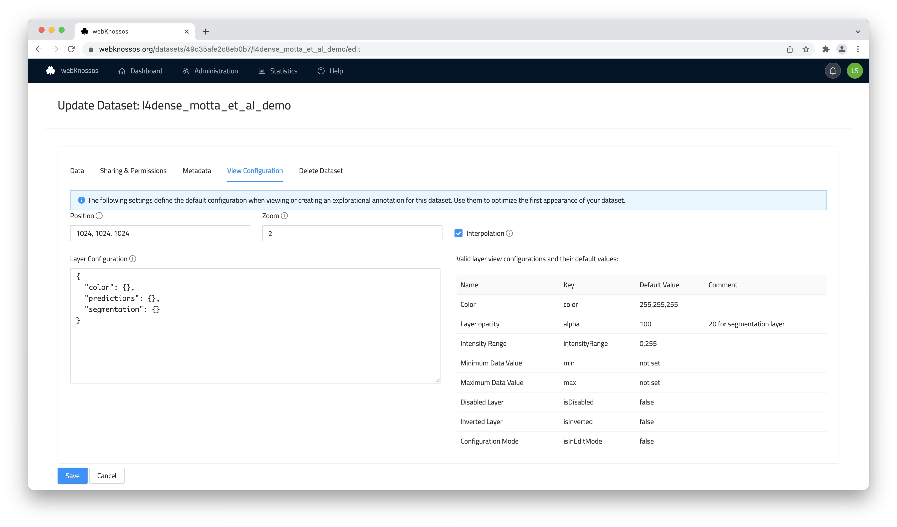
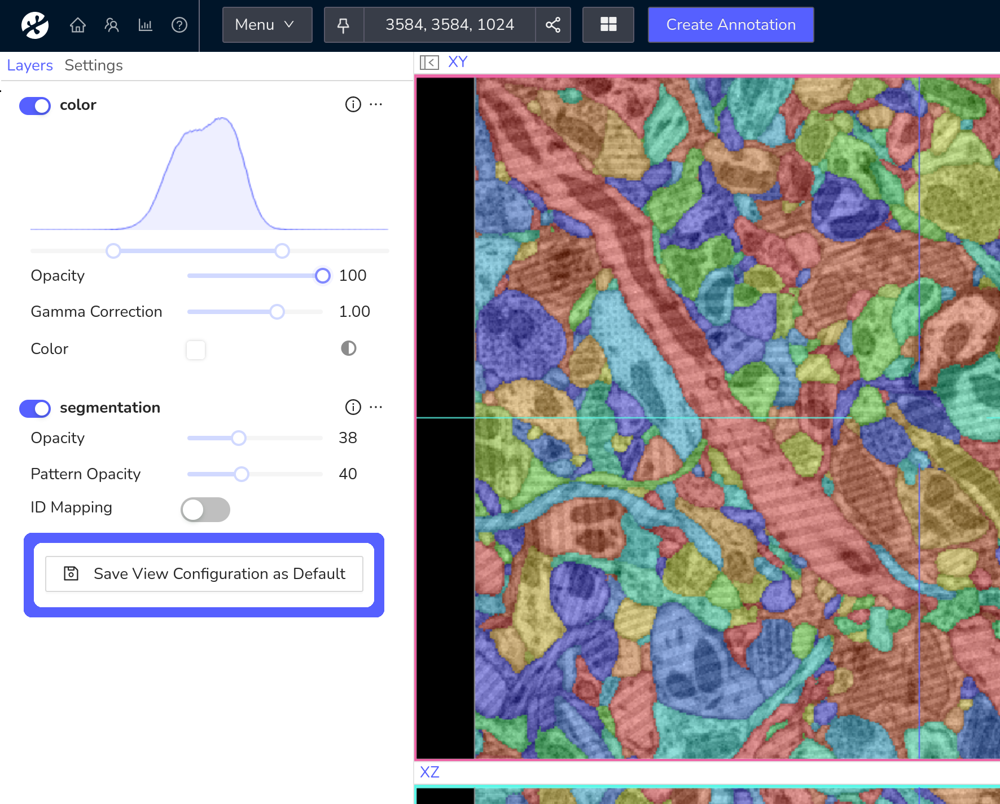
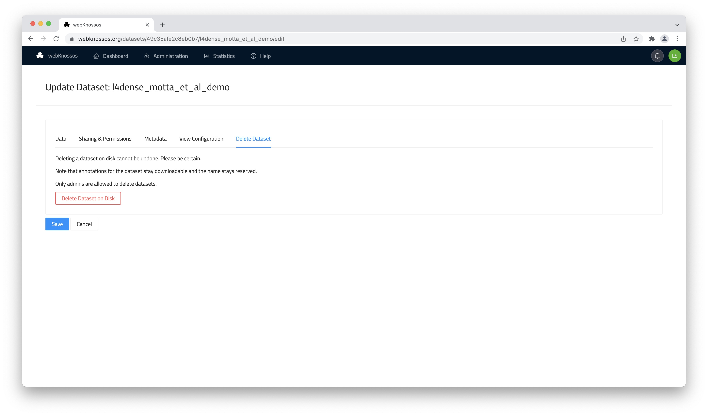

#  Dataset Settings
You can configure the metadata, permission, and other properties of a dataset at any time. 

Note, any changes made to a dataset may influence the user experience of all users in your organization working with that dataset, e.g., removing access rights working, adding/removing layers, or setting default values for rendering the data.

To make changes, click on the "Settings" action next to a dataset in the "Datasets" tab of your dashboard.
Editing these settings requires your account to have enough access rights and permissions. [Read more about this.](../users/access_rights.md)

## Data Tab
The *Data* tab contains the settings for correctly reading the dataset as the correct data type (e.g., `uint8`), setting up, and configuring any layers.

- `Name`: The name of the dataset. Datasets can have duplicate names even within the same organization.
- `Voxel Size`: The physical size of a voxel in the configured unit, e.g., `11, 11, 24`
- `Unit`: The unit of the voxel size.

For each detected layer:

- `Bounding Box`: The position and extents of the dataset layer in voxel coordinates. The format is `x, y, z, x_size,y_size, z_size` or respectively `min_x, min_y, min_z, (max_x - min_x), (max_y - min_y), (max_z - min_z)`.
- `Largest Segment ID`: The highest ID that is currently used in a segmentation layer. When a user wants to annotate a new segment and clicks "Create new Segment Id" in the toolbar, the new ID is generated by incrementing the currently known largest segment id. This value is stored per annotation and is based on the corresponding property of the underlying dataset layer. If the id is not known, the user cannot generate new segment ids. However, they can still change the currently active ID to arbitrary values. Also, they can enter a largest segment id for their annotation without having to edit the dataset's value here (which they might not have the permissions for).

The `Advanced` view lets you edit the underlying [JSON configuration](../data/concepts.md#dataset-metadata) directly. Toggle between the `Advanced` and `Simple` page in the upper right. Advanced mode is only recommended for low-level access to dataset properties and users familiar with the `datasource-properties.json` format.

WEBKNOSSOS automatically periodically checks and detects changes to a dataset's metadata (`datasource-properties.json`) on disk (only relevant for self-hosted instances). Before applying these suggestions, users can preview all the new settings (as JSON) and inspect just the detected difference (as JSON).

## Sharing & Permissions Tab
- `Make dataset publicly accessible`: By default, a dataset can only be accessed by users from your organization with the correct access permissions. Turning a dataset to *public* will allow anyone in the general public to view the dataset when sharing a link to the dataset without the need for a WEBKNOSSOS account. Anyone can start using this dataset to create annotations. Enable this setting if you want to share a dataset in a publication, social media, or any other public website.
- `Teams allowed to access this dataset`: Defines which [teams of your organization](../users/teams.md) have permission to work with this dataset. By default, no team has access, but users with *admin* and *team manager* roles can see and edit the dataset.
- `Sharing Link`: A web URL pointing to this dataset for easy sharing that allows any user to view your dataset. The URL contains an access token to allow people to view the dataset without a WEBKNOSSOS account. The access token is random, and therefore the URL cannot be guessed by visitors. You may also revoke the access token to create a new one. Anyone with a URL containing a revoked token will no longer have access to this dataset. 
Read more in [the Sharing guide](../sharing/dataset_sharing.md).

## Metadata Tab
- `Display Name`: A meaningful name for a dataset other than its (automatically assigned) technical name which is usually limited by the naming rules of file systems. It is displayed in various parts of WEBKNOSSOS. The display name may contain special characters and can also be changed without invalidating already created sharing URLs. It can also be useful when sharing datasets with outsiders while "hiding" any internal naming schemes or making it more approachable, e.g., `L. Simpson et al.: Full Neuron Segmentation` instead of `neuron_seg_v4_2022`.
- `Description`: A free-text field for providing more information about your datasets, e.g., authors, paper reference, descriptions, etc. Supports Markdown formatting. The description will be featured in the WEBKNOSSOS UI when opening a dataset in view mode.

## View Configuration Tab
The *View configuration* tab lets you set defaults for viewing this dataset. Anytime a user opens a dataset or creates a new annotation based on this dataset, these default values will be applied. 

Defaults include:

- `Position`: Default position of the dataset in voxel coordinates. When opening the dataset, users will be located at this position.
- `Zoom`: Default zoom.
- `Interpolation`: Whether interpolation should be enabled by default.
- `Layer Configuration`: Advanced feature to control the default settings on a per-layer basis. It needs to be configured in JSON format. E.g., layer visibility & opacity, color, contrast/brightness/intensity range ("histogram sliders"), and many more.

Alternatively, these settings can be configured in a more intuitive way by opening the dataset in view mode. Change the current view settings to the desired result and save them as the dataset's default using the "Save View Configuration as Default" button in the layer settings tab.

Of course, the defaults can all be overwritten and adjusted once a user opens the dataset in the main WEBKNOSSOS interface and makes changes to any of these settings in his viewports. 

For self-hosted WEBKNOSSOS instances, there are three ways to set default *View Configuration* settings:

- in the web UI as described above
- while viewing the dataset
- inside the `datasource_properties.json` on disk

The *View Configuration* from the web UI takes precedence over the `datasource_properties.json`.
You don't have to set complete *View Configurations* in either option, as WEBKNOSSOS will fill missing attributes with sensible defaults.

## Delete Tab

Offers an option to delete a dataset and completely remove it from WEBKNOSSOS. Be careful, this cannot be undone!

