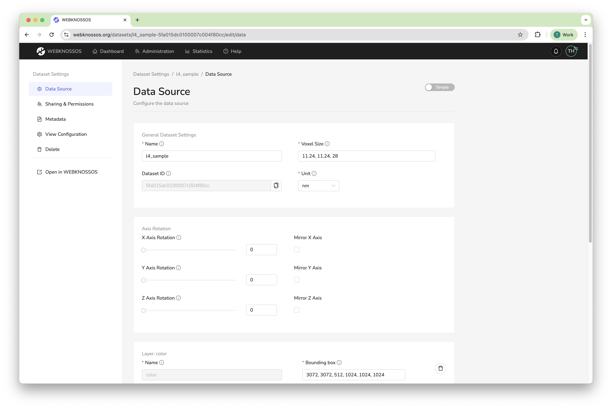
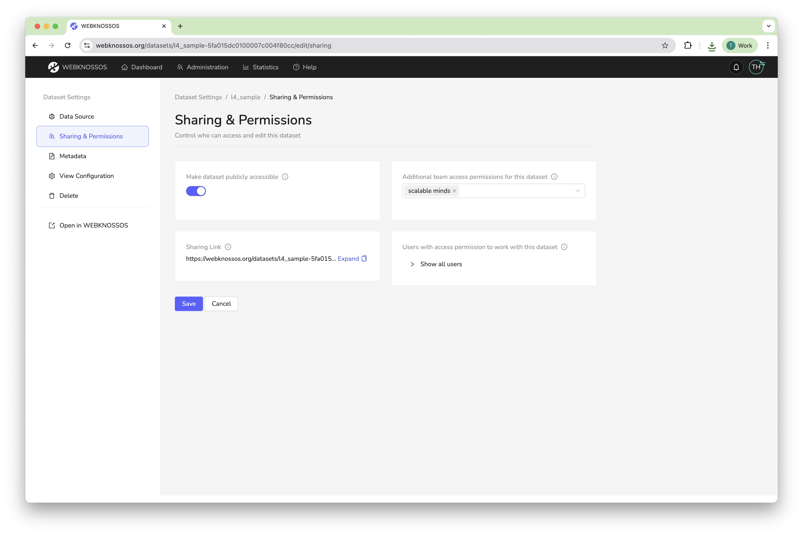
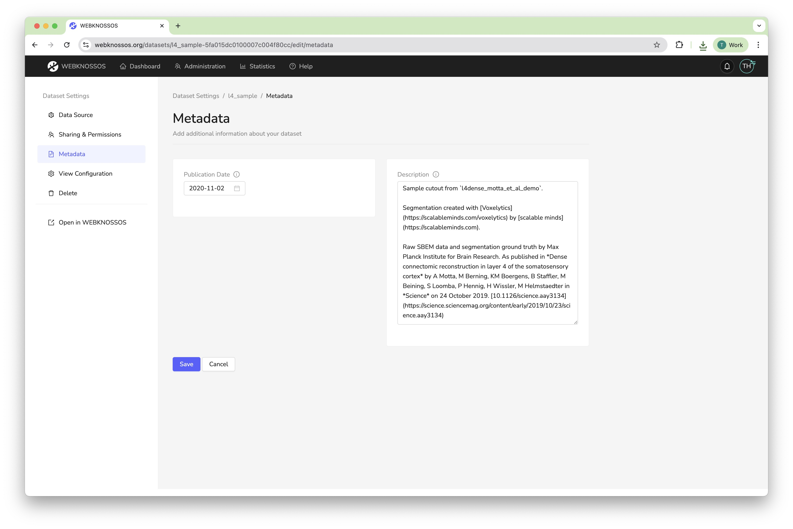
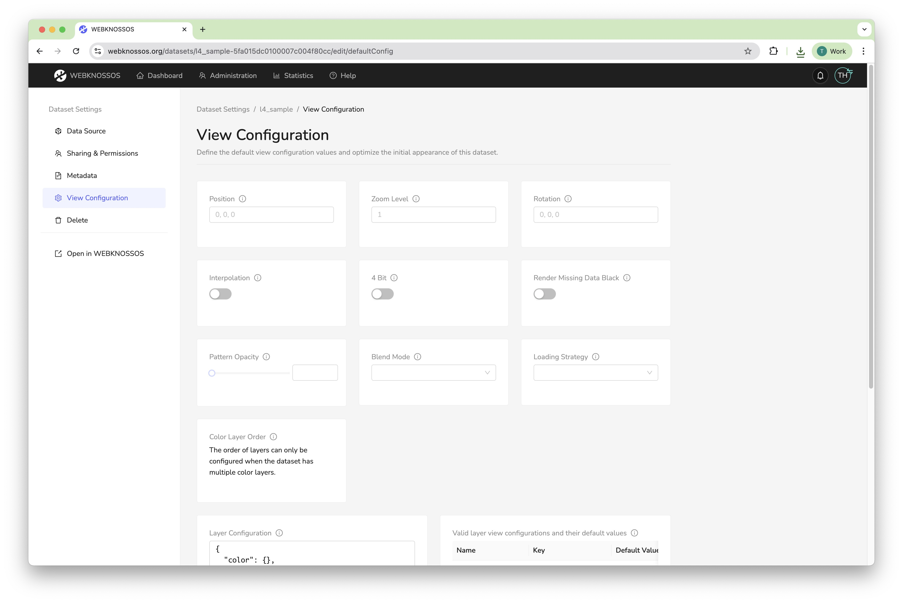
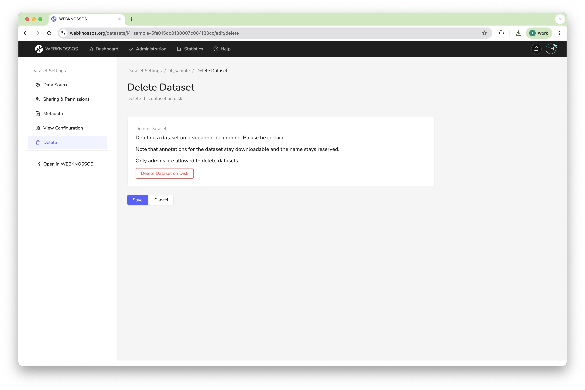

# Dataset Settings

You can configure the metadata, permissions, and other properties of a dataset at any time. To make changes, click on the **Settings** action next to a dataset in the **Datasets** tab of your dashboard.

Note that any changes made to a dataset may influence the user experience of all users in your organization working with that dataset, e.g., removing access rights, adding/removing layers, or setting default values for rendering the data.

Editing these settings requires your account to have sufficient access rights and permissions. [Read more about this.](../users/access_rights.md)

## Data Source Tab

The `Data Source` tab contains the core settings for your dataset.

### General Dataset Settings

- **Name:** The name of the dataset. This is also the display name that will be shown in the UI.
- **Dataset ID:** A unique identifier for the dataset (read-only).
- **Voxel Size:** The physical size of a voxel in the configured unit (e.g., `11, 11, 24`).
- **Unit:** The unit of the voxel size (e.g., `nm`).

### Transformations

Transformations are a way of rotating, mirroring or projecting dataset layers, among others. There are three modes for dataset transformation: `None`, `Simple`, and `Advanced`.

- `None`: There are no transformations. If there were transformations before, they will be removed upon saving.  
- `Simple`: You can rotate the dataset around the X, Y, and Z axes. You can also mirror the axes.  
- `Advanced`: You can define complex transformations per layer with a JSON. See below for the exact format.


#### JSON Schema for Advanced Transformations
The DataLayerWithTransformations schema defines an array structure for specifying coordinate transformations on data layers:

- **Type**: Array of objects
- **Properties per object**:
    - **name** (required, string): The name of the data layer to apply transformations to
    - **coordinateTransformations** (optional, array): A sequence of coordinate transformations to apply

Each transformation can be one of two types:

1. Affine Transformation
A 4x4 transformation matrix for linear transformations (rotation, scaling, translation, shearing).
```
{
  "type": "affine",
  "matrix": [
    [a, b, c, d],
    [e, f, g, h],
    [i, j, k, l],
    [m, n, o, p]
  ]
}
```

2. Thin Plate Spline Transformation
Non-linear warping transformation defined by corresponding point pairs in source and target coordinate spaces.
```
{
  "type": "thin_plate_spline",
  "correspondences": {
    "source": [[x1, y1, z1], [x2, y2, z2], ...],
    "target": [[x1, y1, z1], [x2, y2, z2], ...]
  }
}
```

All in all, the provided JSON for a dataset with the layers `color` and `segmentation` could look like this: 
```
[
  {
    "name": "color",
    "coordinateTransformations": [
      {
        "type": "affine",
        "matrix": [[1, 0, 0, 10], [0, 1, 0, 20], [0, 0, 1, 30], [0, 0, 0, 1]]
      }
    ]
  },
    {
    "name": "segmentation",
    "coordinateTransformations": [
      {
        "type": "affine",
        "matrix": [[1, 0, 0, 10], [0, 1, 0, 20], [0, 0, 1, 30], [0, 0, 0, 1]]
      }
    ]
  }
]
```


### Layer Settings

For each layer in the dataset, you can configure:

- **Name:** The name of the layer.
- **Bounding Box:** The position and extents of the layer in voxel coordinates. The format is `x, y, z, x_size,y_size, z_size` or respectively `min_x, min_y, min_z, (max_x - min_x), (max_y - min_y), (max_z - min_z)`.
- **Category:** The type of the layer, i.e.  `color` for raw microscopy data and `segmentation` for segmentations.
- **Largest Segment ID**: (Segmentation layer only). The highest ID that is currently used in a segmentation layer. When a user wants to annotate a new segment and clicks "Create new Segment Id" in the toolbar, the new ID is generated by incrementing the currently known largest segment id. This value is stored per annotation and is based on the corresponding property of the underlying dataset layer. If the id is not known, the user cannot generate new segment ids. However, they can still change the currently active ID to arbitrary values. Also, they can enter a largest segment id for their annotation without having to edit the dataset's value here (which they might not have the permissions for).


/// caption
Data Source Tab: Configure the core settings for your dataset
///


## Sharing & Permissions Tab

This tab allows you to control who can access your dataset.

- **Make dataset publicly accessible:** By default, a dataset can only be accessed by users from your organization with the correct access permissions. Turning a dataset to *public* will allow anyone to view the dataset with a sharing link, without needing a WEBKNOSSOS account.
- **Additional team access permissions for this dataset:** Defines which [teams of your organization](../users/teams.md) have permission to work with this dataset.
- **Sharing Link:** A URL to share the dataset with others. You can renew the access token to invalidate the old link.
- **Users with access permission to work with this dataset:** A list of all users that have access to the dataset.

Read more in [the Sharing guide](../sharing/dataset_sharing.md).


/// caption
Sharing Tab: Control who can access your dataset
///


## Metadata Tab

This tab allows you to add descriptive information to your dataset.

- **Publication Date:** The date the dataset was published. This influences the dataset ordering in your dashboard.
- **Description:** A free-text field for providing more information about your dataset, such as authors, paper references, etc. It supports Markdown formatting.


/// caption
Metadata Tab: Add descriptive information to your dataset
///


## View Configuration Tab

The `View Configuration` tab lets you set the default viewing parameters for this dataset. These defaults will be applied whenever a user opens the dataset for the first time.

- **Position, Zoom, and Rotation:** Set the default camera position, zoom level, and rotation.
- **Rendering Options:** Configure default rendering settings like `Interpolation`, `4 Bit` rendering, and `Blend Mode`.
- **Layer Configuration:** An advanced feature to control the default settings on a per-layer basis using a JSON object. You can configure properties like visibility, opacity, color, and intensity range.

Alternatively, you can set the default view configuration from the main annotation view by clicking the "Save View Configuration as Default" button in the layer settings.


/// caption
View Configuration Tab: Set the default viewing parameters for this dataset
///


## Delete Tab

This tab offers an option to delete the dataset. This action is irreversible and will permanently remove the dataset from WEBKNOSSOS.

Deleting a dataset will not delete any annotations associated with it.


/// caption
Delete Tab: Permanently delete a dataset
///