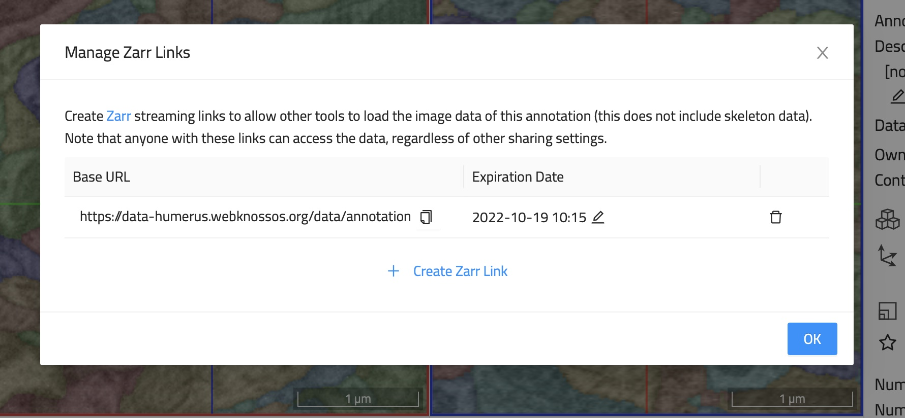
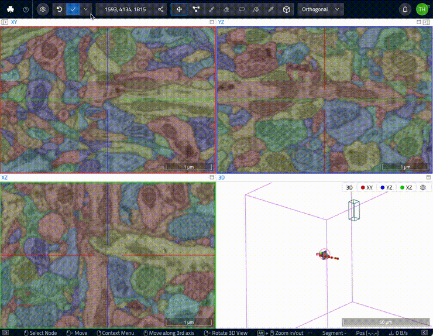

# Data Export and Interoperability

We believe in using the best tool for the job and WEBKNOSSOS makes it easy to download and export any annotation for further processing in third-party software.

## Data Export through Zarr Streaming 

Any dataset and volume annotation in WEBKNOSSOS can also be accessed by third-party software through the Zarr streaming interface. In other words, WEBKNOSSOS is a fully, capable server for streaming data according to the Zarr spec to any client and can be viewed as an alternative to cloud storage options such as AWS S3/Google Cloud Storage. 
As an additional benefit, you still retain all the other helpful WEBKNOSSOS features for managing, searching, tagging, and securing datasets adhering to the FAIR (Findability, Accessibility, Interoperability, and Reuse of digital assets) principles.

Any WEBKNOSSOS dataset/annotation can be accessed this way regardless of its original file format. WEBKNOSSOS will automatically convert any data on the fly.

To access and share a dataset through Zarr streaming, follow these steps:

1. Click on the overflow menu (dropdown), next to the `Save` button in the WEBKNOSSOS navbar
2. Select `Zarr Links` entry
3. Click `Create Zarr Link` to make the resource available through the Zarr streaming interface. Set the `Expiration Date` as required. The default duration is 1 month into the future.
4. Click on the little copy button (clipboard icon) to copy the Zarr web link. Due to the nature of the Zarr spec, if you need to individually copy a URL for each WEBKNOSSOS layer.

A unique aspect of WEBKNOSSOS is private Zarr links. Any annotation shared through Zarr generates a web link containing a unique access token for authentication such that only allowed users and collaborators may access this data. This is akin to WEBKNOSSOS ability to [privately share annotations through web URLs](./sharing.md#annotation-sharing). Zarr links can be revoked/deleted at any time (or time-limited by default) to retain control over your data.

## Data Export through the UI

The WEBKNOSSOS UI comes with a fully featured `Download` panel offering a wide variety of download export options:

- Export cutouts of the data as OME-TIFF or TIFF stack (uses [long-running jobs](./jobs.md) for export)
- Download skeleton annotation as [NML files](./data_formats.md#nml-files)
- Download volume annotations as [WKW files](./data_formats.md#wkw-datasets)
- Instructions for using the WEBKNOSSOS Python library for download (see below)

To access the download panel:

1. Click on the overflow menu (dropdown), next to the `Save` button in the WEBKNOSSOS navbar
2. Select `Download` entry
3. Select the desired data for download or export 

## Data Export through Python

The [WEBKNOSSOS Python library](https://docs.webknossos.org/webknossos-py/index.html) makes it very easy to download/upload any of your organization's datasets, and annotations. For detailed info, please refer to the `webknossos-libs` [documentation website for guides and tutorials](https://docs.webknossos.org/webknossos-py/index.html).

There are also quick start instructions for Python download available directly from the WEBKNOSSOS UI ([see above](./export.md#data-export-through-the-ui)).