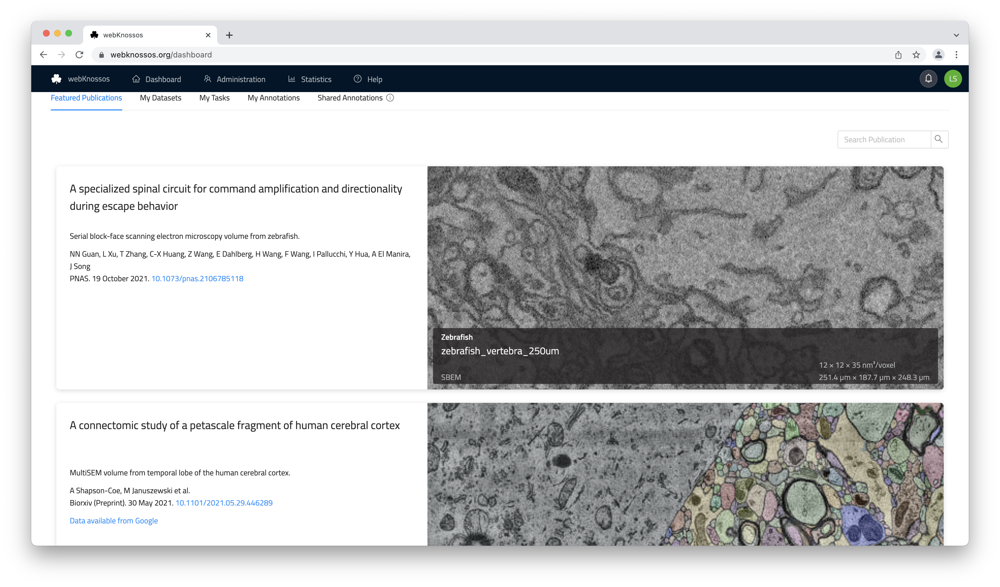
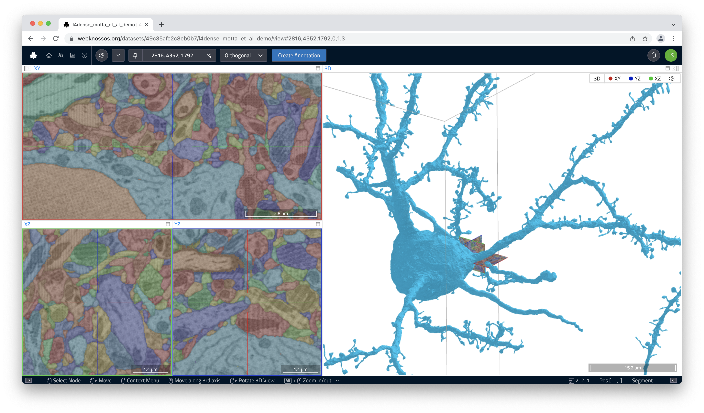

# Getting Started

Welcome to the webKnossos documentation.
Feel free to [drop us a line](mailto:hello@scalableminds.com) or [create a Pull Request](https://github.com/scalableminds/webknossos/pulls) if you have any suggestions for improving the documentation.



## Create a webknossos.org Account
Signing up to [webknossos.org](https://webknossos.org) is the easiest way to get started with webKnossos.
Go to [webknossos.org](https://webknossos.org) and create an account in the "Demo_Lab" organization.
Please make sure to enter a correct email address.
After you have entered your details, the account will be automatically activated.

You can also choose to create a new organization which will allow you to upload private datasets at a later point in time and manage other users.
For testing purposes, the "Demo_Lab" organization is preferred.

Accounts on [webknossos.org](https://webknossos.org) are free to use with published datasets.
If you wish to use private datasets, there is a fee that covers storage costs and also provides support services such as dataset conversions.
Check out the [pricing page for more details](https://webknossos.org/pricing).
You can also rent a fully-managed dedicated webKnossos server from scalable minds or install webKnossos on your own server.


## Explore Published Datasets
On [webknossos.org](https://webknossos.org) there are already a bunch of published community datasets available for you to explore.
To get started, navigate to the `Datasets` tab on your [dashboard](./dashboard.md).
There, you find a list of all available datasets.
Click on the dataset name to open the dataset.



Once you are in the view mode, you are presented with three orthongonal views and one 3D viewport.
You can use the following shortcuts to navigate the data.
See the full list of [gestures and keyboard shortcuts](./keyboard_shortcuts.md) for advanced use.

| Shortcut                      | Operation                       |
| ----------------------------- | ------------------------------- |
| Left Mouse Drag or Arrow Keys | Move In-Plane                   |
| SPACE or Mousewheel           | Move Forward                    |
| SHIFT + SPACE or Mousewheel   | Move Backward                   |
| I or ALT + Mousewheel         | Zoom In                         |
| O or ALT + Mousewheel         | Zoom Out                        |
| Scroll Mousewheel (3D View)   | Zoom In And Out                 |
| Right Click Drag (3D View)    | Rotate 3D View                  |
| . (Dot)                       | Toggle Viewport Maximization    |

You can also change the size of the viewports to see more details in your data and customize your layout.




## Your First Annotation
Click the `Create Tracing` button from the view mode of a dataset to create your first annotation.
Alternatively, navigate to the `Datasets` tab on your [dashboard](./dashboard.md), identify a dataset that your interested in and click on `Start Skeleton Tracing` to create a new skeleton annotation.
webKnossos will launch the main annotation screen allowing you to navigate your dataset and place markers to reconstruct skeletons.

Drag the mouse while pressing the left mouse button to navigate the dataset.
Right-click in the data to place markers, called nodes.
Basic movement in the dataset is done with the mouse wheel or by pressing the spacebar keyboard shortcut.

Learn more about the skeleton, volume, and hybrid annotations as well as the interface in the [Tracing UI guide](./tracing_ui.md).

{% embed data="{\"url\":\"https://www.youtube.com/embed/rMMaItS\_HYE\",\"type\":\"video\",\"title\":\"webKnossos Tracing UI Skeleton\",\"icon\":{\"type\":\"icon\",\"url\":\"https://www.youtube.com/yts/img/favicon\_144-vfliLAfaB.png\",\"width\":144,\"height\":144,\"aspectRatio\":1},\"thumbnail\":{\"type\":\"thumbnail\",\"url\":\"https://i.ytimg.com/vi/rMMaItS\_HYE/mqdefault.jpg\",\"width\":320,\"height\":180,\"aspectRatio\":0.5625},\"embed\":{\"type\":\"player\",\"url\":\"https://www.youtube.com/embed/rMMaItS\_HYE?rel=0&showinfo=0\",\"html\":\"<div style=\\\"left: 0; width: 100%; height: 0; position: relative; padding-bottom: 56.2493%;\\\"><iframe src=\\\"https://www.youtube.com/embed/rMMaItS\_HYE?rel=0&amp;showinfo=0\\\" style=\\\"border: 0; top: 0; left: 0; width: 100%; height: 100%; position: absolute;\\\" allowfullscreen scrolling=\\\"no\\\"></iframe></div>\",\"aspectRatio\":1.7778}}" %}


## Learn More
Now you know the basics of webKnossos.
Feel free to explore more features of webKnossos in this documentation.

* [Dashboard](./dashboard.md)
* [Skeleton Annotations](./skeleton_annotation.md)
* [Volume Annotations & Proof-Reading](./volume_annotation.md)
* [Keyboard Shortcuts](./keyboard_shortcuts.md)
* [Understanding the User Interface](./tracing_ui.md)
* [Sharing](./sharing.md)
* [Datasets](./datasets.md) and [Data Formats](./data_formats.md)
* [User and Permission Management](./users.md)
* [Task and Project Management](./tasks.md)
* [FAQ](./faq.md)

If you need help with webKnossos, there is a [Community Support forum](https://support.webknososs.org) where members of the community and scalable minds are happy to answer your questions.
[scalable minds](https://scalableminds.com) also offers commercial support, managed hosting and feature development services.
[Please contact us](mailto:hello@scalableminds.com) if you want to learn more.


## webKnossos on Your Own Server
webKnossos is open-source, so you can install it on your own server.
We recommend a server with at least 4 CPU cores, 16 GB RAM, and as much disk space as you require for your datasets.
As prerequisites, you need to install [Git](https://git-scm.com/), [Docker](https://docs.docker.com/install/) and [Docker Compose](https://docs.docker.com/compose/install/) on your server.

### Installation
To get started, simply clone the Git repository and start the docker containers:

```bash
git clone https://github.com/scalableminds/webknossos.git
cd webknossos

docker-compose pull webknossos
./start-docker.sh
```

This will start an instance of webKnossos on http://localhost:9000/.
Open the URL in your browser and configure your organization (see below).
This will create a folder for your data at `webknossos/binaryData/<organization name>`.


For production setups, we recommend more elaborate configurations with a public domain name and HTTPS support.
[Please contact us](mailto:hello@scalableminds.com) if you require any assistance with your production setup.


You may also install webKnossos without Docker.
This may be useful if you intend to develop features for webKnossos.
Please refer to the [Code Readme](../README.md) for details.

### Onboarding
When starting with webKnossos you first need to create an organization.
An organization represents your lab in webKnossos and handles permissions for users and datasets.
Choose a descriptive name for your organization, e.g. "The University of Springfield", "Simpsons Lab" or "Neuroscience Department".


In the onboarding flow, you are asked to create a user account for yourself.
This will be the first user of your organization which will automatically be activated and granted admin rights.
Make sure to enter a correct email address.


### Your First Dataset
Now that you've completed the onboarding, you need to import a dataset.
Without any data, webKnossos is not fun.

For small datasets (max. 1GB), you can use the upload functionality provide in the web interface.
For larger datasets, we recommend the file system upload.
Read more about the import functionality in the [Datasets guide](./datasets.md).

If you do not have a compatible dataset available, you can use one of the [sample datasets](./datasets.md#sample-datasets) for testing purposes.

By default, datasets are visible to all users in your organization.
However, webKnossos includes fine-grained permissions to assign datasets to groups of users.


