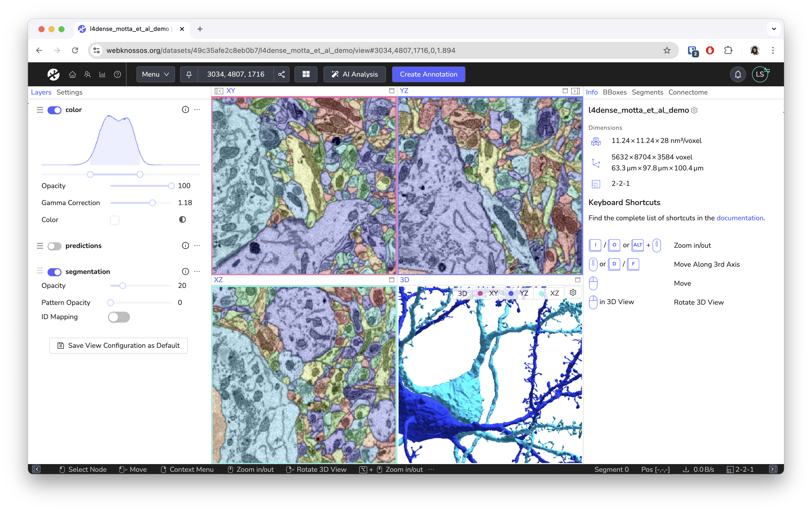
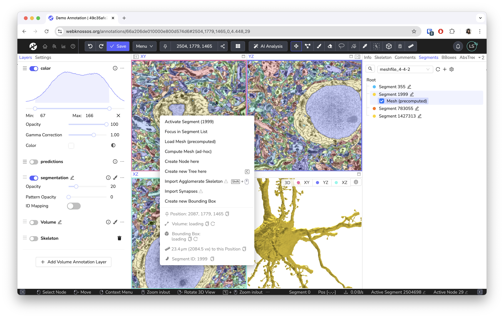

# Getting Started

Welcome to the WEBKNOSSOS documentation.
WEBKNOSSOS is a platform for [exploring large-scale 3D image datasets](./ui/index.md), [creating skeleton annotations](./skeleton_annotation/index.md) and [3D volume segmentations](./volume_annotation/index.md).
Since it is a web app, you can easily [collaborate](./sharing/index.md), [crowdsource](./tasks_projects/tasks.md) and [publish](https://webknossos.org) your work.

[Contact us](mailto:hello@webknossos.org) or create a [pull request](https://github.com/scalableminds/webknossos/pulls) to suggest improvements to the documentation.

Check out this video to get started!

## Create a webknossos.org Account

To get started with WEBKNOSSOS, sign up for a free account on [webknossos.org](https://webknossos.org).
Upload your own datasets or explore one of the many community datasets.

You get 50GB of storage for private datasets with the free tier.
For more data storage, check out the [pricing page for paid plans](https://webknossos.org/pricing) that covers storage costs and provides support services such as data format conversions.

Please [reach out to us](mailto:sales@webknossos.org) for local, on-premise hosting at your institute or custom solutions.

## Explore Published Datasets

[webknossos.org](https://webknossos.org) comes with a large number of published community datasets available for you to explore.
To get started, navigate to the `Featured Publications` tab on your [dashboard](./dashboard/index.md).
There, you find a list of all available public datasets.
Click on the dataset name to open the dataset.

You can open any WEBKNOSSOS dataset for read-only viewing (“View” mode) or in editor-mode to create a new skeleton and/or volume annotation.
Three orthogonal viewports slicing the data along the major axis and a 3D viewport make up the main WEBKNOSSOS user interface.
Read more [about the user interface](./ui/index.md).

You can use the following shortcuts to navigate the data.
See the full list of [gestures and keyboard shortcuts](./ui/keyboard_shortcuts.md) for advanced use.

| Shortcut                      | Operation                    |
| ----------------------------- | ---------------------------- |
| Left Mouse Drag or Arrow Keys | Move In-Plane                |
| SPACE or Mousewheel           | Move Forward                 |
| SHIFT + SPACE or Mousewheel   | Move Backward                |
| I or ALT + Mousewheel         | Zoom In                      |
| O or ALT + Mousewheel         | Zoom Out                     |
| Scroll Mousewheel (3D View)   | Zoom In And Out              |
| Right Click Drag (3D View)    | Rotate 3D View               |
| . (Dot)                       | Toggle Viewport Maximization |

## Your First Annotation

To create your first annotation, click the `Create Annotation` button while in “View” mode.
WEBKNOSSOS will launch the main annotation screen allowing you to navigate your dataset, place markers to reconstruct skeletons, or annotate segments as volume annotations.

You can perform various actions depending on the current tool - selectable in the toolbar at the top of the screen.
Note that the most important controls are always shown in the status bar at the bottom of your screen.
The first tool is the _Move_ tool which allows navigating the dataset by moving the mouse while holding the left mouse button.
With the _Skeleton_ tool, a left mouse click can be used to place markers in the data, called nodes.
Additionally, the left mouse button can also be used to navigate around, select or drag nodes.
The _Brush_ and _Trace_ tools allow to "paint" voxels to create volumetric annotations.
For a full rundown on the other annotations tools, such as _Eraser_, _Segment Picker_, _Fill_ please refer to documentation on [skeleton](./skeleton_annotation/tools.md) and [volume](./volume_annotation/tools.md) annotations.

To open a context-sensitive menu with various actions, such as merging two trees or flood-filling a segment, use a right mouse click.
Use the mouse wheel or press the spacebar keyboard shortcut to move along the 3rd axis.

Read the guides about the [annotation UI](./ui/index.md), [skeleton annotation](./skeleton_annotation/index.md), or [volume annotation](./volume_annotation/index.md) for more details.

## Tutorials
We have tutorials on a wide range of topics to get you started. Also check out our [YouTube channel](https://www.youtube.com/@webknossos) for video guides. 

- [Tutorial: Volume Annotation](./tutorial_volume_annotation.md)
- [Tutorial: Data Sharing with WEBKNOSSOS](./tutorial_data_sharing.md)
- [Tutorial: Automation and Interoperability](./tutorial_automation.md)

## Learn More

Now you know the basics of WEBKNOSSOS.
Feel free to explore more features of WEBKNOSSOS in this documentation.

- [Dashboard](./dashboard/index.md)
- [Volume Annotations & Proofreading](./volume_annotation/index.md)
- [Skeleton Annotations](./skeleton_annotation/index.md)
- [Understanding the User Interface](./ui/index.md)
- [Keyboard Shortcuts](./ui/keyboard_shortcuts.md)
- [Collaboration & Sharing](./sharing/index.md)
- [Data Export and Interoperability](./data/export_ui.md)
- [Datasets](./datasets/index.md) and [Data Formats](./data/index.md)
- [User and Permission Management](./users/index.md)
- [Task and Project Management](./tasks_projects/index.md)
- [FAQ](./faq.md)

Please contact us at [hello@webknossos.org](mailto:hello@webknossos.org) or[write a post in the WEBKNOSSOS support forum](https://forum.image.sc/tag/webknossos) if you need help with WEBKNOSSOS.
scalable minds also offers [commercial support, managed hosting, and feature development services](https://webknossos.org/pricing).

[Read the installation tutorial](./open_source/installation.md) if you wish to install the open source version of WEBKNOSSOS on your server.
