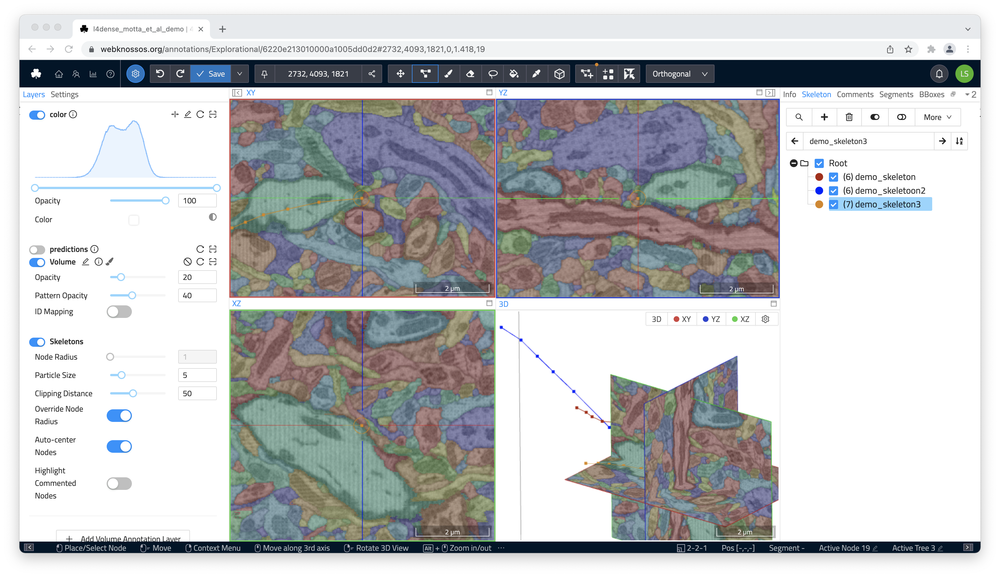
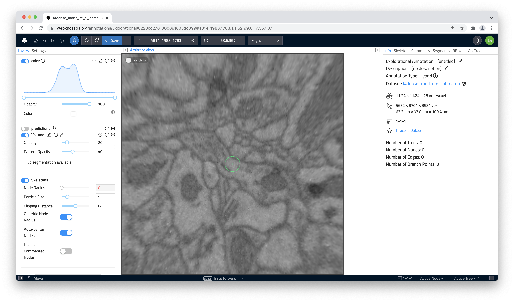

# Welcome to webKnossos

webKnossos is an [open-source tool](https://github.com/scalableminds/webknossos) for [exploring](./tracing_ui.md) large 3D electron-microscopy (EM) and light-microscopy (LM) datasets as well as [collaboratively](./sharing.md) generating annotations.
The web-based tool is powered by a specialized data-delivery backend that stores [large datasets](./datasets.md) efficiently on disk and serves many concurrent users.
webKnossos has a GPU-accelerated viewer that includes tools for creating and sharing annotations (skeletons and volumes).
Powerful [user](./users.md) and [task](./tasks.md) management features automatically distribute tasks to human annotators.
There are a lot of productivity improvements to make the human part as efficient as possible.
webKnossos is also a platform for [showcasing datasets](https://webknossos.org) alongside a paper publication.

> Boergens, Berning, Bocklisch, Bräunlein, Drawitsch, Frohnhofen, Herold, Otto, Rzepka, Werkmeister, Werner, Wiese, Wissler and Helmstaedter
webKnossos: efficient online 3D data annotation for connectomics.
[Nature Methods (2017) DOI:10.1038/NMETH.4331.](https://www.nature.com/articles/nmeth.4331)



## Demo
Try webKnossos on a large selection of published datasets: [https://webknossos.org/](https://webknossos.org/)

## Features
* Exploration of large 3D image datasets
* Fully browser-based user experience with efficient data streaming
* Creation/editing of skeleton and volume annotations
* [Innovative flight mode for fast skeleton annotation](https://www.nature.com/articles/nmeth.4331)
* Optimized performance for large annotations
* User and task management for high-throughput crowdsourcing
* Sharing and collaboration features
* [Standalone datastore component](https://github.com/scalableminds/webknossos/tree/master/webknossos-datastore) for flexible deployments
* [Supported dataset formats: WKW (Optimized), KNOSSOS cubes](https://github.com/scalableminds/webknossos/wiki/Datasets), [Neuroglancer Precomputed, and BossDB](https://github.com/scalableminds/webknossos-connect)
* [Supported image formats](./data_formats.md): Grayscale, Segmentation Maps, RGB, Multi-Channel
* [Mesh Visualization](./mesh_visualization.md)
* [Documented frontend API for user scripts](https://webknossos.org/assets/docs/frontend-api/index.html), REST API for backend access
* Open-source development with [automated test suite](https://circleci.com/gh/scalableminds/webknossos)
* [Docker-based deployment](https://hub.docker.com/r/scalableminds/webknossos/) for production and development

## Screenshots

## Credits and Help

webKnossos was developed by [scalable minds](https://scalableminds.com) in collaboration with the [Max Planck Institute for Brain Research](https://brain.mpg.de/connectomics).

If you need help with webKnossos, feel free to contact us at [hello@scalableminds.com](mailto:hello@scalableminds.com).
scalable minds also offers [commercial support, managed hosting and feature development services](https://webknossos.org/pricing).

<!--
## Labs that use webKnossos

* [Helmstaedter Lab, Max Planck Institute for Brain Research](http://brain.mpg.de/research/helmstaedter-department.html)
* [Briggman Lab, Caesar Institute](https://www.caesar.de/en/our-research/computational-neuroethology/research-focus.html)
* [Schaefer Lab, The Francis Crick Institute](https://www.crick.ac.uk/research/labs/andreas-schaefer)
* [Singer Lab, University of Maryland](http://biology.umd.edu/joshua-singer.html)
[See All Publications Using webKnossos](./publications.md)
[Please let us know](mailto:hello@scalableminds.com), if you'd like to add your lab to the list.
-->
