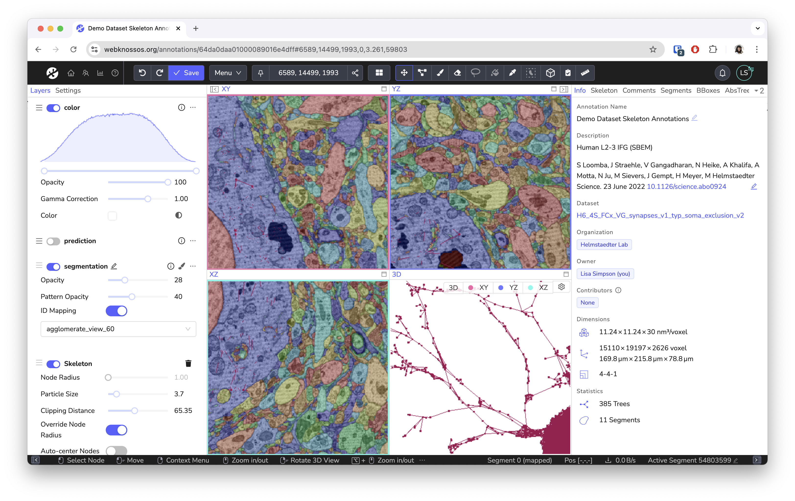
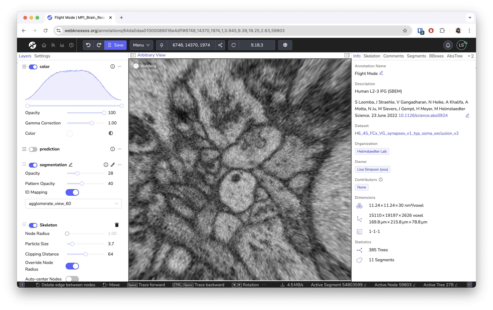
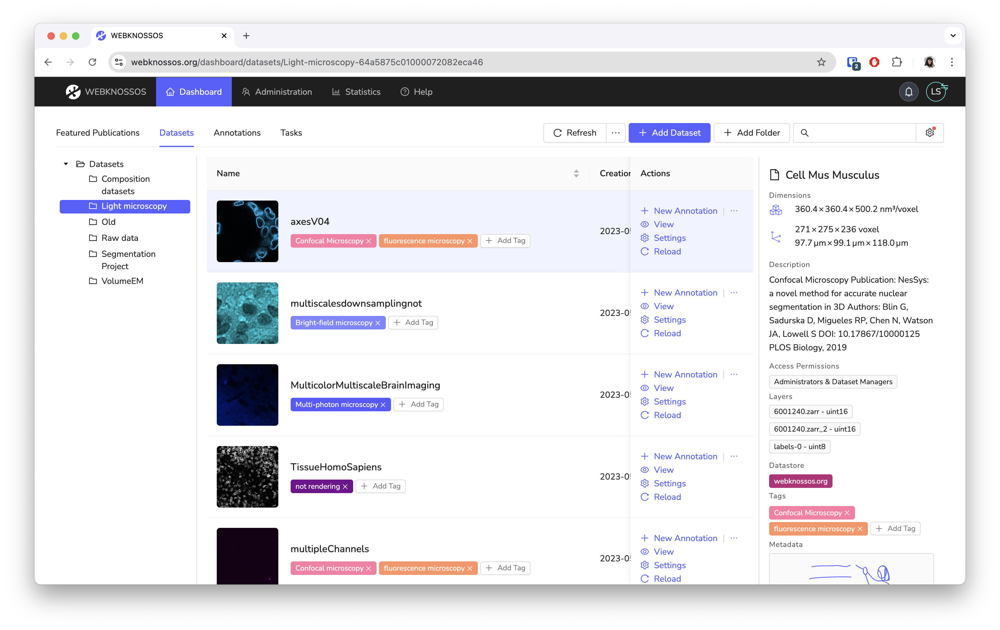
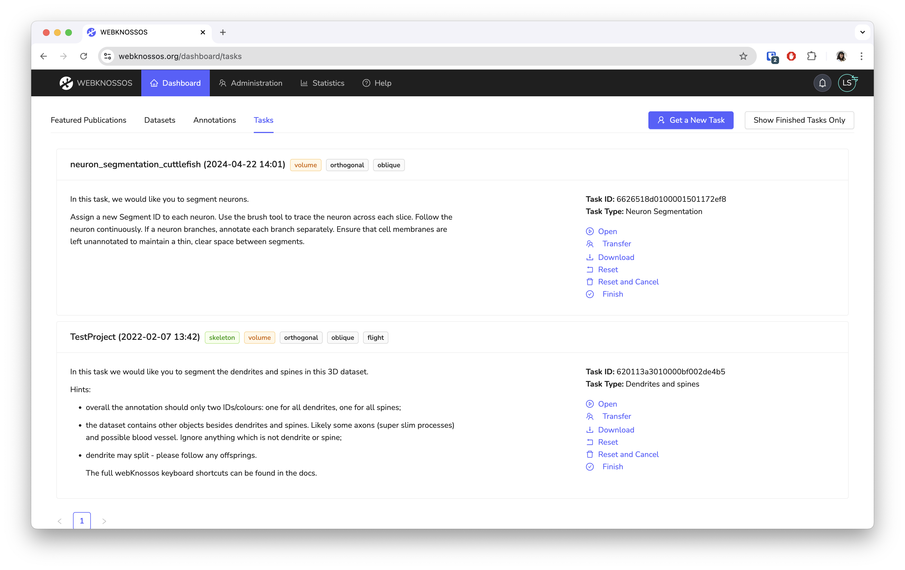

# Welcome to WEBKNOSSOS

WEBKNOSSOS is an [open-source tool](https://github.com/scalableminds/webknossos) for [exploring](./ui/index.md) large 3D electron-microscopy (EM) and light-microscopy (LM) datasets as well as [collaboratively](./sharing/index.md) generating annotations.
The web-based tool is powered by a specialized data-delivery backend that stores [large datasets](./datasets/index.md) efficiently on disk and serves many concurrent users.
WEBKNOSSOS has a GPU-accelerated viewer that includes tools for creating and sharing skeleton and volume annotations.
Powerful [user](./users/index.md) and [task](./tasks_projects/index.md) management features automatically distribute tasks to human annotators.
WEBKNOSSOS is also a platform for [showcasing datasets](https://webknossos.org) alongside a paper publication.

## Features

- Exploration of large 2D, 3D, 4D image datasets as found in electron-microscopy, synchrotron, CT, MRI, Micro/Nano-CT, and light microscopy
- Fully browser-based user experience. No installation required
- Efficient 3D data streaming for quick loading speeds
- Creation/editing of [skeleton (line-segments)](./skeleton_annotation/index.md) and [3D volumetric annotations](./volume_annotation/index.md)
- [Innovative flight mode for fast skeleton annotation](https://www.nature.com/articles/nmeth.4331)
- User and task management for high-throughput collaboration in the lab or crowdsourcing
- Easy Sharing. Share your [datasets](./sharing/dataset_sharing.md) and [annotations](./sharing/annotation_sharing.md) securely with others using web links
- [Fine-grained access permission](./users/access_rights.md) and and user roles for secure collaboration
- [AI Quick Select tool](./volume_annotation/tools.md#ai-quick-select) to speed up segmentation
- [Standalone datastore component](https://github.com/scalableminds/webknossos/tree/master/webknossos-datastore) for flexible deployments
- [Supported dataset formats: Zarr, WKW (Optimized), KNOSSOS cubes, Neuroglancer Precomputed, N5, and image stacks](./data/index.md) (some formats will be converted on upload)
- [Supported image formats](./data/index.md): Grayscale, Segmentation Maps, RGB, Multi-Channel
- Supports Time Series datasets
- [3D Mesh Visualization](./meshes/index.md)
- [Integrated Synapse and Connectome Viewer](./connectome_viewer.md)
- [Python library with documentation for API access and integration in custom analysis workflows](https://docs.webknossos.org/webknossos-py/index.html)
- [Frontend API for user scripting](https://webknossos.org/assets/docs/frontend-api/index.html)
- Developed as an open-source project with [automated testing](https://circleci.com/gh/scalableminds/webknossos)
- [Deployable with Docker for production and development](https://hub.docker.com/r/scalableminds/webknossos/)

## Screenshots

# Built for Science

WEBKNOSSOS is built for scientists with support by scientists. Our goal is to make image analysis and data exploration accessible and easy to use.
While originally designed for the annotation of electron microscopy of neural circuits, we have seen great projects using it to analyze MRI/CT scans, fluorescences microscopy images, and synchrotron datasets.

WEBKNOSSOS' impact on data annotation in neuroscience and Connectomics has been published in Nature Methods, 2017 and many other [publications](./publications.md):

> Boergens, Berning, Bocklisch, Bräunlein, Drawitsch, Frohnhofen, Herold, Otto, Rzepka, Werkmeister, Werner, Wiese, Wissler and Helmstaedter
> webKnossos: efficient online 3D data annotation for connectomics.
> [Nature Methods (2017) DOI:10.1038/NMETH.4331.](https://www.nature.com/articles/nmeth.4331)

## Credits and Help

WEBKNOSSOS is developed by [scalable minds](https://scalableminds.com) in collaboration with the [Max Planck Institute for Brain Research](https://brain.mpg.de/connectomics).

If you need help with WEBKNOSSOS, feel free to contact us at [hello@webknossos.org](mailto:hello@webknossos.org) or [write a post in the community forum](https://forum.image.sc/tag/webknossos).
scalable minds also offers [commercial support, managed hosting, and image analysis services](https://webknossos.org/pricing).
