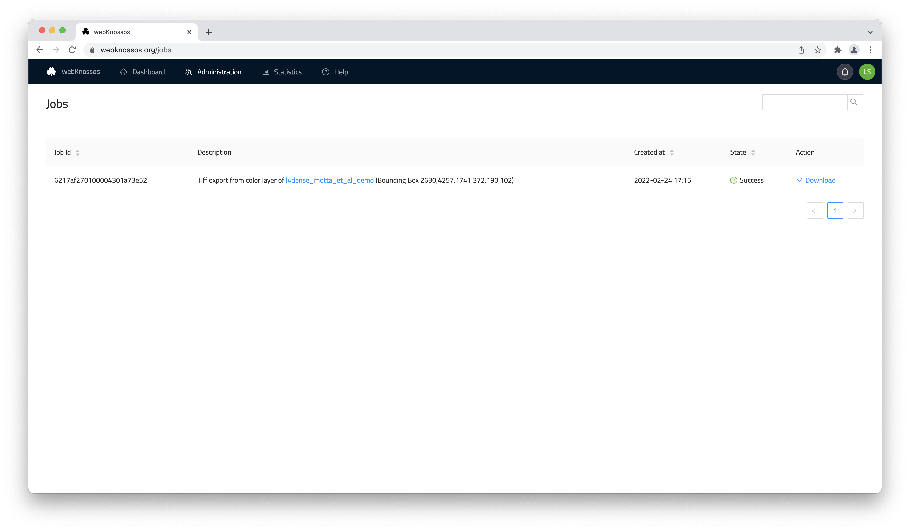

# Jobs

webKnossos.org includes several compute-intensive and automated workflows that are processed in the background. Depending on the operation and dataset size, these workflows may take some time (from minutes to hours) to finish. 

Example workflows:

- [converting datasets on upload](./datasets.md#uploading-through-the-web-browser)
- [automated analysis](./automated_analysis.md), e.g., nuclei inferal 
- [mesh file (pre)-computation](./mesh_visualization.md)
- Tiff export of a bounding box
- downsampling volume annotations

These workflows are executed in background worker tasks as so-called *processing jobs*. 

## Listing Processing Jobs
A list of all past and currently running jobs can be found from the administration menu in the navbar (Admininstration -> *Processing Jobs*).

Depending on the job workflow you may:

- view the resulting resource, e.g., a new segmentation 
- download the data, e.g., Tiff export

We constantly monitor job executions. In rare cases jobs can fail and we aim to re-run them as quickly as possible. In case you run into any trouble please [contact us](mailto:hello@webknossos.org).