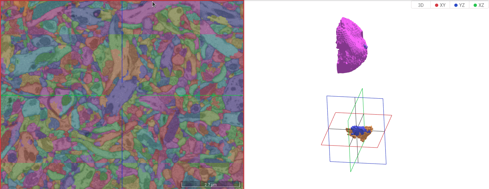
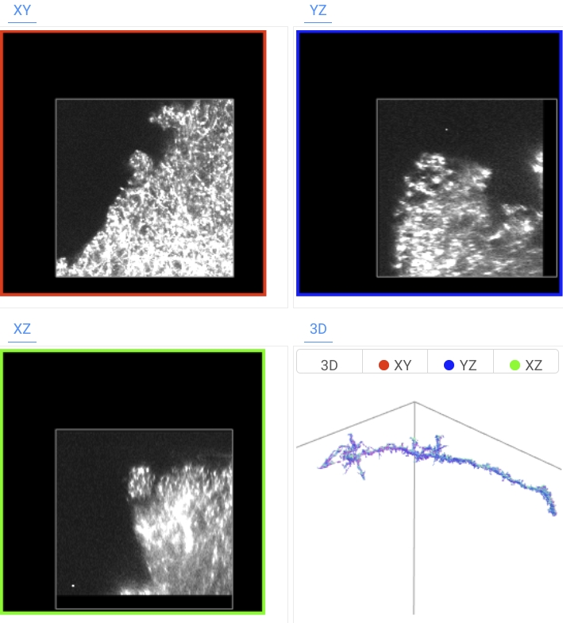
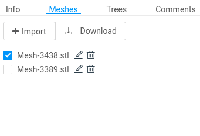

# Mesh Visualization
webKnossos offers two different ways to render segmentations as 3D meshes.
First, meshes can simply be imported as STL files and webKnossos will render these as normal 3D objects.
Second, webKnossos can generate isosurfaces of specific cells ad-hoc.
These two approaches are explained in the following.

## Live Isosurface Generation

When **viewing a dataset** (using the ["View" action](./dashboard.md#datasets) when opening a dataset) with a segmentation layer, the experimental "Render Isosurfaces" setting can be enabled within the [dataset settings](./mesh_visualization.md#tracing-ui-settings).
Once the setting is enabled, webKnossos will generate isosurface meshes of the active cell and render these in the 3D viewport.
To activate a cell, use shift+click on a segment in the annotation view.
The isosurface is computed in chunks, which is why the isosurface is likely to appear bit by bit.
When hovering over an isosurface in the 3D viewport, the cell will also be highlighted in the other viewports.
Shift + Click on an isosurface in the 3D viewport will change the active position to where you clicked.
CTRL + Click on an isosurface will remove that isosurface again.

Note that the generated isosurface is not persisted for the annotation.
Consequently, refreshing the page, will "forget" all previously generated isosurfaces.
To persist generated isosurfaces, you can use the "Download" button within the "Meshes" pane.
That "Download" button will persist the isosurface of the active cell as an STL file to your disk.
Using the "Import" button in the "Meshes" pane, you can re-import isosurfaces.

Read more about STL imports in the following subsection.

## STL Import

Apart from importing STLs which were created by webKnossos, you can also use the "Import" button within the "Meshes" tab to import arbitrary STL files.
Such files can be created from volume data with the help of external tools, such as [Amira](https://www.fei.com/software/amira-avizo/).
After the import, meshes are rendered alongside the actual data in the 3D viewport.
For each mesh, the name, position and visibility can be adapted via the "Meshes" tab.
In contrast to generated isosurfaces, uploaded STLs will be persisted within the annotation.
For that reason, the import only works when opening an annotation (as opposed to just viewing a dataset).

## Troubleshooting

Note that the mesh and isosurface support in webKnossos is an ongoing development effort.
The functionality is currently limited by the following:

- Isosurface generation only works for segmentation layers (as opposed to volume annotations). As a result, the dataset has to be opened in view mode to enable isosurfaces.
- Isosurfaces are not persisted automatically. If you want to manually persist an isosurface, you can use the "Download" button in the meshes tab.
- Importing an STL which was not generated with webKnossos only works when having an annotation opened (since that mesh will be persisted).

We are working on unifying the interface of meshes and isosurfaces to make the experience more intuitive.
