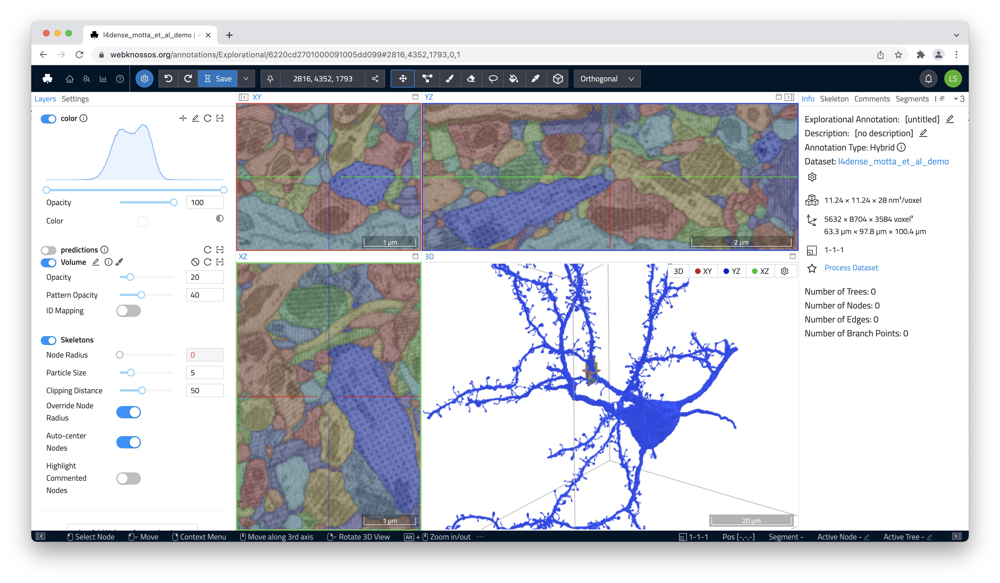

# Mesh Visualization
WEBKNOSSOS offers two different methods to render and visualize volumetric segmentations as 3D meshes.

1. Load a pre-computed 3D mesh. Meshes can either be (pre-)computed from within WEBKNOSSOS for the whole dataset or outside of WEBKNOSSOS with a `mesh file`. These meshes will be instantly available the next time you open this dataset (quicker mesh loading time).
2. Compute an ad-hoc mesh of any segmentation layer or volume annotation. These meshes will live computed any time you request them (slower mesh loading time).

Mesh will always be rendered in the 3D viewport in the lower right. 

## Loading Meshes
Regardless of the method, meshes can be loaded by right-clicking on any segment and bringing up the context-sensitive action menu. Select `Load Mesh (pre-computed)` or `Compute Mesh (ad-hoc)` to load the respective 3D mesh for that segment.

Alternatively, the `Segments` tab in the right-hand side panel, allows you to load the mesh for any segment listed there. Select the corresponding option from the overflow menu next to each list entry.

## Working with Meshes
Any meshes listed in the `Segments` tab can be downloaded as an industry-standard STL file for further rendering/animation, e.g., in Blender ([Read more in this blog series](https://medium.com/scalableminds/how-to-make-great-videos-for-biomedical-microscopy-data-51218ffa2421)]). Hover over the list entry for the desired mesh to reveal a shortcut menu for downloading, reloading, and unloading/removing meshes.

Mesh visibility can also be triggered from the `Segments` tab.

Shift + Click on any mesh in the 3D viewport will navigate WEBKNOSSOS to that position.
CTRL + Click on any mesh will unload that mesh.

## Pre-Computed Mesh Generation
Instead of having to slowly compute individual mesh every time you open a dataset, it might make more sense to pre-compute all meshes within a dataset. Pre-computed meshes have the advantage of loading very quickly - even for larger meshes.

You can start the mesh generation from the `Segments` tab in the right-hand side panel. Click on the little plus button to initiate the mesh generation. We recommend computing the meshes in the medium quality (default) to strike a good balance between visual fidelity, compute time, and GPU resource usage. 

!!! info
    Pre-computated meshes are exclusive to webknossos.org. Contact [sales](mailto:sales@webknossos.org) for access to the WEBKNOSSOS worker or [Voxelytics](https://voxelytics.com)) for the meshing job.

[Check the `Processing Jobs` page](./jobs.md) from the `Admin` menu at the top of the screen to track progress or cancel the operation. The finished, pre-computed mesh will be available on page reload. 
