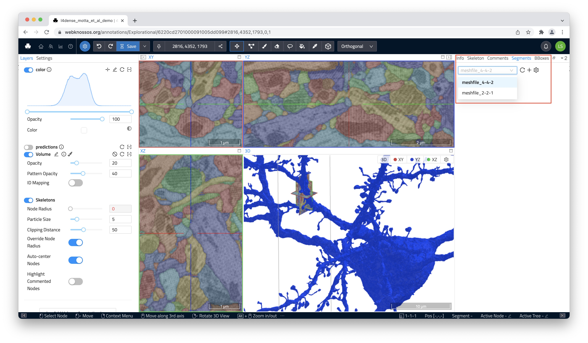

# Mesh Visualization
WEBKNOSSOS offers two different methods to render and visualize volumetric segmentations as 3D meshes.

1. Load a pre-computed 3D mesh. These meshes have been (pre-)computed by WEBKNOSSOS for all segments in the dataset and will load almost instantly (very quick loading time).
2. Compute an ad-hoc mesh of any single segment in your volume annotation. These meshes will be live computed any time you request them (slower mesh loading time).

Mesh will always be rendered in the 3D viewport in the lower right. 

## Loading Meshes
Regardless of the method, meshes can be loaded by right-clicking on any segment and bringing up the context-sensitive action menu. Select `Load Mesh (pre-computed)` or `Compute Mesh (ad-hoc)` to load the respective 3D mesh for that segment.

Alternatively, the `Segments` tab in the right-hand side panel, allows you to load the mesh for any segment or whole group of segments listed there. Select the corresponding option from the overflow menu next to each list entry.

## Working with Meshes
Any meshes listed in the `Segments` tab can be downloaded as an industry-standard STL file for further rendering/animation, e.g., in Blender ([Read more in this blog series](https://medium.com/scalableminds/how-to-make-great-videos-for-biomedical-microscopy-data-51218ffa2421)]). Hover over the list entry for the desired mesh to reveal a shortcut menu for downloading, reloading, and unloading/removing meshes.

Mesh visibility can also be triggered from the `Segments` tab.

Shift + Click on any mesh in the 3D viewport will navigate WEBKNOSSOS to that position.
CTRL + Click on any mesh will unload that mesh.

Additionally, hiding, removing, reloading a mesh or jumping to its hovered position can be done with the context menu in the 3d viewport via right-click on a hovered mesh.

You can also include meshes in [WEBKNOSSOS animations](./animations.md).

## Pre-Computed Mesh Generation
Instead of having to slowly compute individual mesh every time you open a dataset, it might make more sense to pre-compute and save all meshes within a dataset. Pre-computed meshes have the advantage of loading very quickly - even for larger meshes.

You can start mesh generation from the `Segments` tab in the right-hand side panel. Click on the little plus button to initiate the mesh generation. We recommend computing the meshes in the medium quality (default) to strike a good balance between visual fidelity, compute time, and GPU resource usage. 

!!! info
    Pre-computed meshes are exclusive to webknossos.org. Contact [sales](mailto:sales@webknossos.org) for access to the integrated WEBKNOSSOS worker for meshing or the [Voxelytics software](https://voxelytics.com) for standalone meshing from the command line.

[Check the `Processing Jobs` page](./jobs.md) from the `Admin` menu at the top of the screen to track progress or cancel the operation. The finished, pre-computed mesh will be available on page reload. 
