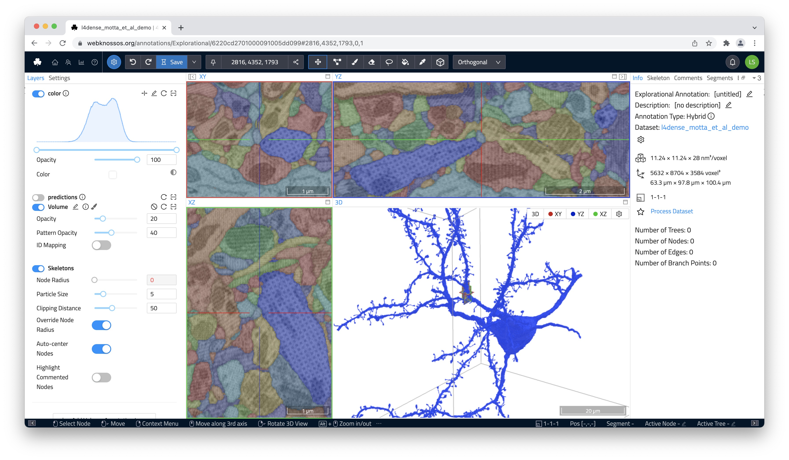

# Mesh Visualization
WEBKNOSSOS offers two different methods to render and visualize volumetric segmentations as 3D meshes.

1. Load a pre-computed 3D mesh. These meshes have been (pre-)computed by WEBKNOSSOS for all segments in the dataset and will load almost instantly (very quick loading time).
2. Compute an ad-hoc mesh of any single segment in your volume annotation. These meshes will be live computed any time you request them (slower mesh loading time).

Mesh will always be rendered in the 3D viewport in the lower right. 

