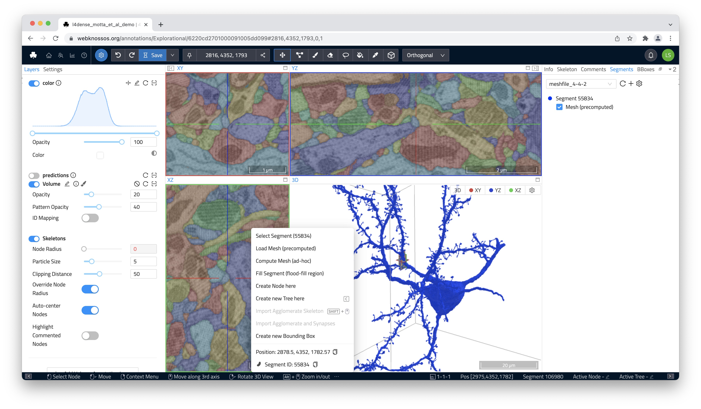
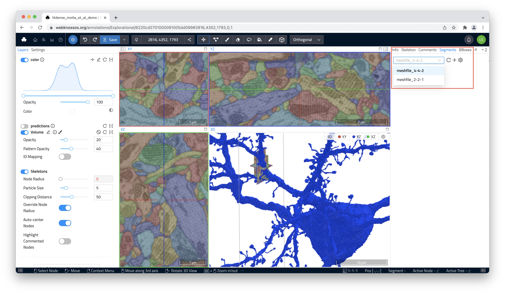

# Loading Meshes
Regardless of the method, meshes can be loaded by right-clicking on any segment and bringing up the context-sensitive action menu. Select `Load Mesh (pre-computed)` or `Compute Mesh (ad-hoc)` to load the respective 3D mesh for that segment.

Alternatively, the `Segments` tab in the right-hand side panel, allows you to load the mesh for any segment or whole group of segments listed there. Select the corresponding option from the overflow menu next to each list entry.

