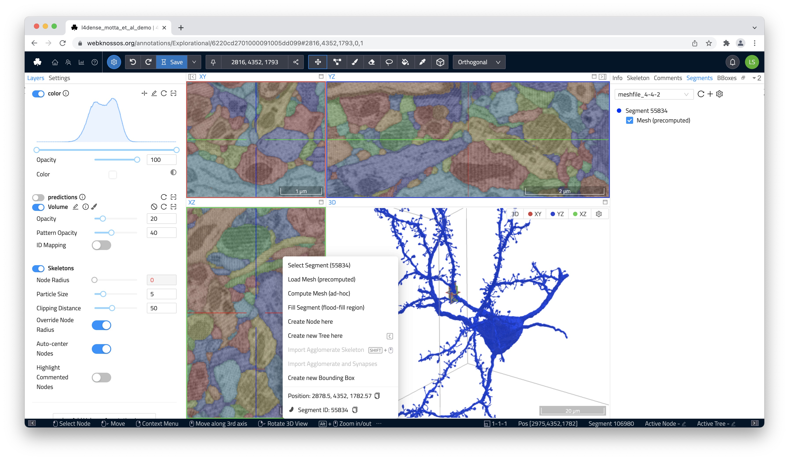
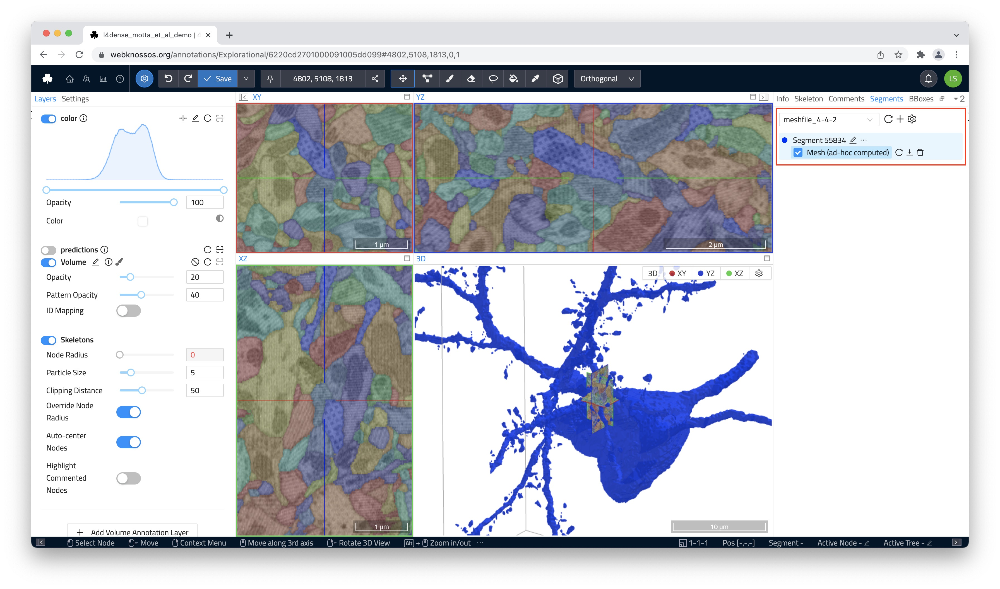
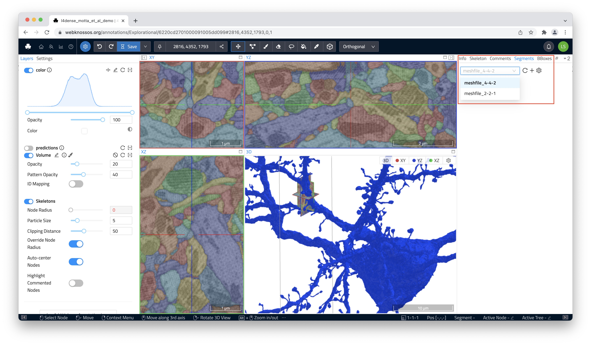

# Loading Meshes

Meshes can be loaded by right-clicking on any segment and selecting `Load Mesh (precomputed)` or `Compute Mesh (ad-hoc)` from the context menu.

Alternatively, the `Segments` tab in the right-hand side panel allows you to load the mesh for any segment or whole group of segments listed there. Select the corresponding option from the overflow menu next to each list entry.

Note that the segmentation layer must be visible to load or compute meshes; otherwise the corresponding actions are disabled.

/// caption
Meshes can be loaded from the context-sensitive right-click menu
///

/// caption
The Segments Tab lists all loaded meshes.
///

## Ad-hoc Meshes

Ad-hoc meshes are computed on demand for individual segments. The mesh quality can be configured from the same settings (gear icon) popover in the `Segments` tab header. Higher quality produces a more detailed mesh but requires more computational resources and takes longer to compute. 

Note that ad-hoc mesh computation can take a significant amount of time for large segments, as the server needs to load and process a large amount of voxel data. For datasets where you regularly work with large segments, consider [generating precomputed mesh files](#generating-precomputed-mesh-files) instead.

## Precomputed Meshes

Precomputed meshes have already been computed for all segments in the dataset and load almost instantly, even for large meshes.

A dataset can have multiple precomputed mesh files, for example one per magnification level. Lower magnifications produce coarser meshes that load faster, while higher magnifications yield finer detail at the cost of longer load times. To switch between mesh files, click the settings (gear) icon at the top of the `Segments` tab and select the desired file from the dropdown. The reload button next to the dropdown refreshes the list if new mesh files have been added.

/// caption
If you have more than one mesh file precomputed, e.g. based on different magnifications, they can be selected from a dropdown.
///

### Generating Precomputed Mesh Files

Instead of computing individual meshes on demand, you can pre-compute and save meshes for all segments in a dataset at once.

Start mesh generation by clicking the plus (+) button at the top of the `Segments` tab. A popover lets you choose the mesh quality and kick off the generation job. We recommend the medium quality (default) for a good balance between visual fidelity, compute time, and GPU resource usage. You can run the job multiple times at different quality levels to produce several mesh files to choose from.

!!! info
    Pre-computed meshes are exclusive to webknossos.org. Contact [sales](mailto:sales@webknossos.org) for access to the integrated WEBKNOSSOS worker for meshing or the [Voxelytics software](https://voxelytics.com) for standalone meshing from the command line.

[Check the `Processing Jobs` page](../automation/jobs.md) from the `Analysis` menu at the top of the screen to track progress or cancel the operation. The finished mesh file will be available on page reload.

