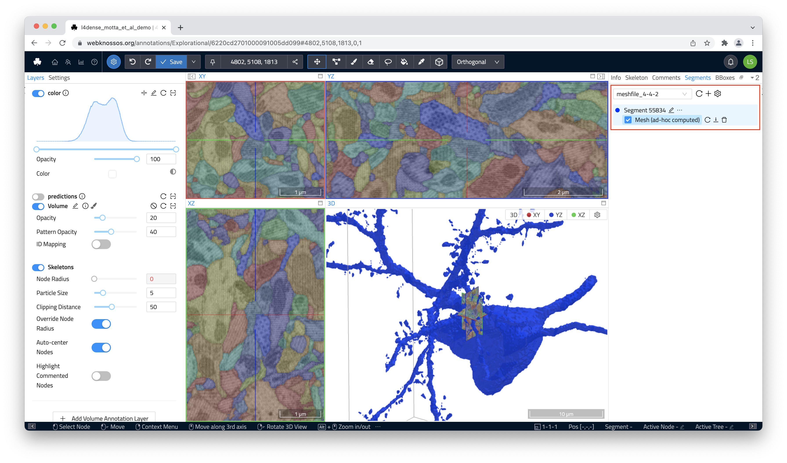

# Working with Meshes

Any meshes listed in the `Segments` tab can be downloaded as an industry-standard STL file for further rendering/animation, e.g., in Blender ([Read more in this blog series](https://medium.com/scalableminds/how-to-make-great-videos-for-biomedical-microscopy-data-51218ffa2421)]). Hover over the list entry for the desired mesh to reveal a shortcut menu for downloading, reloading, and unloading/removing meshes.

Mesh visibility can also be triggered from the `Segments` tab.

Shift + Click on any mesh in the 3D viewport will navigate WEBKNOSSOS to that position.
CTRL + Click on any mesh will unload that mesh.

Additionally, hiding, removing, reloading a mesh or jumping to its hovered position can be done with the context menu in the 3d viewport via right-click on a hovered mesh.

You can also include meshes in [WEBKNOSSOS animations](../automation/animations.md).