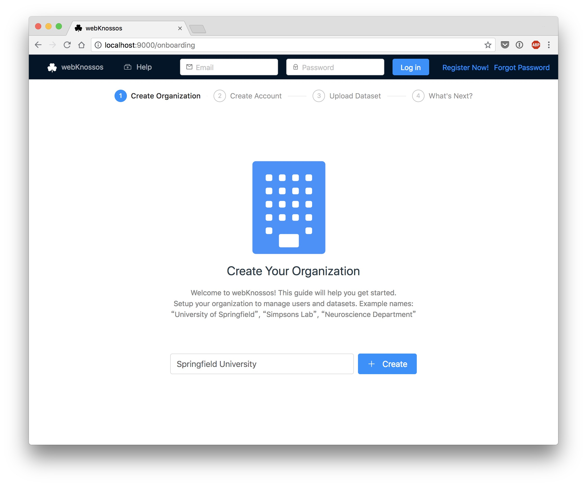
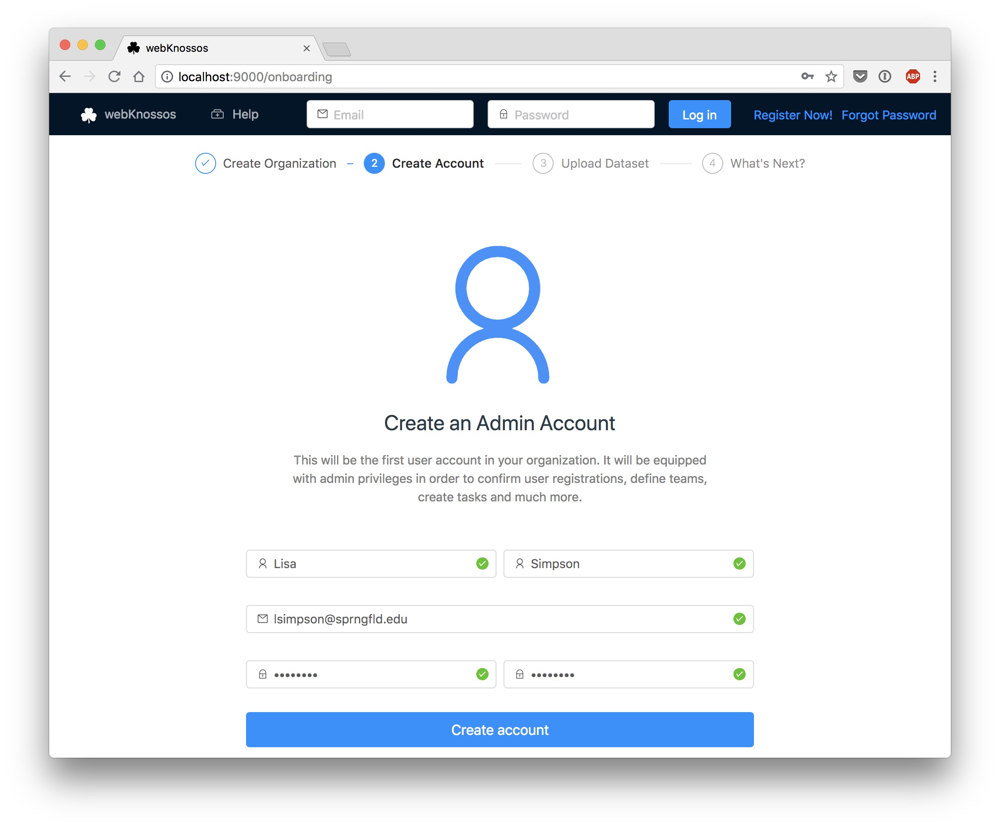
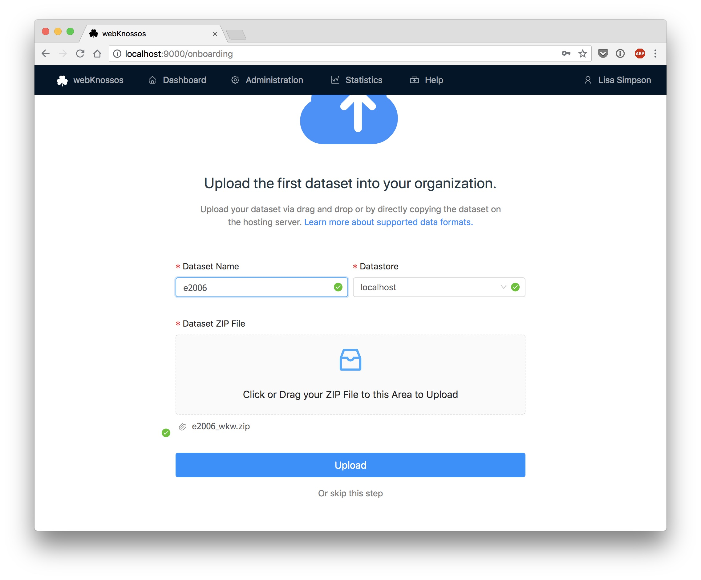
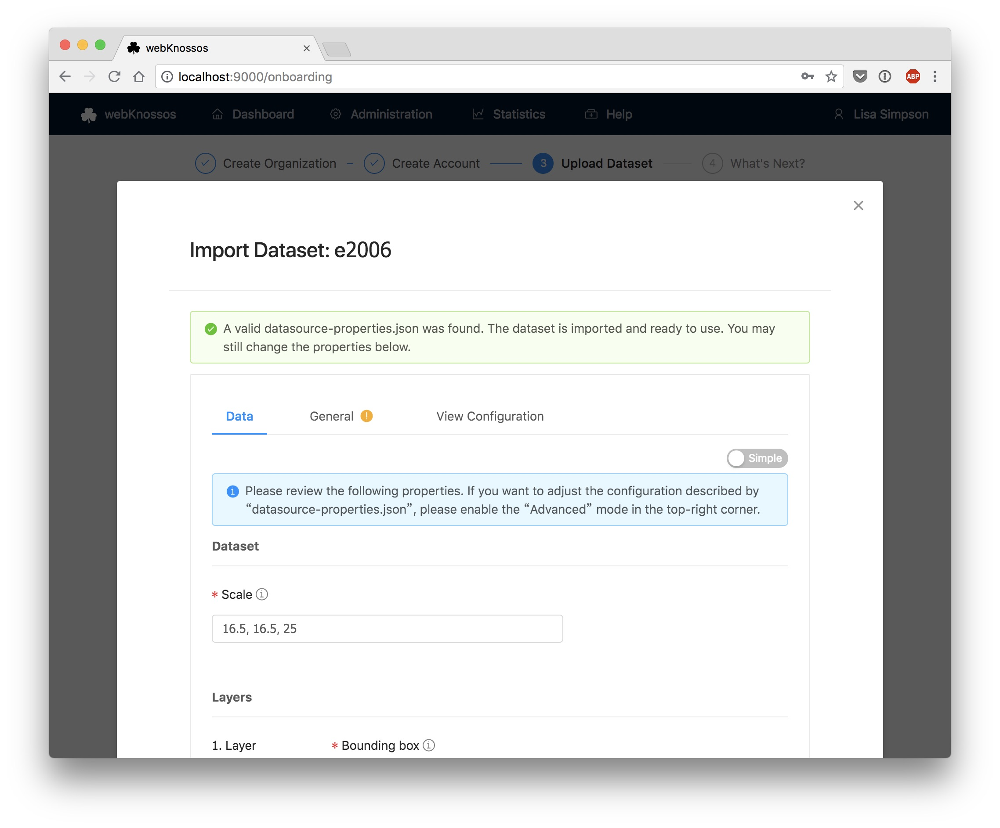
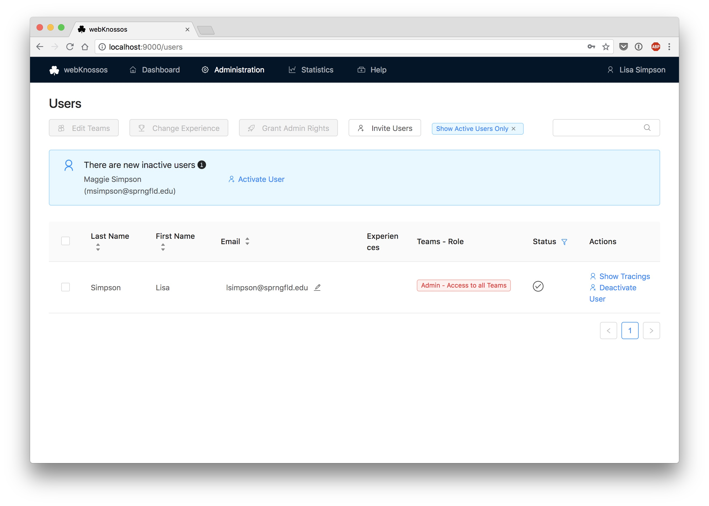
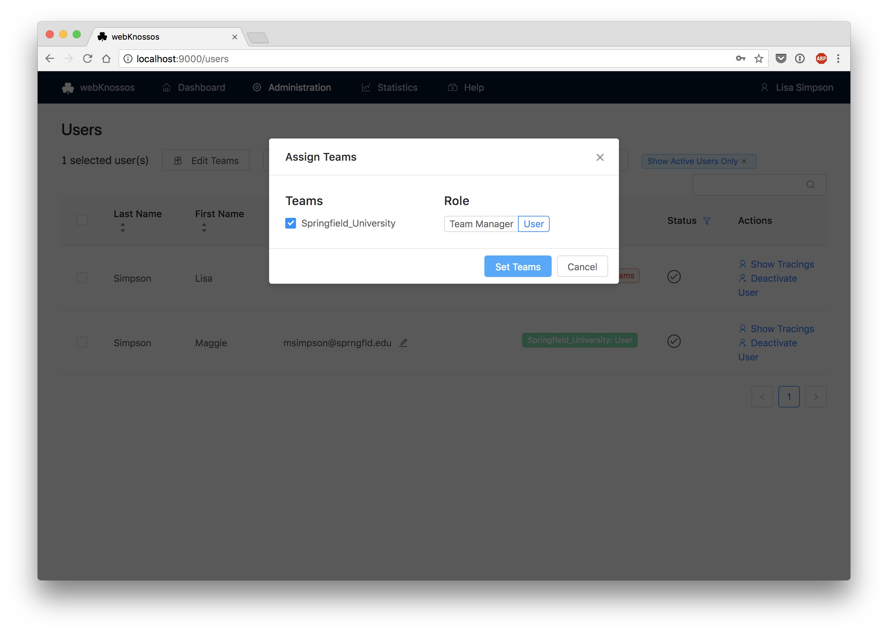

# Installation on your Server
The easiest way to get started with WEBKNOSSOS is to get an account on [webknossos.org](https://webknossos.org).

WEBKNOSSOS is open-source, so you can install it on your own server.
We recommend a server with at least 4 CPU cores, 16 GB RAM, and as much disk space as you require for your datasets.

As prerequisites, you need to install [Docker](https://docs.docker.com/desktop/install/linux-install/) including [Docker Compose](https://docs.docker.com/compose/reference/) on your server. Docker 23+ is recommended.

This tutorial shows how to install WEBKNOSSOS on a fresh VM, which is available over the public internet and has a domain name (or a subdomain) already configured.
WEBKNOSSOS will then be available over a secured connection (HTTPS) with automatic certificate management.

```bash
# Create a new folder for webknossos
mkdir -p /opt/webknossos
cd /opt/webknossos

# Download the docker-compose.yml for hosting
wget https://github.com/scalableminds/webknossos/raw/master/tools/hosting/docker-compose.yml

# Create the binaryData folder which will contain all your datasets
mkdir binaryData

# The binaryData folder needs to be readable/writable by user id=1000,gid=1000
chown -R 1000:1000 binaryData

# Start WEBKNOSSOS and supply the DOCKER_TAG, PUBLIC_HOST and LETSENCRYPT_EMAIL variables
# In addition to WEBKNOSSOS, we also start an nginx proxy with automatic 
# SSL certificate management via letsencrypt
# Note that PUBLIC_HOST does not include http:// or https:// prefixes
# Please look up the latest WEBKNOSSOS version number at https://github.com/scalableminds/webknossos/releases
DOCKER_TAG=xx.yy.z PUBLIC_HOST=webknossos.example.com LETSENCRYPT_EMAIL=admin@example.com \
docker compose up webknossos nginx nginx-letsencrypt

# Wait a couple of minutes for WEBKNOSSOS to become available under your domain
# e.g. https://webknossos.example.com
# Set up your organization and admin account using the onboarding screens (see below)

# After the initial run, you can start WEBKNOSSOS in the background
DOCKER_TAG=xx.yy.z PUBLIC_HOST=webknossos.example.com LETSENCRYPT_EMAIL=admin@example.com \
docker compose up -d webknossos nginx nginx-letsencrypt

# Congratulations! Your WEBKNOSSOS is now up and running.

# Stop everything
docker compose down
```

**This setup does not support regular backups or monitoring.
    Please check out [our paid service plans](https://webknossos.org/pricing) if you require any assistance with your production setup.**

For installations on localhost, please refer to the [Readme](https://github.com/scalableminds/webknossos#docker).

## Onboarding
When starting with WEBKNOSSOS you first need to create an organization.
An organization represents your lab in WEBKNOSSOS and handles permissions for users and datasets.
Choose a descriptive name for your organization, e.g., "The University of Springfield", "Simpsons Lab" or "Neuroscience Department".



In the onboarding flow, you are asked to create a user account for yourself.
This will be the first user of your organization which will automatically be activated and granted admin rights.
Make sure to enter a correct email address.




## Your First Dataset
Without any data, WEBKNOSSOS is not fun.
Luckily, there are some sample datasets that you can download directly from the onboarding screens.
Once you've completed the onboarding, you can also import your own datasets.

For small datasets (max. 1GB), you can use the upload functionality provided in the web interface.
For larger datasets, we recommend the file system upload.
Read more about the import functionality in the [Datasets guide](../datasets/index.md).

If you do not have a compatible dataset available, you can convert your own data using [the WEBKNOSSOS CLI](https://docs.webknossos.org/cli/) or use one of the [sample datasets](../datasets/index.md#example-datasets) for testing purposes.

By default, datasets are visible to all users in your organization.
However, WEBKNOSSOS includes fine-grained permissions to assign datasets to groups of users.




## Activating New Users
TODO revise this section

On private WEBKNOSSOS instances, users can only join through an email invitation.

If newly registered users did not join via an email invite link, they join a WEBKNOSSOS organization with the status "deactivated". An admin or a team manager needs to approve them and activate their user account before they can access anything on your WEBKNOSSOS instance. 
Users that registered within the last 14 days are shown above the `Users` list (accessible from the Admin menu) and can be activated quickly from there.
After that time or by default for any other inactive users, the `Users` list only shows active users, so make sure to deactivate the `Show Active Users Only` filter at the top of the user list to see/activate new users.


When activating new users, a popup opens for

  - team assignment
  - access role assignment


