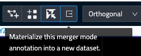

# Proof-Reading

webKnossos offers several ways for proof-reading large segmentation and reconstruction projects.

There are three proof-reading workflows supported by webKnossos:
1. The Proof-Reading tool to correct large segmentation based on an underlaying super-boxel graph
2. The Merger-Mode tool
3. Skeleton annotations together with custom scripting

## Proof-Reading tool

The proof-reading tool enables users to fix merge and split errors in a segmentation generated from an automated workflow (outside of webKnossos), e.g. from a machine learning system. Split and merge operations are directly exectued on the underlaying super-voxel graph structure of a segmentation. 

## Merger Mode

With "Merger Mode" tool individual segments (e.g. from over-segmentation) can be combined ("merged") to refine the segmentation and fix split errors. 

To use the Merge Mode:
1. From the tool bar, switch to the Skeleton Tool
2. From the tool bar, enable the "Merger Mode" modifier (double arrow icon)
3. Mark connected segments by left-clicking them and placing nodes in the corresponding segments. This process will create a skeleton annotation in the process. Segments connected through this skeleton annotation will be merged together. Several segments can be combined by making sure that all "correcting nodes" are part of the same tree.

Note, the merge mode is a rather light-way tool. webKnossos will not directly apply your changes to the underlaying segmentation. Rather the merger mode corrections are applied in-realtime based on the currently available skeleton annotations. Disabeling the merger mode will reveal to previous state of the segmentation. Enabling the merge mode will re-apply your corrections.

After finishing the proof-reading, a [long-running job](./jobs.md) can be started to apply the merging of segments into a new dataset with the same layers. The job can be started by clicking the "Materialize" button next to the merger mode button in the tool-bar.

## Proof-Reading with skeletons and scripting
In our workflows, we make heavy use of skeleton annotations for proof-reading and evaluation. In combination with custom Python scripting we use skeletons:

- to mark error locations as determined by evaluation scripts, e.g. incorrect predictions 
- to label locations for True Positives/False Positive examples, e.g. to debug classifications
- we encode additional metadata for any given segment in the skeleton tree names, groups, and comments, i.e. the biological cell type for a segment
- we manually annotate classification mistakes or interesting features in the data and donwload/bring them back into our Python workflows for correction and further processing

This system is very flexible, though requires a little bit of creativity and coding skills with the [webKnossos Python library](./tooling#webknossos-python-library).