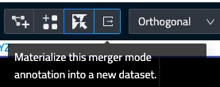
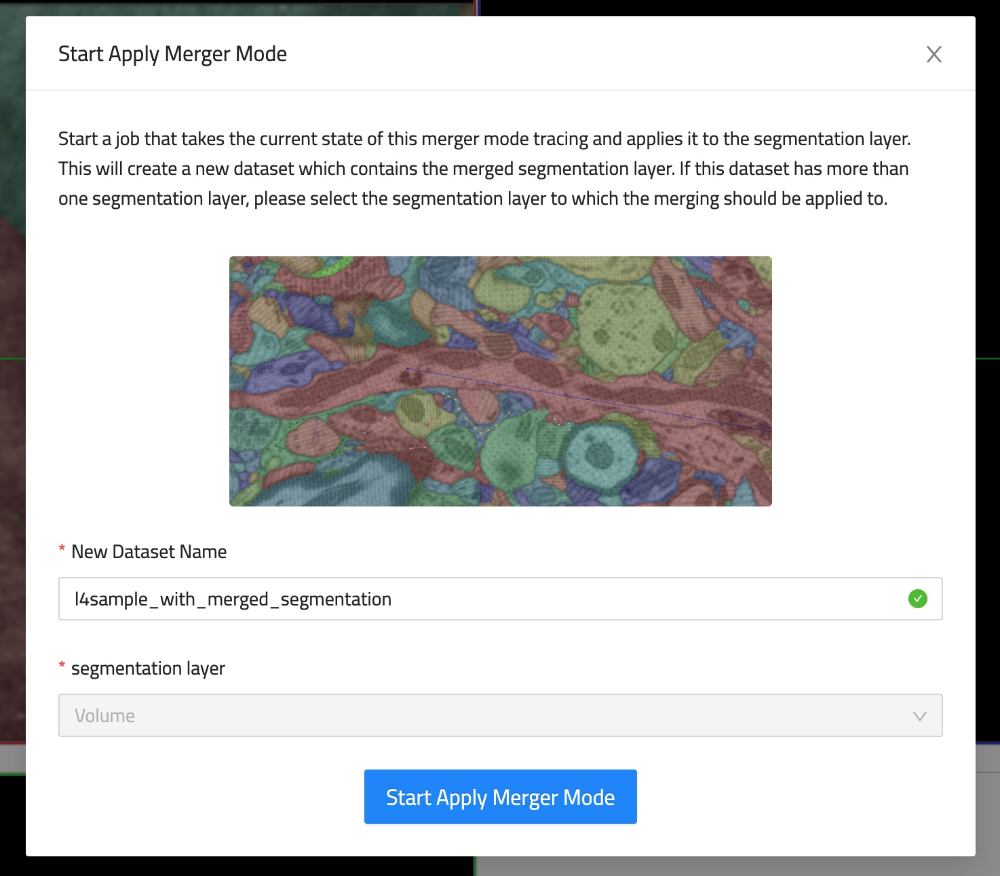

# Merger Mode

With the `Merger Mode` tool, individual segments (for example from over-segmentation) can be combined ("merged") to refine a segmentation and fix split errors.

To use the `Merger Mode`:

1. From the toolbar, switch to the Skeleton Tool
2. From the toolbar, enable the "Merger Mode" modifier (double arrow icon)
3. Mark connected segments by left-clicking and placing nodes in the corresponding segments. This creates a skeleton annotation. Segments connected through that skeleton annotation will be merged. To combine multiple segments, ensure all "correcting nodes" belong to the same tree.

Please note, `Merger Mode` is a lightweight correction workflow. WEBKNOSSOS does not directly modify the underlying segmentation while you trace. Instead, corrections are applied in real time based on the current skeleton annotation. Disabling `Merger Mode` shows the original segmentation; re-enabling it reapplies your corrections.

After finishing the proofreading, a [long-running job](../automation/jobs.md) can be started to apply the merging of segments into a new dataset with the same layers. The job can be started by clicking the "Materialize" button next to the merger mode button in the toolbar.

/// caption
Button to open the Merger mode long-running job dialog
///

/// caption
Dialog to start the Merger mode long-running job
///
