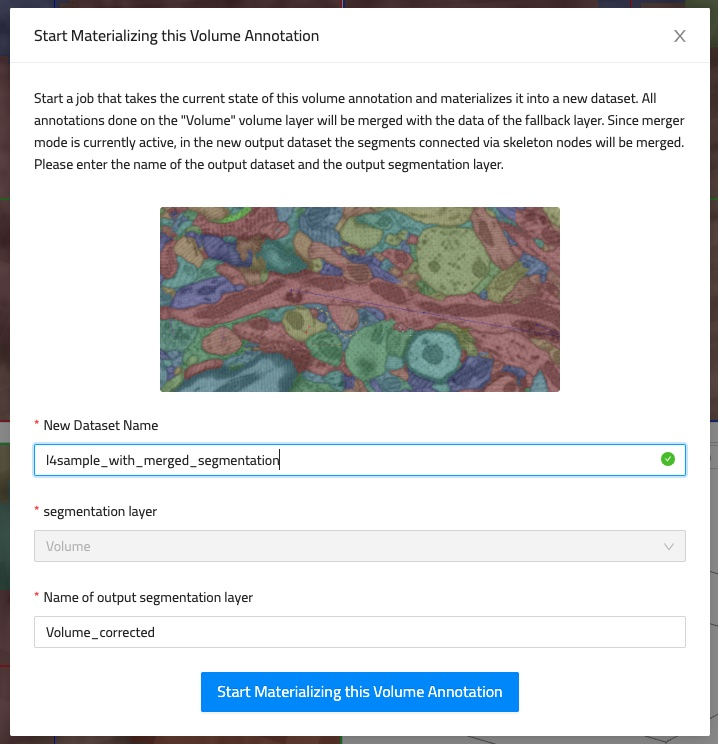

# Merger Mode

With the `Merger Mode` tool individual segments (e.g. from over-segmentation) can be combined ("merged") to refine the segmentation and fix split errors.

To use the `Merger Mode`:

1. From the toolbar, switch to the Skeleton Tool
2. From the toolbar, enable the "Merger Mode" modifier (double arrow icon)
3. Mark connected segments by left-clicking them and placing nodes in the corresponding segments. This process will create a skeleton annotation in the process. Segments connected through this skeleton annotation will be merged into one. Several segments can be combined by making sure that all "correcting nodes" are part of the same tree.

Note, the `Merger Mode` is a rather light-way tool. WEBKNOSSOS will not directly apply your changes to the underlying segmentation. Rather the `Merger Mode` corrections are applied in real-time based on the currently available skeleton annotations. Disabling the `Merger Mode` will reveal the previous state of the segmentation. Enabling the merge mode will re-apply your corrections.

After finishing the proofreading, a [long-running job](../automation/jobs.md) can be started to apply the merging of segments into a new dataset with the same layers. The job can be started by clicking the "Materialize" button next to the merger mode button in the toolbar.

