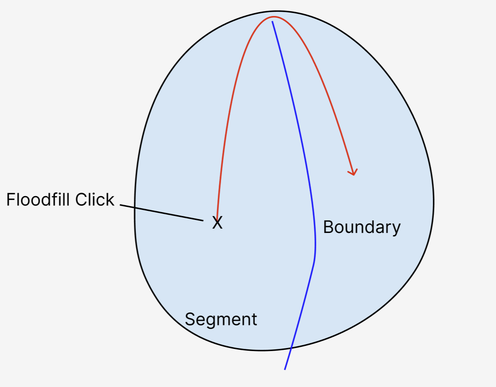

# Split Segments Toolkit

As explained in the [Toolkits](../ui/toolbar.md#Toolkits) section, there is a dedicated toolkit for splitting segments in your volume annotation.
When this toolkit is activated, you can create a curved 3D surface and use it to split a segment into two.

## Workflow

The recommended steps for splitting a segment are as follows:

- Use the bounding box tool to create a box around the merge error that you want to correct. Theoretically, this step is optional, but keep in mind that relabeling large parts of a segment can be infeasible due to resources. Consider using the [proofreading tool](../proofreading/tools.html) for larger corrections. If you want to correct data for the purpose of groundtruth, it is often enough to only do a local correction.
- Go to the first z slice of the bounding box.
- Create a new skeleton tree and place nodes on the boundary that should split the segment into two. Consider activating the "Pen" mode within the skeleton tool so that you can rapidly draw nodes by dragging the mouse while it's pressed down.
- Go to the last z slice of the bounding box and repeat the previous step.
- Now you can inspect all the slices in between. A smooth spline curve will be shown in each slice that is derived from interpolating between adjacent slices. If you want to correct the interpolation, you can create new nodes on a slice. A new spline curve will be computed from these points and the interpolation will be updated.
- If you are satisfied with the (interpolated) boundary, you can switch to the fill tool. Ensure to enable the 3D mode as well as the "Restrict to Bounding Box" mode.

## Troubleshooting

- It can easily happen that the floodfill operation relabels the entire segment instead of only the part you intended to relabel. The cause of this is usually that the 3D surface doesn't cut the segment completely. Instead, the surface might only go very close to the edge. In that case, the floodfill operation can traverse over that edge and thus relabel everything (see image below). If this happens, you should undo the fill operation and double-check the surface. To avoid this problem, it is recommended to make the surface a bit bigger than usual.
- If multiple spline curves appear per slice, this is often due to a configuration issue. Please adapt the clipping distance in the left sidebar ("Layers" -> "Skeleton").

## Impact of "Split Segments" Toolkit

Note that the workflow above is only possible because the "Split Segments" toolkit is enabled.
By activating that toolkit, WEBKNOSSOS behaves differently in the following way:

- The active tree will be rendered without any edges. Instead, for each slice in which multiple nodes exist, a spline curve is calculated that goes through these nodes.
- Using the spline curves from before, a 3D surface is generated that interpolates through these curves. The surface can be seen in the 3D viewport.
- The floodfill tool will respect the surface by not crossing it.
