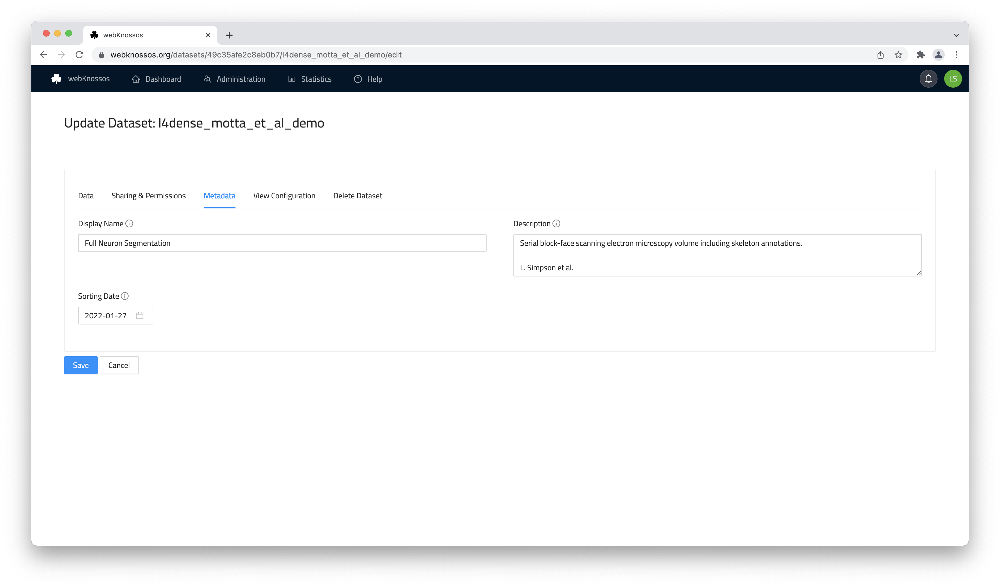

# Collaboration & Sharing
webKnossos is built for working collaboratively and sharing your work with colleagues, collaborators, and the scientific community.
Anything in webKnossos can be shared: the raw datasets, any skeleton or volume annotations, or complex segmentations.

When speaking about collaboration and sharing, we imagine two scenarios supported by webKnossos:
1. Sharing data with outsiders - anyone who is not a member of your webKnossos organization, e.g., colleagues from other institutes, reviewers, publishers, a paper publication, and the research community as a whole.
2. Share data within your organization to collaborate with other members/co-workers

Since webKnossos is a web platform, most resources can be shared as a web link/URL. This makes it super easy to integrate webKnossos in your existing communication workflows, e.g.:
- send collaborators an *email* containing a link to specific, interesting data location or annotations
- include a link in a *publication* so readers can have direct access to the data to see for themselves
- share a link through *Slack*, *MS Teams*, or any other messenger service
- include it in any *lab journal* and *blog* posts
- link it in a *forum* post

In many ways, the sharing by web link works similarly to products like Google Drive or Dropbox.

webKnossos sharing is tightly integrated with user permissions and access rights. See the sections [on dataset management](./datasets.md#general) and [user administration](./users.md) for more info.

## Sharing 
As mentioned earlier, any webKnossos resource can be shared as a normal web URL. The easiest way to obtain this sharing link is by clicking the `Share` button in the toolbar at the top of the screen next to the position/coordinate section (*Share icon*). 

For more control, you can bring up the detailed sharing dialog. The sharing dialog is accessible from the menu next to the Save button at the top of the screen under `Share`. The sharing menu includes fine-grained options for internal and outside sharing, explained in more detail below:

1. `Private`: Only you and your team manager have access to the annotation.
2. `Internal`: All members of your organization have access to the annotation. 
3. `Public`: Everybody with access to the link, regardless their login status, can access this annotation.
4. (`Team Sharing`: Share this annotation with other organization members on the dashboard in the `Shared Annotations` tab)

In any case, the sharing link also encodes additional information, such as your current camera position/rotation, zoom level, any layers that are turned on/off, the selected node, etc ([Details below](#sharing_link_format). In other words, a sharing link typically captures your current webKnossos state so that any recipient can take off from the same situation.


### Private and Internal Sharing
A privately shared dataset can only be accessed from outside users using the correct URL.
A unique authentification token is part of the URL, so anyone with this URL has access permission for viewing the dataset.
The dataset is NOT featured publicly anywhere else on your webKnossos instance.

Private sharing is useful for giving outside users (reviewers, editors, journalists etc.) an opportunity to look at your data without having to publish it publicly.

To share a dataset privately, follow these steps:

1. Navigate to your user dashboard and `My Datasets`. 
2. Select the dataset that you want to share and click on `Settings`.
3. Under the `Sharing & Permissions` tab, scroll down to the `Sharing Link` and copy it. 


To revoke a sharing link in the future, click the `Revoke` button to the right-hand side of the link.


  **Do not enable the `Make dataset publicly accessible` checkbox or otherwise anyone with a link can access this dataset without needing to log in/authenticate.
  Public access rights are not required for private sharing.**

### Public Sharing
Public sharing provides access to your dataset to the general public.
Anyone can access the shared dataset and view it on your webKnossos instance without the need for an account.


Public datasets provide an easy and convenient way of sharing your data with outside users after you have successfully published them.
Outside users can explore your data from the comfort of their browser without needing to sign up for an account.

To share a dataset publicly, follow these steps:

1. Navigate to your user dashboard and `Datasets`. 
2. Select the dataset that you want to share and click on `Settings`.
3. Under the `Sharing & Permissions` tab, scroll down to the checkbox `Make dataset publicly accessible` and enable it.
4. Copy the sharing link and distribute it to your colleagues through email, social media, messengers, etc.
5. (Recommended. From the `Metadata` tab, add/edit the dataset's description and give it a more appropriate title (`Display name`)).



  **We recommend giving your datasets a meaningful display name and description. Both are featured next to the data viewport in the `Info` tab in the main webKnossos UI.**


## Annotation Sharing
Besides sharing just a dataset for viewing, webKnossos can also share complete annotations, e.g., a large-scale skeleton reconstruction.
Sharing works for both skeletons and volume annotations.


### Annotation Permissions
There are three options to control who can see an annotation if they know the annotation URL:

1. `Private`: Only you and your team manager have access to the annotation.
2. `Internal`: All members of your organization have access to the annotation. Default option.
3. `Public`: Everybody, regardless their login status, can access this annotation.
4. (`Team Sharing`: Share this annotation with other organization members on the dashboard in the `Shared Annotations` tab)

To change the visibility of an annotation, follow these steps:

1. Open your annotation from the dashboard
2. From the [toolbar](./tracing_ui.md#the-toolbar) select `Share` from the overflow menu next to the `Save` button.
3. At the right side of the screen press 'share dialog' if you want to configure the visibility of your annotation.
4. Select the desired permission level from the three available options.


### Link Sharing
Annotations can be shared via a link. People, who obtain the link, must have access to the annotation according to the permissions above to view the annotation.

`Public` annotations do not require any user authentication and are a great option for sharing a link to your annotation from social media or your website.
For public annotations to work properly, the underlying dataset must also be shared publicly or privately (via token URL).
Otherwise, the annotation and data cannot be loaded by webKnossos, and an error will occur.
[Learn how to share datasets publicly above.](#public-sharing)

`Internal` annotations require the recipient of a link to log in with his webKnossos account.
This is primarily used for sharing annotations with your co-workers, e.g. for highlighting interesting positions in your work.
Since your position, rotation, zoom etc. is encoded in the URL it is a great way for working collaboratively.
Just send an URL to your co-workers in an email or blog post, and they may jump right into the annotation at your location.

`Private` annotations don't allow sharing. However, your direct supervisor and admins can still view the annotation.

Since every annotation is tied to an individual webKnossos user, co-workers cannot modify your annotation if you share it with them.
Instead, the shared annotation will be read-only.
If your co-workers want to make modifications to the annotation, they can click the `Copy to my Account` button in the toolbar.
This will create a copy of the annotation, link it to the co-workers' accounts and enable modifications again.
Think of this feature like GitHub forks. Changes made to a copy are not automatically synced with the original.

To get the sharing link of an annotation, follow the same steps as for changing the viewing permissions:

1. Open your annotation
2. From the [toolbar](./tracing_ui.md#the-toolbar) select `Share` from the overflow menu next to the `Save` button.
3. Copy the sharing URL.


#### Sharing Link Format

As already indicated, the sharing link encodes certain properties, like the current position, rotation, zoom, active mapping, and visible meshes. 
Anyone who opens a link will have the same webKnossos experience that was captured when copying the link. 
Alternatively, the link can be crafted manually or programmatically to direct users to specific locations in a dataset. 

The information is JSON-encoded in the URL fragment and has the following format (flow type definition):

<details>
  <summary>URL Fragment Format</summary>
  ```javascript
  type MappingType = "JSON" | "HDF5";
  type ViewMode = "orthogonal" | "oblique" | "flight" | "volume";
  type Vector3 = [number, number, number];

  type BaseMeshUrlDescriptor = {|
    +segmentId: number,
    +seedPosition: Vector3,
  |};
  type AdHocMeshUrlDescriptor = {|
    ...BaseMeshUrlDescriptor,
    +isPrecomputed: false,
    mappingName: ?string,
    mappingType: ?MappingType,
  |};
  type PrecomputedMeshUrlDescriptor = {|
    ...BaseMeshUrlDescriptor,
    +isPrecomputed: true,
    meshFileName: string,
  |};
  type MeshUrlDescriptor = AdHocMeshUrlDescriptor | PrecomputedMeshUrlDescriptor;

  type UrlStateByLayer = {
    [layerName: string]: {
      meshInfo?: {
        meshFileName: ?string,
        meshes: Array<MeshUrlDescriptor>,
      },
      mappingInfo?: {
        mappingName: string,
        mappingType: MappingType,
        agglomerateIdsToImport?: Array<number>,
      },
    },
  };
  
  type UrlManagerState = {|
    position?: Vector3,
    mode?: ViewMode,
    zoomStep?: number,
    activeNode?: number,
    rotation?: Vector3,
    stateByLayer?: UrlStateByLayer,
  |};

  ```
</details>


To avoid having to create annotations in advance when programmatically crafting links, a sandbox annotation can be used. A sandbox annotation is always accessible through the same URL and offers all available annotation features, however, changes are not saved. At any point, users can decide to copy the current state to their account. The sandbox can be accessed at `<webknossos_host>/datasets/<organization>/<dataset>/sandbox/skeleton`.

### Team Sharing
In addition to sharing your annotation via a link, you can also share your annotations with colleagues and make them available on their dashboard from the `Shared Annotations` tab.
This is the simplest way to share an annotation with a whole team.

To share an annotation with a certain team, follow these steps:
1. Open your annotation
2. From the [toolbar](./tracing_ui.md#the-toolbar) select `Share` from the overflow menu next to the `Save` button.
3. Under *Team Sharing*, select the teams from the dropdown menu.

If members of these teams open their [Shared Annotations Dashboard Tab](./dashboard.md#shared-annotations), they will see your annotation.


**Next to the integrated Annotation Sharing features, you can also download annotations and send them via email to collaborators.**


Dataset sharing allows people outside of your organization or anyone without a webKnossos account to view your datasets and annotations within webKnossos directly from their browser. No additional installation or signup is needed. Anyone with a link can view the data.