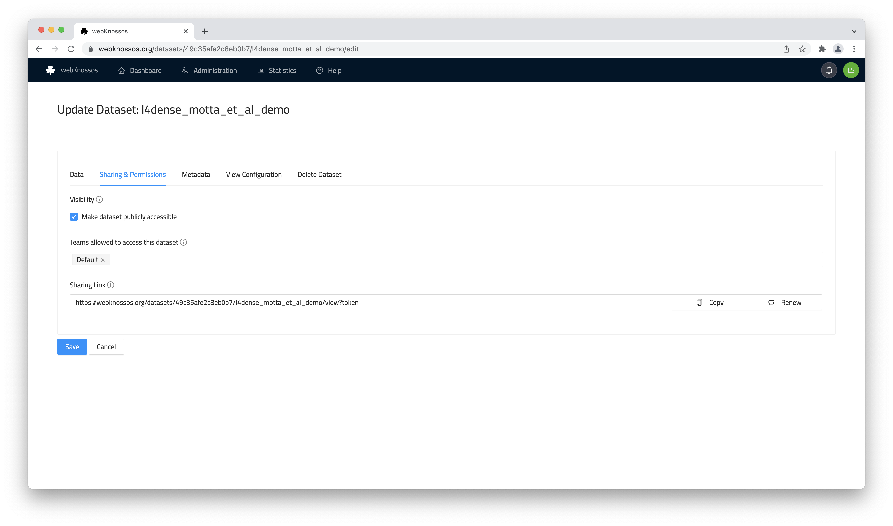
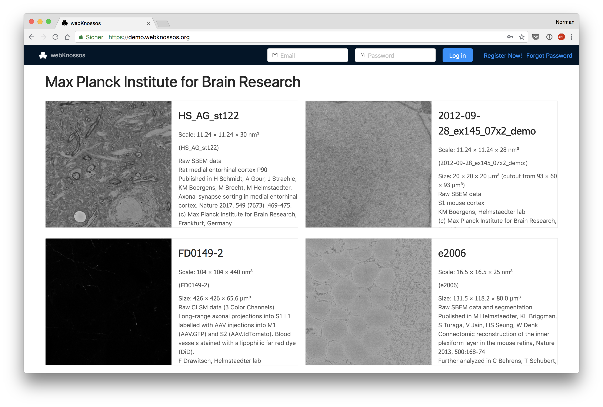
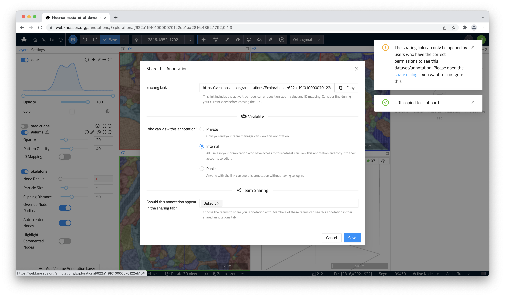
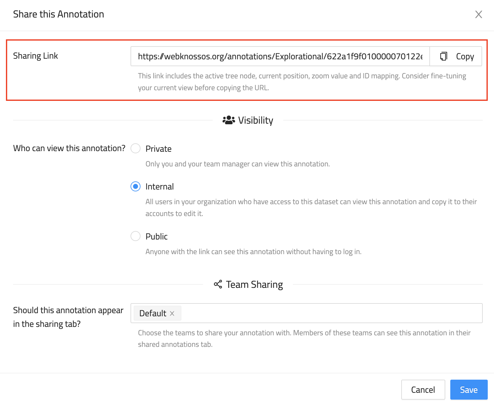
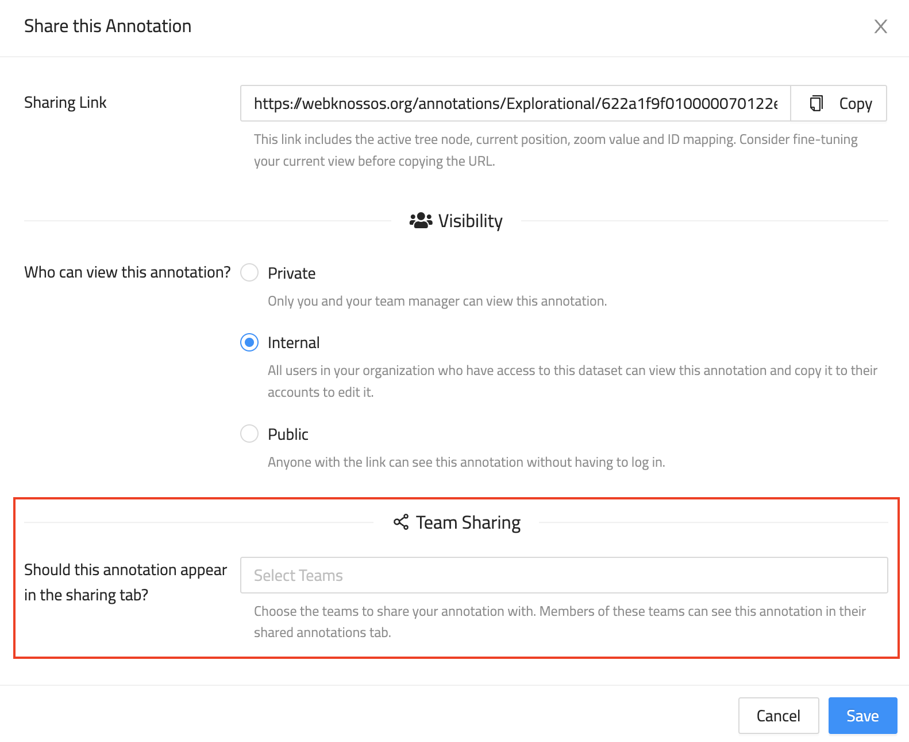

# Collaboration & Sharing
webKnossos is built for working collaboratively and sharing your work with the community.
webKnossos can share both skeleton annotations of large structures as well as raw datasets and segmentations for showcasing the data.
The sharing features discussed here refer to sharing scenarios with colleagues, reviewers, and publishers outside of your webKnossos organization or your lab.

To manage access rights to certain datasets for webKnossos users check out [the Datasets guide](./datasets.md#general).

## Dataset Sharing

Dataset sharing allows outside users to view your datasets and segmentation layers within webKnossos.
Shared resources can be accessed through a direct URL or can be featured on a spotlight gallery for showcasing your work.
[Please contact us](mailto:hello@webknossos.org) to feature your dataset on https://webknossos.org.

Sharing a dataset is useful for multiple scenarios: 
- You recorded a novel microscopy dataset and want to include links to it in your paper or for reviewers. Use wklink.org to shorten these URLs, e.g. https://wklink.org/5386 ([contact us](mailto:hello@webknossos.org)).
- You created an interesting, highly-accurate segmentation layer for an existing dataset and want to share it for your publication.
- You have worked and published several datasets over the years and want to have a single gallery for all your public datasets.

webKnossos shares datasets publicly (everyone can view them without any login) or privately (a login or special URLs are required to view the link).


### Private Sharing for Review
A privately shared dataset can only be accessed from outside users using the correct URL.
A unique authentification token is part of the URL so anyone with this URL has access rights for viewing the dataset.
The dataset is NOT featured publicly anywhere else on your webKnossos instance.

Private sharing is useful for giving outside users (reviewers, editors, journalists etc.) an opportunity to look at your data without having to publish it publicly.

To share a dataset privately, follow these steps:

1. Navigate to your user dashboard and `Datasets`. 
2. Select the dataset that you want to share and click on `Edit`.
3. Under the `General` tab, scroll down to the `Sharing Link` and copy it. 

That's all you need to do.



To revoke a sharing link in the future, click the `Revoke` button to the right-hand side of the link.

!!! warning
    Do not enable the `Make dataset publicly accessible` checkbox or otherwise, your dataset will be featured on the front page of your webKnossos instance.
    Public access rights are not required for private sharing.

### Public Sharing
Public sharing provides access to your dataset to the general public.
Anyone can access the shared dataset and view it on your webKnossos instance without the need for an account.
Further, publicly shared datasets are featured in a dataset gallery on your webKnossos start page for logged-out users.
Alternatively, navigate to `https://<webKnossos-url>/spotlight`.



Public datasets provide an easy and convenient way of sharing your data with outside users after you have successfully published them.
Outside users can navigate through your data from the comfort of their own browser.

To share a dataset publicly, follow these steps:

1. Navigate to your user dashboard and `Datasets`. 
2. Select the dataset that you want to share and click on `Edit`.
3. Under the `General` tab, scroll down to the checkbox `Make dataset publicly accessible` and enable it.
4. On the same screen, you can add/edit a dataset's description and give it more appropriate tile (`Display name`).
5. On the same screen, copy the sharing link.

That's all you need to do.

!!! info
    We recommend giving your datasets a meaningful display name and description.
    Both are featured next to a preview of the dataset in the gallery of promoted public datasets.


## Annotation Sharing
Besides sharing just the data layers for viewing, webKnossos can also share complete annotations, e.g. a large skeleton reconstruction.
Sharing works for both skeletons and volume annotations.

### Annotation Permissions
There are three options to control, who can see an annotation if they know the annotation url. To learn how to get the url, look at the following paragraph about [Link Sharing](#link-sharing).

1. `Private`: Only you and your team manager have access to the annotation.
2. `Internal`: All members of your organization have access to the annotation. 
3. `Public`: Everybody, regardless their login status, has access to the annotation.

The default option is `Internal`.

To change the visibility of an annotation, follow these steps:

1. Open your annotation
2. From the [toolbar](./tracing_ui.md#the-toolbar) select `Share` from the overflow menu next to the `Save` button.
3. Select the desired option from the three available options.



### Link Sharing
Annotations can be shared via a link. People, who obtain the link, must have access to the annotation according to the permissions above to view the annotation.

`Public` annotations do not require any user authentication and are a great option for sharing a link to your annotation from social media or your website.
Unlike with datasets, publicly shared annotations are not featured in a gallery.
For public annotations to work properly, the underlying dataset must also be shared publicly or privately (via token URL).
Otherwise, the annotation and data cannot be loaded by webKnossos and an error will occur.
[Learn how to share datasets publicly above.](#public-sharing)

`Internal` annotations require the recipient of a link to log in with his webKnossos account.
This is primarily used for sharing annotations with your co-workers, e.g. for highlighting interesting positions in your work.
Since your position, rotation, zoom etc. is encoded in the URL, it is a great way for working collaboratively.
Just send an URL to your co-workers in an email or blog post and they may jump right into the annotation at your location.

`Private` annotations don't allow sharing. However, your direct supervisor and admins can still view the annotation.

Since every annotation is tied to an individual webKnossos user, co-workers cannot modify your annotation if you share it with them.
Instead, the shared annotation will be read-only.
If your co-workers want to make modifications to the annotation, they can click the `Copy to my Account` button in the toolbar.
This will make a copy of the annotation, link it to the co-workers' accounts and enable modifications again.
Think of this feature like GitHub forks. Changes made to the copy are not automatically synced with the original.

To get the sharing link of an annotation, follow the same steps as for changing the viewing permissions:

1. Open your annotation
2. From the [toolbar](./tracing_ui.md#the-toolbar) select `Share` from the overflow menu next to the `Save` button.
3. Copy the sharing URL.



#### Sharing Link Format

As already indicated, the sharing link encodes certain properties, like the current position, rotation, zoom, and active mapping to ensure that users you share the link with see the same things you saw when you copied the link. Alternatively, the link can be crafted manually or programmatically to direct users to specific locations in a dataset. The information is json encoded in the URL fragment and has the following format (flow type definition):

```javascript
type MappingType = "JSON" | "HDF5";
type ViewMode = "orthogonal" | "oblique" | "flight" | "volume";
type Vector3 = [number, number, number];

type UrlStateByLayer = {
  [layerName: string]: {
    mappingInfo?: {
      mappingName: string,
      mappingType: MappingType,
      agglomerateIdsToImport?: [number],
    },
  },
};

type UrlManagerState = {|
  position?: Vector3,
  mode?: ViewMode,
  zoomStep?: number,
  activeNode?: number,
  rotation?: Vector3,
  stateByLayer?: UrlStateByLayer,
|};

```

To avoid having to create annotations in advance when programmatically crafting links, a sandbox tracing can be used. A sandbox tracing is always accessible through the same URL and offers all available tracing features, however, changes are not saved. At any point, users can decide to copy the current state to their account. The sandbox can be accessed at `<webknossos_host>/datasets/<organization>/<dataset>/sandbox/skeleton`.

### Team Sharing
In addition to sharing your annotation via a link, you can also share your annotations with colleagues in the shared annotations tab.
This is the simplest way to share an annotation with a whole team.

To share an annotation with a certain team, follow these steps:
1. Open your annotation
2. From the [toolbar](./tracing_ui.md#the-toolbar) select `Share` from the overflow menu next to the `Save` button.
3. Select the teams from the dropdown menu.

If members of these teams open their [Shared Annotations Dashboard Tab](./dashboard.md#shared-annotations), they will see your annotation.



!!! info
    Next to the integrated Annotation Sharing features, you can also download [NML files](./data_formats.md#nml) and send them via email to collaborators.


