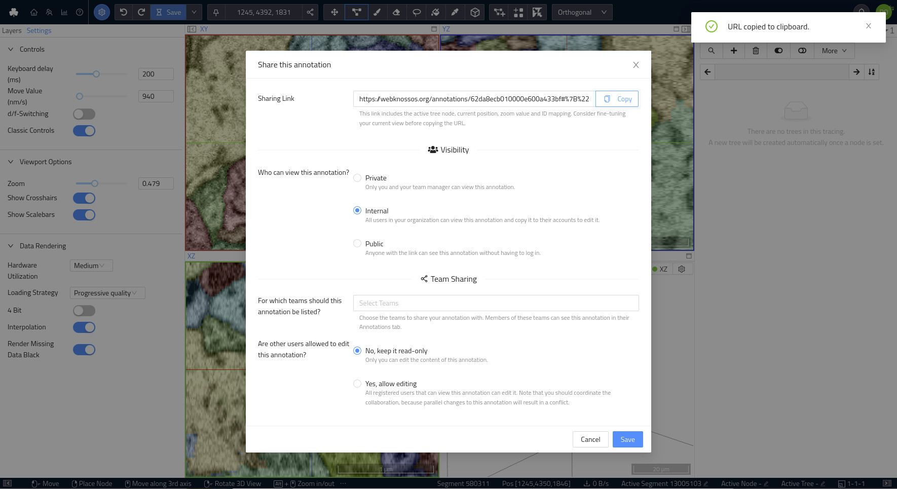
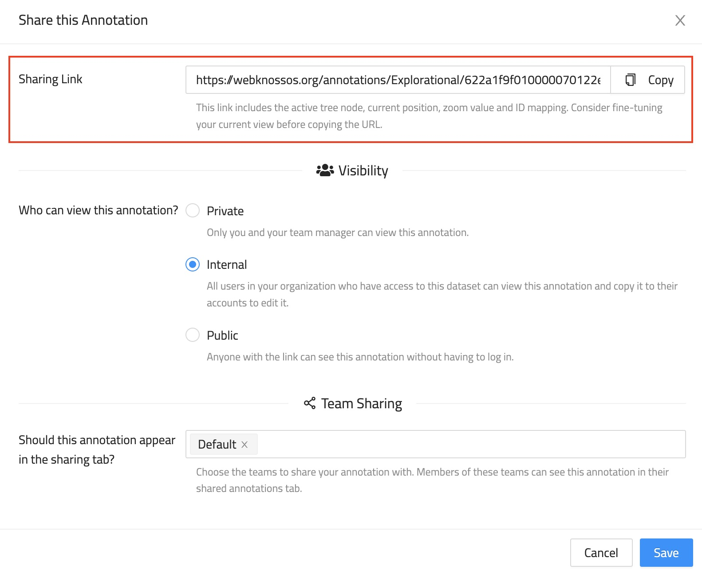
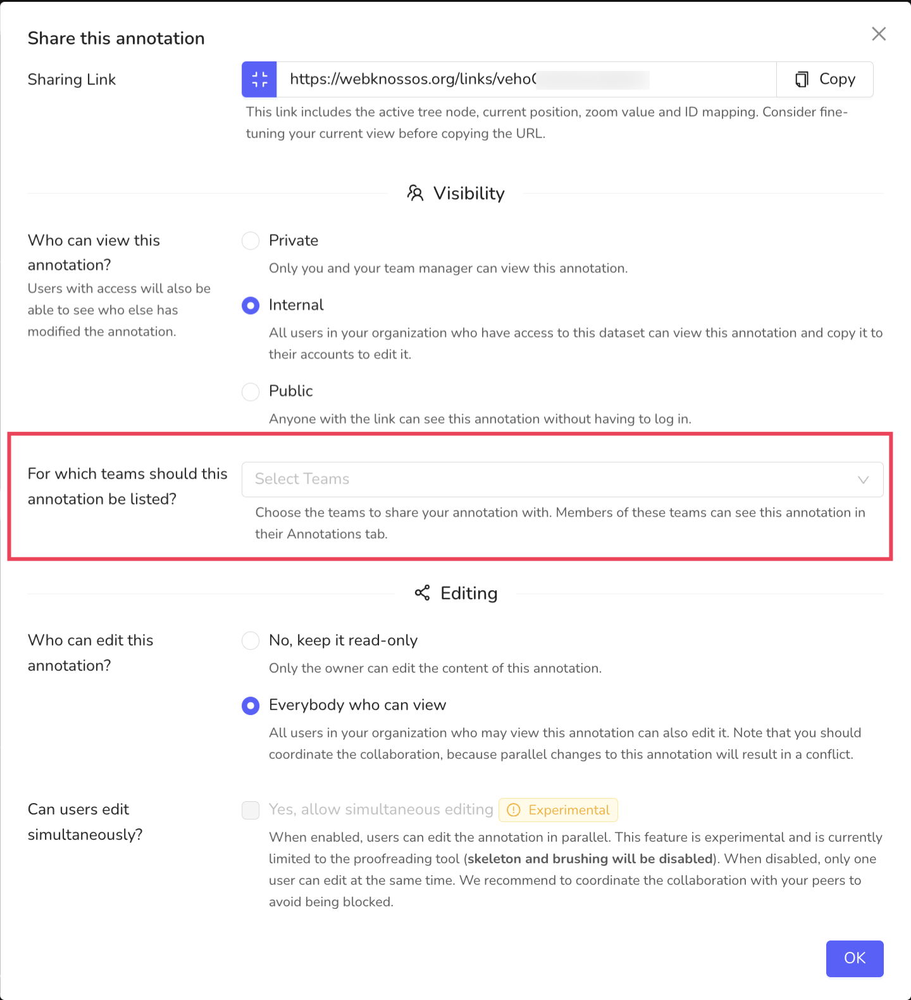
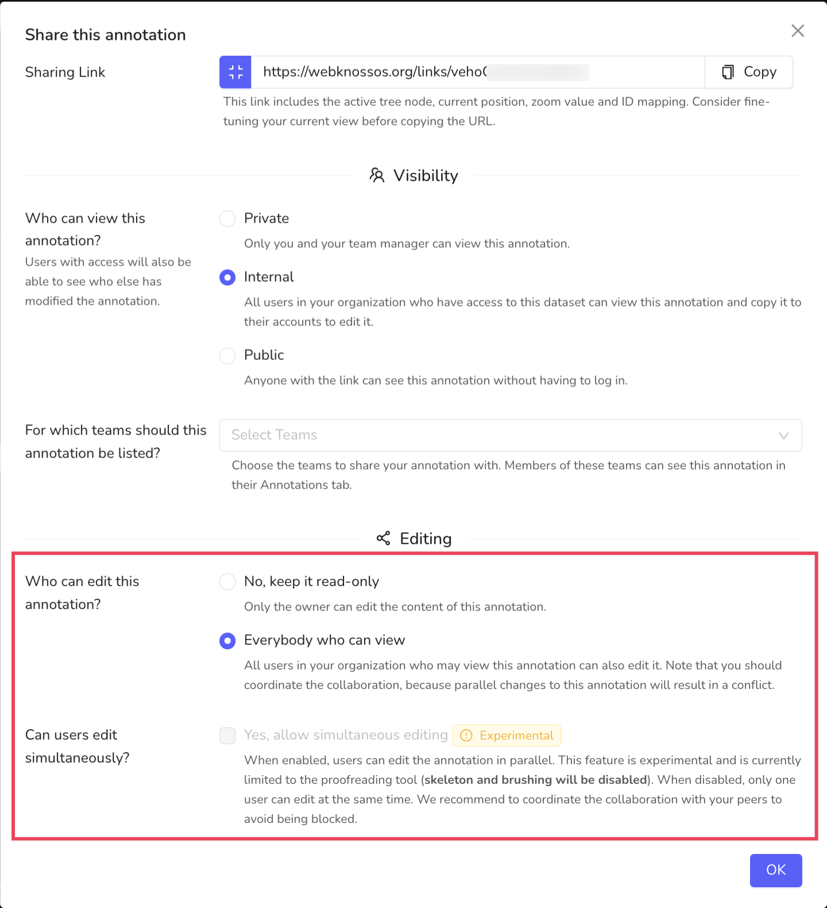

# Annotation Sharing

Besides sharing just a dataset for viewing, WEBKNOSSOS can also share complete annotations, e.g., a large-scale skeleton reconstruction.
Sharing works for both skeletons and volume annotations.

## Annotation Permissions

There are three permission levels to control who can see an annotation if they know the annotation URL, plus an additional team sharing option:

1. `Private`: Only you and your team manager have access to the annotation.
2. `Internal`: All members of your organization have access to the annotation. Default option.
3. `Public`: Everybody, regardless of their login status, can access this annotation.
4. (`Team Sharing`: Share this annotation with other organization members so that it appears on their dashboard in the `Annotations` tab)

To change the visibility of an annotation, follow these steps:

1. Open your annotation from the dashboard
2. From the [toolbar](../ui/toolbar.md) select `Share` from the overflow menu next to the `Save` button.
3. Select the desired permission level from the three available options.



Additionally, you can control whether other users, who can see your annotation, may also edit your annotation.
Use this setting to enable collaborative work within your annotation.
However, note that you should coordinate the collaboration because parallel changes to an annotation are not supported.
To avoid possible conflicts in such cases the annotation will be locked to a single user at a time. In case the annotation is locked by someone else WEBKNOSSOS will tell you the name of the person currently editing so you can coordinate with this person.

## Link Sharing

Annotations can be shared via a link. People, who obtain the link, must have access to the annotation according to the permissions above to view the annotation.

`Public` annotations do not require any user authentication and are a great option for sharing a link to your annotation from social media or your website.
For public annotations to work properly, the underlying dataset must also be shared publicly or privately (via token URL).
Otherwise, the annotation and data cannot be loaded by WEBKNOSSOS, and an error will occur.
[Learn how to share datasets publicly.](./dataset_sharing.md#public-sharing)

`Internal` annotations require the recipient of a link to log in with his WEBKNOSSOS account.
This is primarily used for sharing annotations with your co-workers, e.g. for highlighting interesting positions in your work.
Since your position, rotation, zoom etc. are encoded in the URL it is a great way for working collaboratively.
Just send an URL to your co-workers in an email or blog post, and they may jump right into the annotation at your location.

`Private` annotations don't allow sharing. However, your direct supervisor and admins can still view the annotation.

Since every annotation is tied to an individual WEBKNOSSOS user, co-workers cannot modify your annotation if you share it with them.
Instead, the shared annotation will be read-only.
If your co-workers want to make modifications to the annotation, they can click the `Copy to my Account` button in the toolbar.
This will create a copy of the annotation, link it to the co-workers' accounts and enable modifications again.
Think of this feature as GitHub forks. Changes made to a copy are not automatically synced with the original.

To get the sharing link of an annotation, follow the same steps as for changing the viewing permissions:

1. Open your annotation
2. From the [toolbar](../ui/toolbar.md) select `Share` from the overflow menu next to the `Save` button.
3. Copy the sharing URL.



### Sharing Link Format

By default, WEBKNOSSOS shortens the web links for ease of use. Use the `Shorten this link` toggle next to the link field in the Share dialog to switch between shortened and full-length links.

As mentioned above, the sharing link encodes certain properties, like the current position, rotation, zoom, active mapping, and visible meshes.
Anyone who opens a link will have the same WEBKNOSSOS experience that was captured when copying the link.
Alternatively, the link can be crafted manually or programmatically to direct users to specific locations in a dataset.

The information is JSON-encoded in the URL fragment and has the following format (flow type definition):

<details>
  <summary>URL Fragment Format</summary>
  
  ```javascript
  type MappingType = "JSON" | "HDF5";
  type ViewMode = "orthogonal" | "flight";
  type Vector3 = [number, number, number];
  // For datasets with more than 3 dimensions
  type AdditionalCoordinate = { name: string; value: number };

  type BaseMeshUrlDescriptor = {|
    +segmentId: number,
    +seedPosition: Vector3,
    +seedAdditionalCoordinates?: AdditionalCoordinate[];
  |};
  type AdHocMeshUrlDescriptor = {|
    ...BaseMeshUrlDescriptor,
    +isPrecomputed: false,
    mappingName: ?string,
    mappingType: ?MappingType,
  |};
  type PrecomputedMeshUrlDescriptor = {|
    ...BaseMeshUrlDescriptor,
    +isPrecomputed: true,
    meshFileName: string,
  |};
  type MeshUrlDescriptor = AdHocMeshUrlDescriptor | PrecomputedMeshUrlDescriptor;

  type UrlStateByLayer = {
    [layerName: string]: {
      meshInfo?: {
        meshFileName: ?string,
        meshes: Array<MeshUrlDescriptor>,
      },
      mappingInfo?: {
        mappingName: string,
        mappingType: MappingType,
        agglomerateIdsToImport?: Array<number>,
      },
      connectomeInfo?: {
        connectomeName: string,
        agglomerateIdsToImport?: Array<number>,
      },
      isDisabled?: boolean,
    },
  };

  type UrlManagerState = {|
    position?: Vector3,
    mode?: ViewMode,
    zoomStep?: number,
    activeNode?: number,
    rotation?: Vector3,
    stateByLayer?: UrlStateByLayer,
    additionalCoordinates?: AdditionalCoordinate[];
    nativelyRenderedLayerName?: string | null;
    clippingDistance?: number;
    clipSkeletonToCurrentSection?: boolean;
  |};

  ```
</details>


To avoid having to create annotations in advance when programmatically crafting links, a sandbox annotation can be used. A sandbox annotation is always accessible through the same URL and offers all available annotation features, however, changes are not saved. At any point, users can decide to copy the current state to their account. The sandbox can be accessed at `<webknossos_host>/datasets/<organization>/<dataset>/sandbox/skeleton`.

## Team Sharing & Collaboration

In addition to sharing your annotation via a link, you can also share your annotations with colleagues and make them available on their dashboard from the `Annotations` tab.
This is the simplest way to share an annotation with a whole team both for review purposes (read-only) or collaborative work efforts on the same annotation by several people.

To share an annotation with a certain team, follow these steps:

1. Open your annotation
2. From the [toolbar](../ui/toolbar.md) select `Share` from the overflow menu next to the `Save` button.
3. Under *Team Sharing*, select the teams from the dropdown menu.



Any annotation shared this way will be listed in your personal and any team member's [Annotations Dashboard Tab](../dashboard/annotations.md). By default team sharing is read-only, i.e. other team members can not make modifications to your annotation.

To collaboratively work on the same annotation with multiple users from your team, you can share an annotation and allow modifications. Select "Everybody who can view" under "Who can edit this annotation?" from the sharing UI.

### Exclusive Editing (default)



By default, only one collaborator can actively make changes to a shared annotation at a time.
While a collaborator is editing, WEBKNOSSOS locks the annotation to that person; everyone else sees the annotation as read-only along with the name of the person currently editing, so that collaborators can coordinate manually.
Once the current editor stops working on the annotation (e.g., by closing the tab), the lock is released and another collaborator can take over.

WEBKNOSSOS does not resolve changes made by multiple people annotating truly simultaneously in this mode, so please coordinate with your collaborators (e.g., by taking turns) to avoid data loss or inconsistencies.

### Simultaneous Editing (Experimental)

!!! warning "Experimental Feature"
    Simultaneous editing (also called "live collaboration") is experimental, under active development. We cannot guarantee complete data / annotation consistency here. If you want to try it out, we are happy to hear about your feedback.

In addition to exclusive editing, WEBKNOSSOS offers an experimental mode in which multiple collaborators can edit the same annotation at the same time, without waiting for a lock. Changes made by one collaborator are periodically synced to every other collaborator who currently has the annotation open.

To enable simultaneous editing:

1. Activate an [ID mapping](../proofreading/segmentation_mappings.md) and perform and save at least one [proofreading](../proofreading/proofreading_tool.md) action (merge or split). This is currently a prerequisite for enabling simultaneous editing.
2. Open the sharing dialog and set "Who can edit this annotation?" to "Everybody who can view".
3. Check "Yes, allow simultaneous editing", which is marked with an "Experimental" tag.

Current limitations of simultaneous editing:

- **Only the [proofreading tool](../proofreading/proofreading_tool.md) is supported.** While simultaneous editing is enabled, regular skeleton editing and volume brushing/tracing tools are disabled for all collaborators; only merging/splitting agglomerates via proofreading remains possible.
- **Undo/redo is disabled.** Use "Restore Older Version" from the dropdown next to the `Save` button instead. Note that restoring an older version discards any pending changes of all collaborators and forces them to reload the annotation.
- Support for further annotation types (e.g., bounding boxes, general skeleton and volume annotation) is planned but not yet available.

Even with simultaneous editing enabled, we recommend coordinating with your collaborators (e.g., by working on separate areas of the dataset) to avoid confusing conflicts.

Each collaborator's view configuration — including layer visibility, opacity, colors, and other display settings — is stored independently per user. Changing which layers are visible or adjusting rendering settings in a shared annotation only affects your own view and does not change what other collaborators see. When a user opens a shared annotation for the first time, the annotation owner's view configuration is used as the initial default.

!!! info
    In addition to the integrated Sharing features, you can also [download annotations](../volume_annotation/import_export.md) and send them via email to collaborators.
