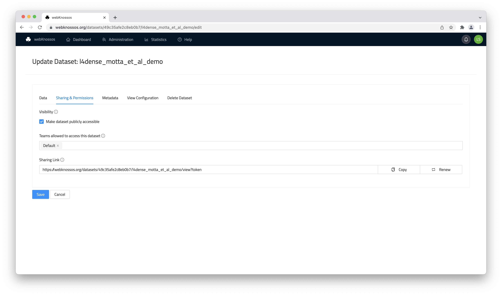
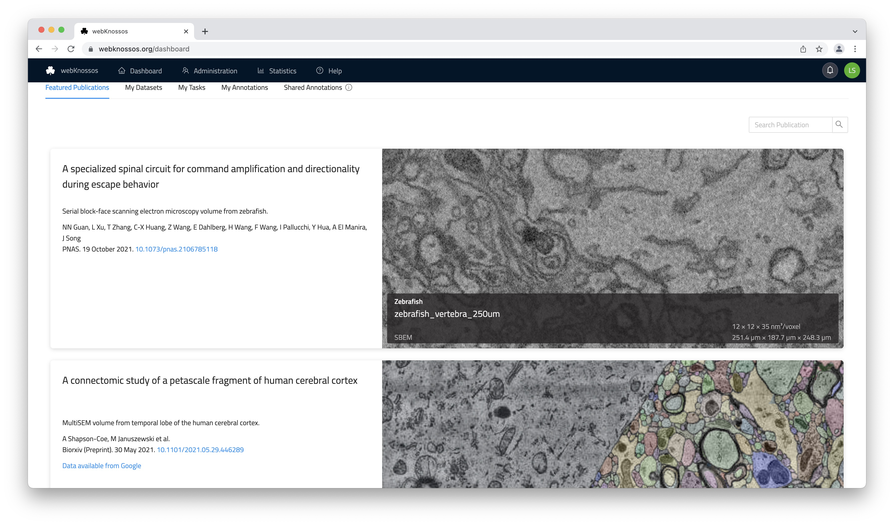
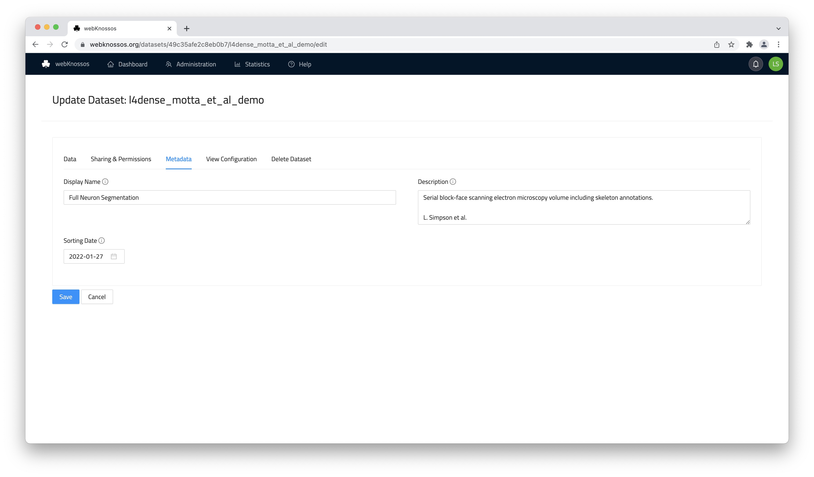

# Dataset Sharing

Dataset sharing allows outside users to view your datasets and segmentation layers within WEBKNOSSOS.
Shared resources can be accessed through a direct URL or can be featured.
[Please contact us](mailto:hello@webknossos.org) to feature your dataset on https://webknossos.org.

The easiest way to obtain this sharing link is by clicking the `Share` button in the toolbar at the top of the screen next to the position/coordinate section (_Share icon_).
The sharing link also encodes additional information, such as your current camera position/rotation, zoom level, any layers that are turned on/off, the selected node, etc ([Details](./annotation_sharing.md#sharing-link-format). In other words, a sharing link typically captures your current WEBKNOSSOS state so that any recipient can take off from the same situation.

Sharing a dataset is useful for multiple scenarios:

- You recorded a novel microscopy dataset and want to include links to it in your paper or for reviewers. Use wklink.org to shorten these URLs, e.g. https://wklink.org/5386 ([contact us](mailto:hello@webknossos.org)) to create these short links.
- You created an interesting, highly-accurate segmentation layer for an existing dataset and want to share it for your publication.
- You have worked and published several datasets over the years and want to have a single gallery for all your public datasets.

WEBKNOSSOS shares datasets publicly (everyone can view them without any login) or privately (a login or special URLs are required to view the link).

## Private and Internal Sharing

A privately shared dataset can only be accessed by outside users using the correct URL.
A unique authentication token is part of the URL, so anyone with this URL has access permission for viewing the dataset.
The dataset is NOT featured publicly anywhere else on your WEBKNOSSOS instance.

Private sharing is useful for giving outside users (reviewers, editors, journalists etc.) an opportunity to look at your data without having to publish it publicly.

To share a dataset privately, follow these steps:

1. Navigate to your user dashboard and `Datasets`.
2. Select the dataset that you want to share and click on `Settings`.
3. Under the `Sharing & Permissions` tab, scroll down to the `Sharing Link` and copy it.

To revoke a sharing link in the future, click the `Revoke` button on the right-hand side of the link.

**Do not enable the `Make dataset publicly accessible` checkbox otherwise, anyone with a link can access this dataset without needing to log in/authenticate.
Public access rights are not required for private sharing.**

## Public Sharing

Public sharing provides access to your dataset to the general public.
Anyone can access the shared dataset and view it on your WEBKNOSSOS instance without the need for an account.

Public datasets provide an easy and convenient way of sharing your data with outside users after you have successfully published them.
Outside users can explore your data from the comfort of their browser without needing to sign up for an account.

To share a dataset publicly, follow these steps:

1. Navigate to your user dashboard and `Datasets`.
2. Select the dataset that you want to share and click on `Settings`.
3. Under the `Sharing & Permissions` tab, scroll down to the checkbox `Make dataset publicly accessible` and enable it.
4. Copy the sharing link and distribute it to your colleagues through email, social media, messengers, etc.
5. (Recommended. From the `Metadata` tab, add/edit the dataset's description and give it a more appropriate title (`Display name`)).

**We recommend giving your datasets a meaningful display name and description. Both are featured next to the data viewport in the `Info` tab in the main WEBKNOSSOS UI.**

