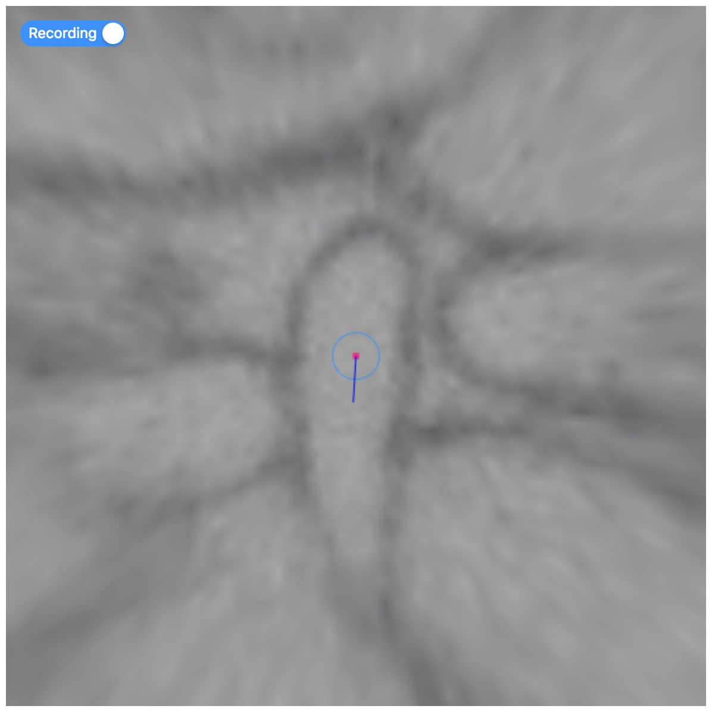
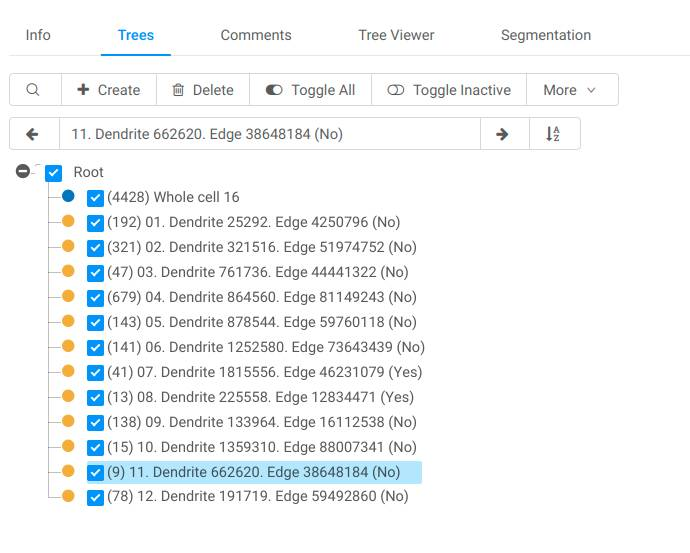
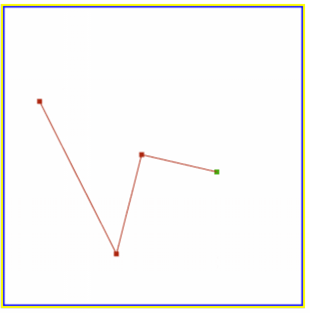
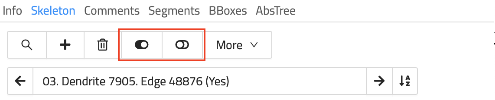
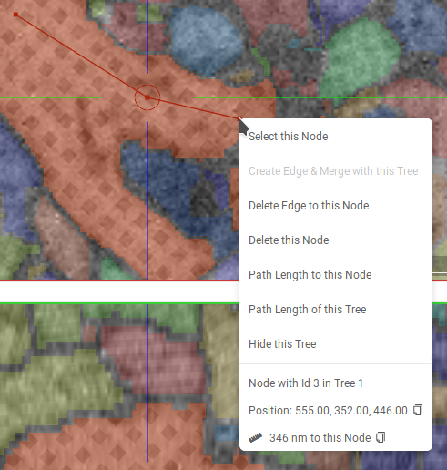
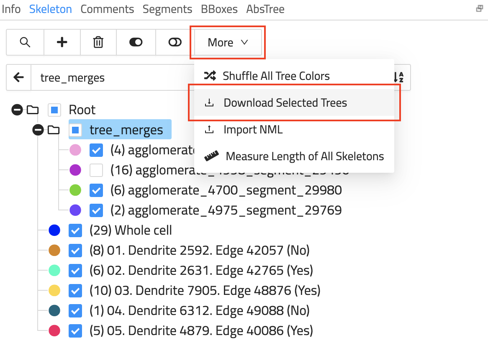
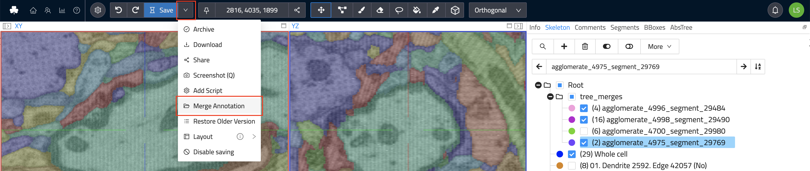
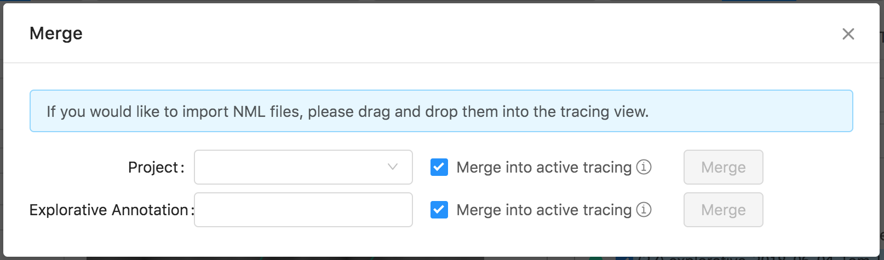

## Skeleton Annotations
The typical goal of skeleton annotations is the reconstruction of long-running structures in a dataset that span across many data slices as a graph of connected nodes.
A typical example of creating skeleton annotations is the analysis of nerve cells placing a node every few slices to reconstruct their path through a dataset. (See image below)

A typical skeleton annotation contains the reconstruction of one or more structures, often with many thousand nodes.
All connected nodes form a tree or more generally speaking a graph.

Skeleton annotations can be downloaded, modified, imported using a human-readable XML-based file format called [NML](./data_formats.md#nml).

This article outlines commonly used features and operations for viewing, editing, or creating new skeleton annotations in webKnossos.

### Annotation Modes
webKnossos supports several modes for displaying your dataset & interacting with skeleton annotations.

#### Orthogonal Mode
Orthogonal mode displays a dataset with the camera oriented orthogonally to each of the three main axis x, y, z.
Additionally, a fourth viewport shows the data and skeletons from a 3D perspective.
All camera movements happen along the respective main axis.
This view is especially useful for viewing your data in the highest possible quality alongside its main imaging axis, typically XY.
Every single slice of the raw data can be viewed.

Most skeleton annotation operations and keyboard shortcuts are tailored for the Orthogonal Mode.

#### Oblique Mode

Oblique mode presents an arbitrarily-resliced view through the data.
In contrast to Orthogonal mode, any arbitrary slice through the dataset at any rotational angle of the camera is possible.

#### Flight Mode
Flight mode also allows a resliced view through the data.
In contrast to Oblique mode, the data is projected on the inside of a sphere with the camera located at the center of the sphere.

Spherical projection is especially useful when rotating the camera, as pixels close to the center of the screen move in a predictable manner.
Interactions and movements in Flight mode feel similar to First-Person-View (FPV) games.

Flight mode is best used for annotating structures very quickly.
Trained tracers can follow "tube"-like structures as though they are "flying" through them.
Nodes are placed automatically along the flight path, creating skeletons very efficiently.

### Nodes and Trees
Skeleton annotations consist of connected nodes forming a graph.
Nodes are connected through edges and are organized in trees.

Nodes can be placed by clicking (*Left Click* by default or *Right Click* when *Classic Controls* are enabled in the settings sidebar) in orthogonal mode (the skeleton tool should be selected) or automatically when moving in flight or oblique mode.
All (global) operations are executed on the currently active node, e.g. adding a comment or node deletion.
Most keyboard shortcuts take the active node into context.
Operations on whole trees, e.g. splitting or merging trees, follow the same pattern.

Skeleton annotations can contain one or many trees consisting of several nodes all the way to millions of nodes.
Users can add comments to each node to mark important positions or easily select them from a list of comments for later usage.
Comments are organized in the `Comments` tab on the right-hand side of the screen.
The `Tree Viewer` tab on the right-hand side menu displays a 2D simplified tree representation of the currently active tree.

Many organic structures do not follow a single, linear path but split into several individual branches instead.
webKnossos natively supports branch points.
Any node can be marked as a branch point using the keyboard shortcut "B".
Branch points are highlighted using a slightly different color.
All branch points are saved as a stack for each tree and can be accessed first-in, first-out (FIFO).
Press the "J" to jump to the latest branch point to continue working from there and remove it from the stack.

| Key Binding       | Operation                           |
| ----------------- | -------------                       |
| Left Click        | Create New Node                     |
| Left Click        | Select Node (Mark as Active Node) under the cursor  |
| Left Drag         | Move around                         |
| Left Drag         | Move node under the cursor        |
| S                 | Center Camera on Active Node        |
| DEL               | Delete Active Node                  |
| B                 | Create Branch Point                 |
| J                 | Jump to Last Branch Point           |
| C                 | Create New Tree                     |

Note that you can enable *Classic Controls* which will behave slightly different and more explicit for some mouse actions:

| Key Binding       | Operation                           |
| ----------------- | -------------                       |
| Left Drag         | Move around                         |
| Right Click       | Create New Node                     |
| SHIFT + Left Click| Select Node (Mark as Active Node)   |
| Left Drag         | Move node under the cursor (unless *Classic Controls* are enabled)        |

All further keyboard shortcuts are [available here](./keyboard_shortcuts.md).

### Tree Operations & Tree Groups
All operations and information regarding trees are organized under a tab called `Trees` on the right-hand side of the screen.

A typical skeleton annotation consists of one or more trees.
Trees can be nested and organized in so-called `Tree Groups`.
Tree groups can have a name and are used to structure and label your annotation even further.
Trees can be dragged and dropped between tree groups. This action can be applied to multiple trees by selecting them with Ctrl + Left Mouse (on Mac OS Cmd + Left Mouse).
Hover over existing tree groups to bring up a little menu for creating new groups and deletion. It also has options to expand and collapse all subgroups. Renaming of a group can be done by selecting a group and then entering the new name into the input above the tree hierarchy structure view.

#### Merging / Splitting Trees
Common tree operations include splitting and merging trees.

- `Tree splitting` can be done in two ways:
  1. Delete a node at which to split. This can be done by right-clicking a node and choosing "Delete this Node". If you have enabled *Classic Controls*, you need to select (*SHIFT + Left Click*) the node first and then delete (*DEL*) it.
  2. Delete an edge between two nodes. Select the first node (*Left Click*), then right-click the second node and select *Delete Edge to this Node*. If you have enabled *Classic Controls*, you need to select the first node with *Shift + Left Click* and then click on the second node with *SHIFT + CTRL + Left Click* on the second node of the edge to delete this connection.
- `Tree merging` works similarly to edge deletion but will create a new edge between two previously unconnected trees. Select the first node and right-click on a second one to choose *Create Edge & Merge with this Tree*. When using *Classic Controls*, the second node needs to be selected with *SHIFT + ALT + Left Click* to create an edge between the two.

#### Tree Colors
A random color is assigned to each tree upon creation.
Colors can be shuffled for a single tree or for all trees in a skeleton.
Use the overflow menu under `More` in the tree tab and select `Change Color` or `Shuffle All Colors` to assign new randomly chosen colors.
All nodes have the same color as their parent tree and can not be changed individually.
The active node, branch points, and nodes that have comments assigned to them are highlighted with a slight variation of the tree's color.

#### Tree Visibility
The visibility of individual trees can be toggled to hide some trees for a better overview.
Toggle the checkbox before each tree name or tree group to hide/show it.
Alternatively, the visibility of all trees can be toggled all at once using the `Toggle All` / `Toggle Inactive` button under the `Tree Tab`.
There are also keyboard shortcuts to quickly toggle the visibility:

| Key Binding                 | Operation                             |
| ----------------------------| -------------                         |
| 1                           | Toggle Visibility of all Trees        |
| 2                           | Toggle Visibility of Inactive Trees   |

#### The Context Menu for Easy Access to Functionalities
webKnossos also has a context menu that can be opened via *Right Click* (or *Shift + Right Click* if *Classic Controls* are enabled). This context menu takes the selected node into context and offers functionalities plus information to the user.

The context menu has two modes. 

- The first mode is active if the mouse was over a node when the user opened the context menu (like in the image above). In this case, the context menu offers additional information about the selected node and offers interactions with the active node. An example of possible interactions is to measure the path length of the active node to the selected node. (This option is only available if both nodes are in the same tree).
- The other mode is activated if the user did not select a node with the context menu. In this mode, there are no options available that require a selected node. Instead, it offers the user to create a new tree or a new node at the selected position.

### Importing & Exporting NML Files
webKnossos makes it easy to import or export skeleton annotations as [NML files](./data_formats.md#nml).
There are two ways for downloading your annotations:

1. There is a `Download` button in the overflow menu next to the prominent `Save` button in the toolbar at the top of the screen.

2. If you need more fine-grained control over which trees to download use the `Download Selected Trees` option. From the `Trees Tab` click on `More` and select `Download Selected Trees` from the menu. All visible trees (checkmark in front of the name) will be downloaded as an NML file. This is especially useful if you need to only download a single tree of an otherwise much larger annotation.

Importing a skeleton annotation can be achieved using two approaches as well:

1. If you already have an annotation open you can easily add more skeletons to it by **drag and dropping** an NML file onto your browser window. Otherwise, use the `Import NML` option next to `Download Selected Trees`. This will merge the NML file's content with the already open annotation.

2. To import a skeleton annotation as a completely new webKnossos annotation, just drag and drop the NML file anywhere on your user dashboard. Alternately, navigate to your user dashboard and use the `Upload Annotation` button within the "Explorative Annotations" section.

### Merging Skeleton Annotations
There are two ways for merging annotations:

1. While in the annotation UI, **drag and drop** an NML file onto your browser window to import a skeleton. The imported skeleton will be merged with currently open annotation.

2. If you would like to merge your current annotation with another existing annotation, select the `Merge` operation from the overflow menu next to the `Save` button. (see image) Either enter the ID of an existing explorative annotation or select a whole project and proceed to merge the selection with your currently open annotation. The resulting annotation can either be created as a new explorative annotation. Otherwise, the merge will happen in your current annotation.

