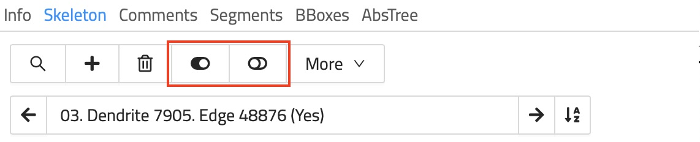

## Skeleton Annotations

Skeleton annotations are typically used to reconstruct structures that span across multiple data slices as graphs of connected nodes.
For example, you can analyze nerve cells by placing nodes along their pat/circuitry through the dataset (see image below).

Commonly, skeleton annotations contain reconstructions of one or more structures, sometimes thousands of nodes.
Each connected group of nodes form a tree, i.e., an undirected graph.

WEBKNOSSOS skeleton annotations can be downloaded, modified, and imported using a human-readable XML-based file format called [NML](./data_formats.md#nml).

This article shows you how to view, edit, or create skeleton annotations in WEBKNOSSOS

### Annotation Modes

WEBKNOSSOS supports several modes for displaying your dataset & interacting with skeleton annotations.

#### Orthogonal Mode

Orthogonal mode shows the dataset from three orthogonal views along the x, y, and z axes.
Additionally, a fourth viewport shows the data and skeleton from a 3D perspective.
You can move the camera along any of the main axes.
This view lets you see your data in the highest quality along its main imaging axis, usually XY
You can view your dataset slice by slice.

Most skeleton annotation operations and keyboard shortcuts are tailored for the Orthogonal Mode.

#### Oblique Mode

Oblique mode lets you slice the data at any angle.
Unlike Orthogonal mode, you can rotate the camera and slice the data in any direction.

#### Flight Mode

Flight mode gives you another way to slice the data.
Unlike Oblique mode, Flight mode projects the data on a sphere around the camera.

Spherical projection makes it easier to rotate the camera, because the pixels near the center of the screen stay in place.
Interactions and movements in Flight mode feel similar to First-Person-View (FPV) games.

You can annotate structures faster in Flight mode.
Seasoned annotators can follow tube-like structures, such as dendrites or axons, as if they are flying through them, much like in racing game or flight simulator.
Flight mode places nodes along your path automatically, which creates skeletons more efficiently.

### Tools

You can use these tools in the WEBKNOSSOS toolbar to work with skeletons:

- `Move`: Navigate around the dataset.
- `Skeleton`: Create skeleton annotations and place nodes with a left mouse click. Read more below.

When the `Skeleton` tool is active, the following modifiers become available:

- `Create new Tree`: Creates a new tree.
- `Toggle single node tree mode`: This modifier makes the skeleton annotation tool create a new tree for each node instead of adding nodes to the current tree. You can use this mode to mark single objects or seeds, such as nuclei. This is also known as "Soma-clicking mode".
- `Toggle merger mode`: This modifier activates the `Merger Mode` for the skeleton annotation tool. In merger mode, you can use skeletons to "collect" and merge volume segments from an over-segmentation. [Read more about `Merger Mode`](./volume_annotation.md#proof_reading_and_merging_segments).

### Nodes and Trees

A skeleton annotation is a graph of connected nodes.
Edges connect the nodes and form trees.

You can place nodes by left-clicking in Orthogonal Mode (with the Skeleton tool selected) or by moving in Flight or Oblique Mode.
All (global) operations are executed on the currently active node, e.g., adding a comment or node deletion.
The active node is always highlighted with a circle around it.
Most keyboard shortcuts take the active node into context.
Operations on whole trees, e.g., splitting or merging trees, follow the same pattern.

Skeleton annotations can contain one or many trees consisting of several nodes all the way to millions of nodes.
Users can add comments to each node to mark important positions or easily select them from a list of comments for later usage.
Comments are organized in the `Comments` tab on the right-hand side of the screen.
The `Tree Viewer` tab on the right-hand side menu displays a 2D simplified tree representation of the currently active tree.

Many organic structures do not follow a single, linear path but split into several individual branches instead.
WEBKNOSSOS natively supports marking nodes as branch points.
Any node can be marked as a branch point using the keyboard shortcut "B" or through the right-click menu.
Branch points are highlighted using a slightly different color.
All branch points are stored as a first-in, first-out (FIFO) stack. Press "J" to jump to the latest branch point in FIFO-order to continue working from there and remove it from the stack.

### Controls & Keyboard Shortcuts for Skeleton Annotations

While most operations for working with skeleton annotations are either available through the UI or the context-sensitive right-click menu, some users prefer to use keyboard shortcuts to work very efficiently.

| Key Binding | Operation                                          |
| ----------- | -------------------------------------------------- |
| Left Click  | Create New Node                                    |
| Left Click  | Select Node (Mark as Active Node) under the cursor |
| Left Drag   | Move around                                        |
| Left Drag   | Move the node under the cursor                     |
| S           | Center Camera on Active Node                       |
| DEL         | Delete Active Node                                 |
| B           | Create Branch Point                                |
| J           | Jump to Last Branch Point                          |
| C           | Create New Tree                                    |

Note that you can enable _Classic Controls_ which will behave slightly different and more explicit for some mouse actions:

| Key Binding        | Operation                                                              |
| ------------------ | ---------------------------------------------------------------------- |
| Left Drag          | Move around                                                            |
| Right Click        | Create New Node                                                        |
| SHIFT + Left Click | Select Node (Mark as Active Node)                                      |
| Left Drag          | Move the node under the cursor (unless _Classic Controls_ are enabled) |

A full list of keyboard shortcuts is [available here](./keyboard_shortcuts.md).

### Tree Operations & Tree Groups

All operations and information regarding trees are organized under a tab called `Trees` on the right-hand side of the screen.

A typical skeleton annotation consists of one or more trees.
Trees can be nested and organized in so-called `Tree Groups`.
Tree groups can have a name and are used to structure and label your annotation even further.
Trees can be dragged and dropped between tree groups.
This action can be applied to multiple trees by selecting them with Ctrl + Left Mouse (on Mac OS Cmd + Left Mouse).
Right-click on an existing tree group to bring up a menu for creating new (sub-)groups or to delete a group.
Renaming of a group can be done by selecting a group and then entering a new name into the input above the tree hierarchy structure view.

#### Merging / Splitting Trees

Common tree operations include splitting and merging trees.

- `Tree splitting` can be done in two ways:

  1. Delete the node at which to split. This can be done by right-clicking a node and choosing "Delete this Node". If you have enabled _Classic Controls_, you need to select (_SHIFT + Left Click_) the node first and then delete (_DEL_) it.
  2. Delete an edge between two nodes. Select the first node (_Left Click_), then right-click the second node and select _Delete Edge to this Node_. If you have enabled _Classic Controls_, you need to select the first node with _Shift + Left Click_ and then click on the second node with _SHIFT + CTRL + Left Click_ on the second node of the edge to delete this connection.

- `Tree merging` works similarly to edge deletion but will create a new edge between two previously unconnected trees. Select the first node and right-click on a second one to choose _Create Edge & Merge with this Tree_. When using _Classic Controls_, the second node needs to be selected with _SHIFT + ALT + Left Click_ to create an edge between the two.

#### Tree Colors

A random color is assigned to each tree upon creation.
Colors can be shuffled for a single tree or for all trees in a skeleton.
Right-click on a tree to bring up several actions, e.g. `Shuffle Color`.
When editing several trees, use the overflow menu under `More` in the `Skeleton` tab and select `Change Color` or `Shuffle All Colors` to assign new randomly chosen colors.
All nodes have the same color as their parent tree and can not be changed individually.
The active node, branch points, and nodes that have comments assigned to them are highlighted with a slight variation of the tree's color.

#### Skeleton & Tree Visibility

You can quickly toggle the visibility of all skeletons from the `Layers` menu in the left-hand side panel.

The visibility of individual trees can be toggled to hide some trees for a better overview.
Toggle the checkbox before each tree name or tree group to hide/show it.
Alternatively, the visibility of all trees can be toggled all at once using the `Toggle Visibility of All Trees` / `Toggle Visibility of Inactive Trees` button under the `Skeleton` Tab.
There are also keyboard shortcuts to quickly toggle the visibility:

| Key Binding | Operation                           |
| ----------- | ----------------------------------- |
| 1           | Toggle Visibility of all Trees      |
| 2           | Toggle Visibility of Inactive Trees |

#### The Context Menu for Easy Access to Functionalities

WEBKNOSSOS has a context menu that can be opened via _Right Click_ (or _Shift + Right Click_ if _Classic Controls_ are enabled). This context menu offers useful context-sensitive information and most operations should be available through it:

Example operations include (but are not limited to):

- Clicking on a node:
  - measuring the path length of the active node to the selected node
  - node deletion
  - tree merging & splitting
  - and many more
- Clicking on a volume segmentation:
  - compute or load its 3D mesh
  - flood-filling the segment (assigning a new ID)
- Clicking on the background data:
  - Creating a new node or tree
  - Creating a new bounding box

### Importing & Exporting NML Files

WEBKNOSSOS makes it easy to import or export skeleton annotations as [NML files](./data_formats.md#nml).
There are several ways for downloading your annotations:

1. There is a `Download` button in the overflow menu next to the prominent `Save` button in the toolbar at the top of the screen.

2. If you need more fine-grained control over which trees to download, use the `Download Selected Trees` option. From the `Skeleton` Tab, click on `More` and select `Download Selected Trees` from the menu. All visible trees (checkmark in front of the name) will be downloaded as an NML file. This is especially useful if you need to only download a single tree of an otherwise much larger annotation.

Importing a skeleton annotation can be achieved using one of two ways:

1. If you already have an annotation open you can easily add more skeletons to it by _drag and dropping_ an NML file onto your browser window. Otherwise, use the `Import NML` option next to `Download Selected Trees`. This will merge the NML file's content with the already open annotation.

2. To import a skeleton annotation as a completely new WEBKNOSSOS annotation, drag and drop the NML file anywhere on your user dashboard. Alternately, navigate to your user dashboard and use the `Upload Annotation` button within the "Annotations" section.

If you are looking to import/export annotations through Python code, check out our [WEBKNOSSOS Python library](https://docs.webknossos.org/webknossos-py).

### Merging Skeleton Annotations

There are two ways for merging annotations:

1. While in the annotation UI, _drag and drop_ an NML file onto your browser window to import a skeleton. The imported skeleton will be merged with the currently open annotation.

2. If you would like to merge your current annotation with another existing annotation, select the `Merge` operation from the overflow menu next to the `Save` button (see image). Either enter the ID of an existing explorative annotation or select a whole project and proceed to merge the selection with your currently open annotation. The resulting annotation can either be created as a new explorative annotation or the merge will happen in your current annotation.

