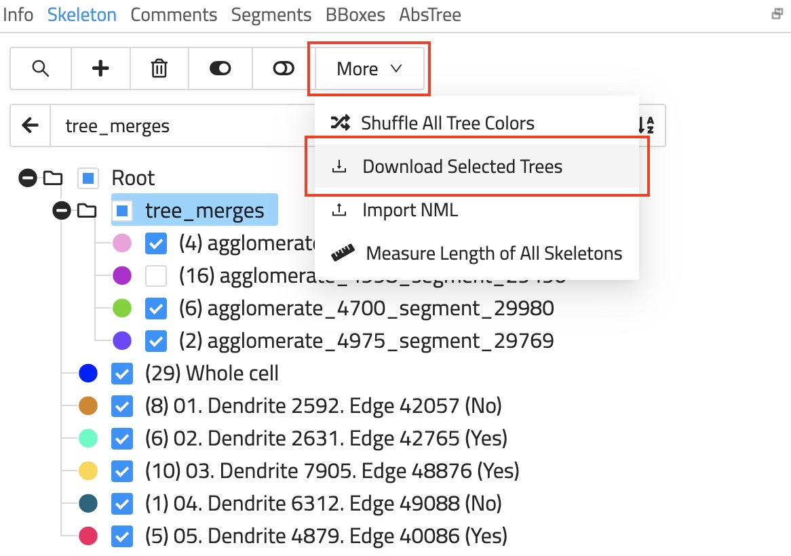
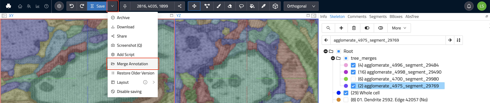

# Importing & Exporting Skeletons as NML Files

WEBKNOSSOS makes it easy to import or export skeleton annotations as [NML files](../data/concepts.md#nml-files).

## Export Skeleton Annotations

There are several ways for downloading your annotations:

1. There is a `Download` button in the overflow menu next to the prominent `Save` button in the toolbar at the top of the screen.
  

2. If you need more fine-grained control over which trees to download, use the `Download Selected Trees` option. From the `Skeleton` Tab, click on `More` and select `Download Selected Trees` from the menu. All visible trees (checkmark in front of the name) will be downloaded as an NML file. This is especially useful if you need to only download a single tree of an otherwise much larger annotation.
  

## Import Skeleton Annotations
Importing a skeleton annotation can be achieved using one of two ways:

1. If you already have an annotation open you can easily add more skeletons to it by _drag and dropping_ an NML file onto your browser window. Otherwise, use the `Import NML` option next to `Download Selected Trees`. This will merge the NML file's content with the already open annotation.

2. To import a skeleton annotation as a completely new WEBKNOSSOS annotation, drag and drop the NML file anywhere on your user dashboard. Alternately, navigate to your user dashboard and use the `Upload Annotation` button within the "Annotations" section.

If you are looking to import/export annotations through Python code, check out our [WEBKNOSSOS Python library](https://docs.webknossos.org/webknossos-py).

## Merging skeleton annotations

There are two ways for merging annotations:

1. While in the annotation UI, _drag and drop_ an NML file onto your browser window to import a skeleton. The imported skeleton will be merged with the currently open annotation.

2. If you would like to merge your current annotation with another existing annotation, select the `Merge` operation from the overflow menu next to the `Save` button (see image). Either enter the ID of an existing explorative annotation or select a whole project and proceed to merge the selection with your currently open annotation. The resulting annotation can either be created as a new explorative annotation or the merge will happen in your current annotation.

