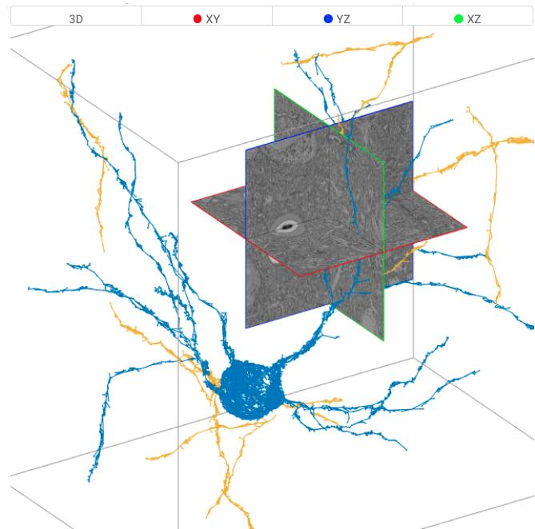
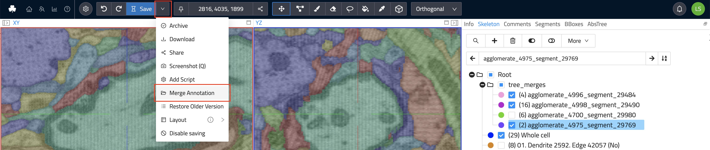
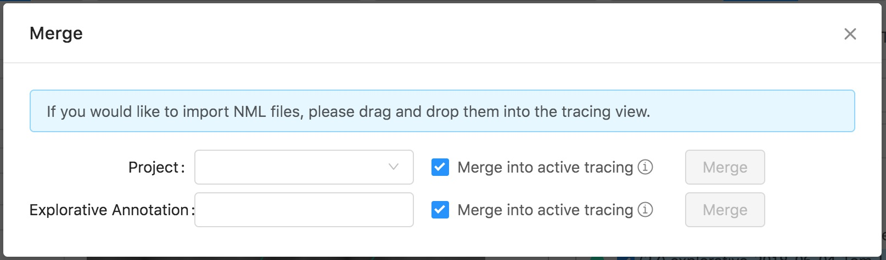

## Skeleton Annotations

Skeleton annotations are typically used to reconstruct structures that span across multiple data slices as graphs of connected nodes.
For example, you can analyze nerve cells by placing nodes along their pat/circuitry through the dataset (see image below).

Commonly, skeleton annotations contain reconstructions of one or more structures, sometimes thousands of nodes.
Each connected group of nodes form a tree, i.e., an undirected graph.

WEBKNOSSOS skeleton annotations can be downloaded, modified, and imported using a human-readable XML-based file format called [NML](../data_formats.md#nml).

This article shows you how to view, edit, or create skeleton annotations in WEBKNOSSOS

### Nodes and Trees

A skeleton annotation is a graph of connected nodes.
Edges connect the nodes and form trees.

You can place nodes by left-clicking in Orthogonal Mode (with the Skeleton tool selected) or by moving in Flight or Oblique Mode.
All (global) operations are executed on the currently active node, e.g., adding a comment or node deletion.
The active node is always highlighted with a circle around it.
Most keyboard shortcuts take the active node into context.
Operations on whole trees, e.g., splitting or merging trees, follow the same pattern.

Skeleton annotations can contain one or many trees consisting of several nodes all the way to millions of nodes.
Users can add comments to each node to mark important positions or easily select them from a list of comments for later usage.

The `Tree Viewer` tab on the right-hand side menu displays a 2D simplified tree representation of the currently active tree.

Many organic structures do not follow a single, linear path but split into several individual branches instead.
WEBKNOSSOS natively supports marking nodes as branch points.
Any node can be marked as a branch point using the keyboard shortcut "B" or through the right-click menu.
Branch points are highlighted using a slightly different color.
All branch points are stored as a first-in, first-out (FIFO) stack. Press "J" to jump to the latest branch point in FIFO-order to continue working from there and remove it from the stack.

### Merging Skeleton Annotations

There are two ways for merging annotations:

1. While in the annotation UI, _drag and drop_ an NML file onto your browser window to import a skeleton. The imported skeleton will be merged with the currently open annotation.

2. If you would like to merge your current annotation with another existing annotation, select the `Merge` operation from the overflow menu next to the `Save` button (see image). Either enter the ID of an existing explorative annotation or select a whole project and proceed to merge the selection with your currently open annotation. The resulting annotation can either be created as a new explorative annotation or the merge will happen in your current annotation.

