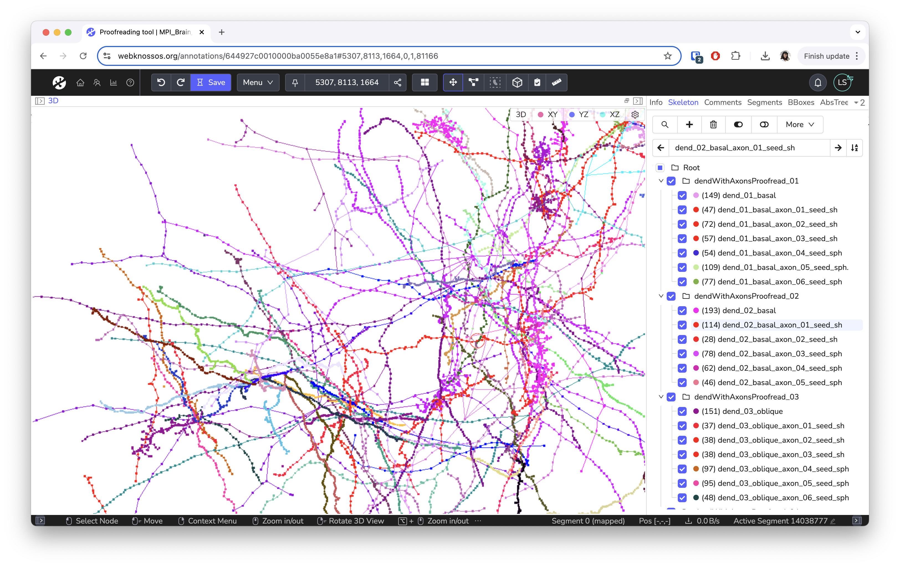

# Skeleton Annotations

Skeleton annotations are typically used to reconstruct structures that span across multiple data slices as graphs of connected nodes.
For example, you can analyze nerve cells by placing nodes along their path/circuitry through the dataset (see image below).

Commonly, skeleton annotations contain reconstructions of one or more structures, sometimes thousands of nodes.
Each connected group of nodes form a tree, i.e., an undirected graph.

WEBKNOSSOS skeleton annotations can be downloaded, modified, and imported using a human-readable XML-based file format called [NML](../data/concepts.md#nml-files).

The following pages explain: 

- [Tools and shortcuts](./tools.md) for skeleton annotations 
- [Skeleton tree list](./trees_list.md)
- [Skeleton operations](./operations.md)
- [Comments](./comments.md)
- [Import and export](./import_export.md) for skeleton annotations 
- [Annotation modes](./modes.md)

