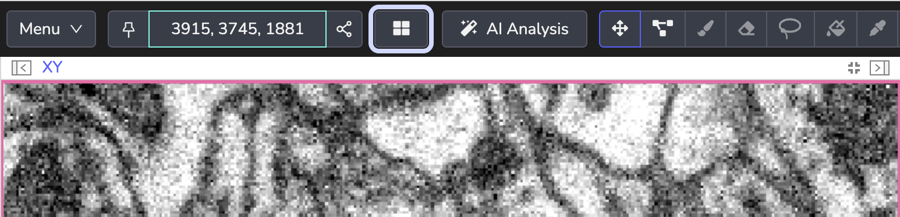
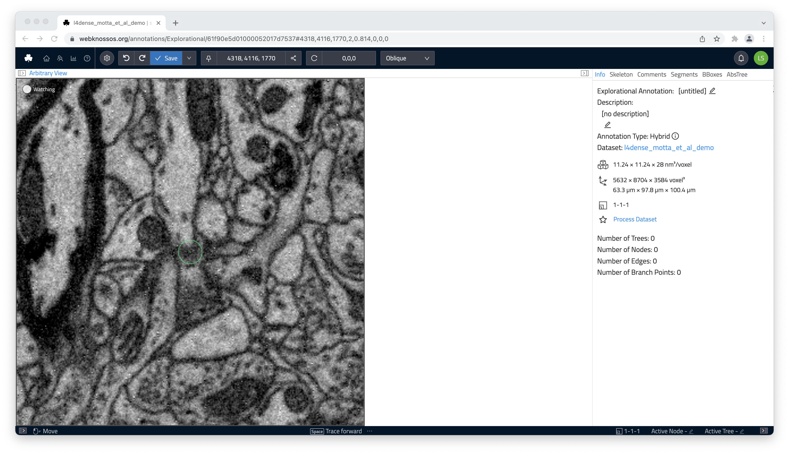
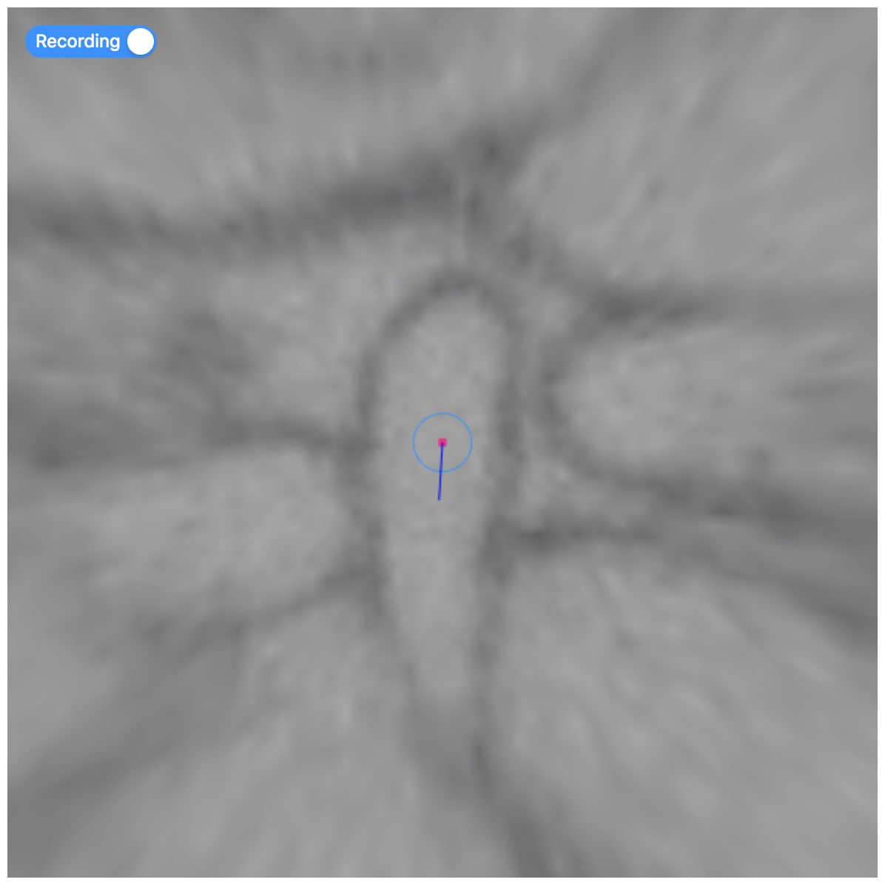
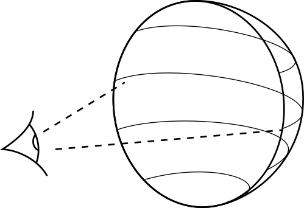

# View Modes

WEBKNOSSOS supports several modes for displaying your dataset & interacting with (skeleton) annotations.

## Orthogonal Mode

Orthogonal mode shows the dataset from three orthogonal views along the x, y, and z axes.
Additionally, a fourth viewport shows the data and skeleton from a 3D perspective.
You can move the camera along any of the main axes.
This view lets you see your data in the highest quality along its main imaging axis, usually XY
You can view your dataset slice by slice.

Most skeleton annotation operations and keyboard shortcuts are tailored for the Orthogonal Mode.

## Oblique Mode

Oblique mode lets you slice the data at any angle.
Unlike Orthogonal mode, you can rotate the camera and slice the data in any direction.

## Flight Mode

Flight mode gives you another way to slice the data.
Unlike Oblique mode, Flight mode projects the data on a sphere around the camera.

Spherical projection makes it easier to rotate the camera, because the pixels near the center of the screen stay in place.
Interactions and movements in Flight mode feel similar to First-Person-View (FPV) games.

You can annotate structures faster in Flight mode.
Seasoned annotators can follow tube-like structures, such as dendrites or axons, as if they are flying through them, much like in racing game or flight simulator.
Flight mode places nodes along your path automatically, which creates skeletons more efficiently.
